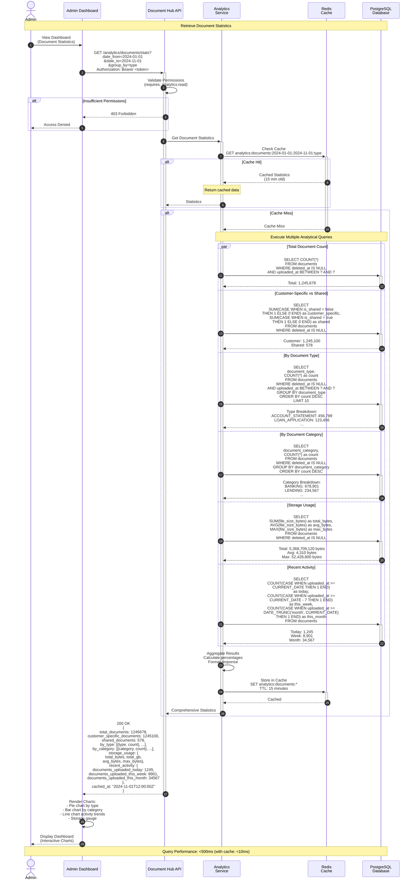
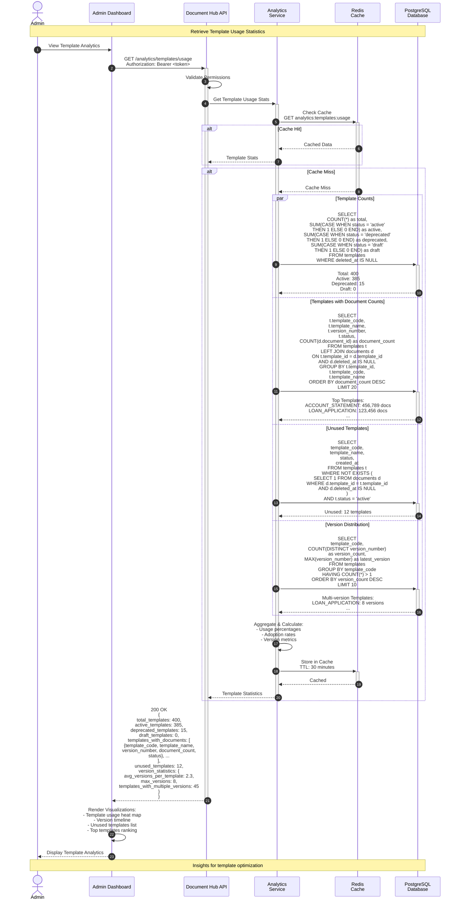
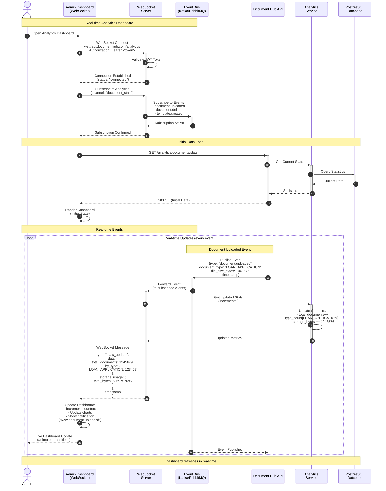

# Analytics & Reporting Flow - Sequence Diagram

**Note:** Authentication is handled by the API Gateway before requests reach the API.

This sequence diagram illustrates the analytics and reporting capabilities of the Document Hub API, including document statistics, template usage analytics, and performance monitoring.

## Mermaid Sequence Diagram - Document Statistics



## Mermaid Sequence Diagram - Template Usage Statistics



## Mermaid Sequence Diagram - Real-time Dashboard with WebSocket



## Flow Descriptions

### Document Statistics Flow

1. **Authorization** (Step 1)
   - Admin opens analytics dashboard
   - API Gateway validates JWT token before request reaches API
   - Require `analytics:read` permission
   - If unauthorized → 403 Forbidden

2. **Cache Check** (Steps 2-4)
   - Check Redis cache for recent results
   - Cache key includes date range and grouping
   - If cache hit (< 15 min old), return immediately
   - If cache miss, proceed to database queries

3. **Parallel Analytical Queries** (Steps 5-15)
   Execute multiple queries in parallel for performance:

   - **Total Document Count**: Count all non-deleted documents
   - **Customer-Specific vs Shared**: Breakdown by `is_shared` flag
   - **By Document Type**: Top 10 document types with counts
   - **By Document Category**: All categories with counts
   - **Storage Usage**: Sum, average, and max file sizes
   - **Recent Activity**: Counts for today, this week, this month

4. **Aggregation** (Steps 16-17)
   - Combine all query results
   - Calculate percentages and derived metrics
   - Format for API response

5. **Cache Storage** (Steps 18-19)
   - Store results in Redis cache
   - Set TTL to 15 minutes
   - Subsequent requests are much faster

6. **Response & Visualization** (Steps 20-23)
   - Return comprehensive statistics
   - Client renders interactive charts
   - Display to admin

### Template Usage Statistics Flow

1. **Authorization** (Step 1)
   - Admin requests template analytics
   - API Gateway validates JWT token before request reaches API

2. **Cache Check** (Steps 2-4)
   - Check for cached template statistics
   - 30-minute TTL (templates change less frequently)

3. **Template Queries** (Steps 5-13)
   Execute specialized template queries:

   - **Template Counts**: Total, active, deprecated, draft
   - **Usage Ranking**: Templates ordered by document count
   - **Unused Templates**: Active templates with no documents
   - **Version Distribution**: Templates with multiple versions

4. **Analysis** (Steps 14-15)
   - Calculate adoption rates
   - Identify optimization opportunities
   - Version complexity metrics

5. **Cache & Response** (Steps 16-19)
   - Cache results for 30 minutes
   - Return detailed template analytics
   - Render visualizations

### Real-time Dashboard Flow

1. **WebSocket Connection** (Step 1)
   - Admin opens dashboard
   - Establish WebSocket connection
   - API Gateway validates JWT token before connection is established

2. **Channel Subscription** (Steps 2-4)
   - Client subscribes to analytics channel
   - Server subscribes to event bus
   - Listen for document and template events

3. **Initial Data Load** (Steps 5-10)
   - Fetch current statistics via REST API
   - Render initial dashboard state
   - Display to admin

4. **Real-time Event Processing** (Steps 11-22)
   - Document uploaded/deleted/updated events published
   - Event bus forwards to WebSocket server
   - Server calculates incremental updates
   - Push updates to connected clients
   - Client updates dashboard in real-time
   - Smooth animations and notifications

## API Endpoint Details

### Get Document Statistics

```
GET /api/v1/analytics/documents/stats?date_from=2024-01-01&date_to=2024-11-01&group_by=type
Authorization: Bearer <token>
```

**Query Parameters:**
- `customer_id` - Filter by specific customer (optional)
- `date_from` - Start date (ISO 8601)
- `date_to` - End date (ISO 8601)
- `group_by` - Group results by: type, category, customer, month

**Success Response (200 OK):**
```json
{
  "total_documents": 1245678,
  "customer_specific_documents": 1245100,
  "shared_documents": 578,
  "by_type": [
    {
      "document_type": "ACCOUNT_STATEMENT",
      "count": 456789,
      "percentage": 36.7
    },
    {
      "document_type": "LOAN_APPLICATION",
      "count": 123456,
      "percentage": 9.9
    }
  ],
  "by_category": [
    {
      "document_category": "BANKING",
      "count": 678901,
      "percentage": 54.5
    },
    {
      "document_category": "LENDING",
      "count": 234567,
      "percentage": 18.8
    }
  ],
  "storage_usage": {
    "total_bytes": 5368709120,
    "total_gb": 5.0,
    "avg_bytes": 4310,
    "max_bytes": 52428800
  },
  "recent_activity": {
    "documents_uploaded_today": 1245,
    "documents_uploaded_this_week": 8901,
    "documents_uploaded_this_month": 34567
  },
  "query_time_ms": 387,
  "cached": false,
  "generated_at": "2024-11-01T12:00:00Z"
}
```

### Get Template Usage Statistics

```
GET /api/v1/analytics/templates/usage
Authorization: Bearer <token>
```

**Success Response (200 OK):**
```json
{
  "total_templates": 400,
  "active_templates": 385,
  "deprecated_templates": 15,
  "draft_templates": 0,
  "templates_with_documents": [
    {
      "template_code": "ACCOUNT_STATEMENT",
      "template_name": "Monthly Account Statement",
      "version_number": 2,
      "document_count": 456789,
      "status": "active",
      "usage_percentage": 36.7
    },
    {
      "template_code": "LOAN_APPLICATION",
      "template_name": "Loan Application Form",
      "version_number": 3,
      "document_count": 123456,
      "status": "active",
      "usage_percentage": 9.9
    }
  ],
  "unused_templates": [
    {
      "template_code": "UNUSED_FORM",
      "template_name": "Old Application Form",
      "status": "active",
      "created_at": "2023-06-15T10:00:00Z"
    }
  ],
  "version_statistics": {
    "avg_versions_per_template": 2.3,
    "max_versions": 8,
    "templates_with_multiple_versions": 45
  },
  "query_time_ms": 245,
  "cached": true,
  "generated_at": "2024-11-01T12:00:00Z"
}
```

## Performance Optimizations

### Query Optimization
```sql
-- Materialized view for fast analytics
CREATE MATERIALIZED VIEW document_statistics AS
SELECT
  DATE_TRUNC('day', uploaded_at) as date,
  document_type,
  document_category,
  COUNT(*) as count,
  SUM(file_size_bytes) as total_size
FROM documents
WHERE deleted_at IS NULL
GROUP BY date, document_type, document_category;

-- Refresh periodically (every hour)
REFRESH MATERIALIZED VIEW CONCURRENTLY document_statistics;

-- Index for fast lookups
CREATE INDEX idx_document_statistics_date
ON document_statistics(date, document_type);
```

### Caching Strategy
- **Document Stats Cache**: 15-minute TTL
- **Template Stats Cache**: 30-minute TTL
- **Dashboard Aggregates**: 5-minute TTL
- **Real-time Counters**: Redis incrementers (no TTL)

### Database Indexes
```sql
-- Analytics queries
CREATE INDEX idx_documents_uploaded_at
ON documents(uploaded_at DESC)
WHERE deleted_at IS NULL;

CREATE INDEX idx_documents_type_date
ON documents(document_type, uploaded_at)
WHERE deleted_at IS NULL;

CREATE INDEX idx_documents_category
ON documents(document_category, uploaded_at)
WHERE deleted_at IS NULL;

-- Template analytics
CREATE INDEX idx_documents_template_id
ON documents(template_id)
WHERE deleted_at IS NULL;

CREATE INDEX idx_templates_status
ON templates(status, created_at);
```

### Query Performance Targets
- **Document Statistics**: <500ms (first request), <10ms (cached)
- **Template Usage**: <300ms (first request), <5ms (cached)
- **Real-time Updates**: <50ms latency
- **Dashboard Load**: <1 second (total page load)

## Visualization Examples

### Dashboard Components

1. **Document Type Distribution** (Pie Chart)
   - Visualize document types by count
   - Interactive segments
   - Show percentages

2. **Upload Activity Timeline** (Line Chart)
   - Documents uploaded over time
   - Daily, weekly, monthly views
   - Trend lines

3. **Storage Usage** (Gauge/Progress)
   - Current storage vs capacity
   - Growth rate
   - Cost projections

4. **Template Usage Heatmap**
   - Template activity matrix
   - Color-coded usage intensity
   - Identify popular templates

5. **Real-time Counter**
   - Live document count
   - Animated increments
   - Recent activity feed

## Error Scenarios

| Scenario | HTTP Status | Error Code | Action |
|----------|-------------|------------|--------|
| Authentication (401 Unauthorized) | 401 | UNAUTHORIZED | Handled by API Gateway; not shown in this diagram |
| Insufficient permissions | 403 | INSUFFICIENT_PERMISSIONS | Need analytics:read role |
| Invalid date range | 400 | INVALID_DATE_RANGE | Check date format |
| Query timeout | 504 | QUERY_TIMEOUT | Simplify query or use cache |
| WebSocket auth failed | 403 | WS_AUTH_FAILED | Invalid token (checked at gateway) |

## Best Practices

1. **Use Caching Aggressively**
   - Analytics queries are expensive
   - Cache results for appropriate TTL
   - Invalidate on major data changes

2. **Implement Materialized Views**
   - Pre-compute common aggregations
   - Refresh periodically
   - Much faster than live queries

3. **Real-time for Critical Metrics**
   - Use WebSocket for live dashboards
   - Incremental updates, not full refreshes
   - Reduces server load

4. **Optimize Query Complexity**
   - Limit date ranges for better performance
   - Use pagination for large result sets
   - Consider data sampling for approximate results

5. **Monitor Query Performance**
   - Log slow queries (> 1 second)
   - Alert on degraded performance
   - Optimize indexes based on usage patterns

6. **Provide Data Export**
   - Allow CSV/Excel export for offline analysis
   - Generate reports asynchronously
   - Email large reports instead of inline

## Advanced Analytics Features

### Predictive Analytics
- **Storage Forecasting**: Predict when storage limits will be reached
- **Usage Trends**: Identify growing/declining document types
- **Capacity Planning**: Recommend infrastructure scaling

### Custom Reports
- **Scheduled Reports**: Daily/weekly email summaries
- **Custom Dashboards**: User-defined metrics and visualizations
- **Data Export**: CSV, JSON, Excel formats

### Compliance Reporting
- **Document Retention**: Track documents approaching retention expiry
- **Access Audits**: Who accessed what documents
- **Regulatory Reports**: Compliance-specific analytics
