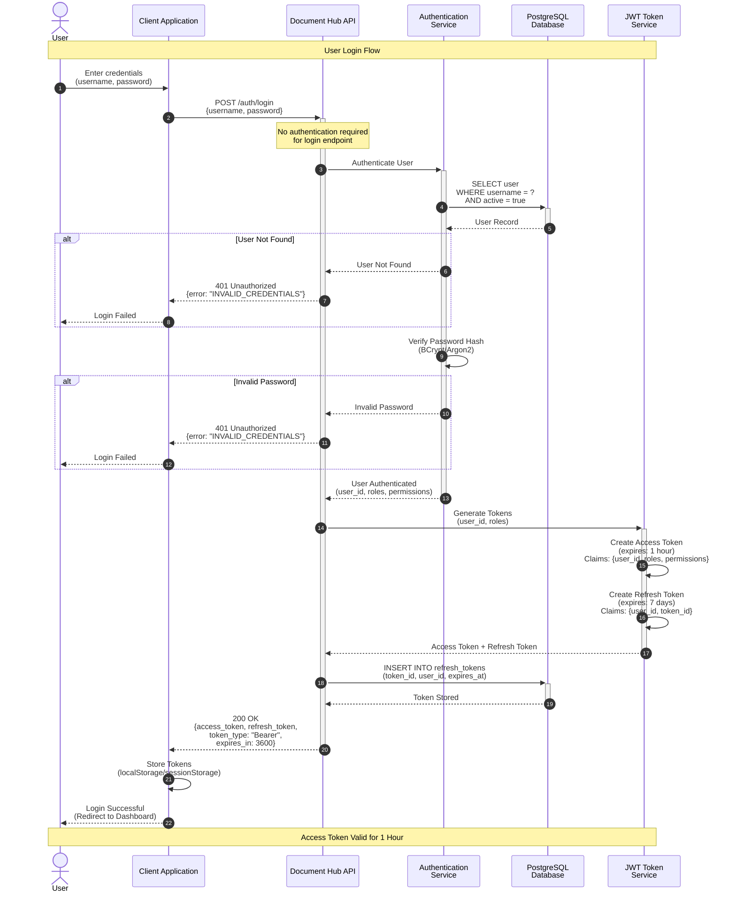
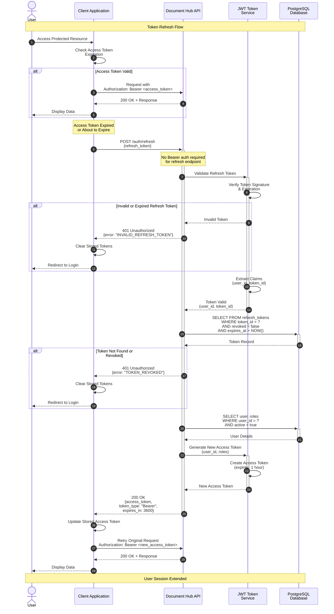

# Authentication Flow - Sequence Diagram

This sequence diagram illustrates the authentication flow including login and token refresh mechanisms in the Document Hub API.

## Mermaid Sequence Diagram - Login Flow



## Mermaid Sequence Diagram - Token Refresh Flow



## Flow Descriptions

### Login Flow Steps

1. **User Credentials** (Steps 1-2)
   - User enters username and password
   - Client sends POST request to `/auth/login`
   - No authentication required for this endpoint

2. **User Lookup** (Steps 3-5)
   - Authentication service queries database for user
   - Checks if user exists and is active
   - If not found → 401 Unauthorized

3. **Password Verification** (Step 6-7)
   - Verify password hash using BCrypt/Argon2
   - If invalid → 401 Unauthorized

4. **Token Generation** (Steps 8-10)
   - Generate JWT access token (1 hour expiration)
   - Generate JWT refresh token (7 days expiration)
   - Access token contains: user_id, roles, permissions
   - Refresh token contains: user_id, token_id (for revocation)

5. **Token Storage** (Steps 11-12)
   - Store refresh token in database for revocation tracking
   - Return both tokens to client

6. **Client Storage** (Steps 13-14)
   - Client stores tokens in secure storage
   - Redirect user to dashboard

### Token Refresh Flow Steps

1. **Token Expiration Detection** (Steps 1-3)
   - Client checks if access token is expired or about to expire
   - If valid, proceed with normal request

2. **Refresh Request** (Steps 4-5)
   - Client sends refresh token to `/auth/refresh`
   - No Bearer authentication required

3. **Token Validation** (Steps 6-8)
   - Validate refresh token signature and expiration
   - If invalid → 401 Unauthorized, redirect to login

4. **Revocation Check** (Steps 9-11)
   - Check if refresh token is in database and not revoked
   - Verify token hasn't expired
   - If revoked/not found → 401 Unauthorized

5. **User Verification** (Steps 12-13)
   - Verify user still exists and is active
   - Fetch current roles/permissions

6. **New Access Token** (Steps 14-16)
   - Generate new access token with current user data
   - Return to client

7. **Resume Operation** (Steps 17-20)
   - Client updates stored access token
   - Retry original request with new token
   - User continues working seamlessly

## API Endpoint Details

### Login Endpoint

```
POST /api/v1/auth/login
Content-Type: application/json

Request Body:
{
  "username": "admin@example.com",
  "password": "SecurePassword123!"
}
```

**Success Response (200 OK):**
```json
{
  "access_token": "eyJhbGciOiJIUzI1NiIsInR5cCI6IkpXVCJ9...",
  "refresh_token": "eyJhbGciOiJIUzI1NiIsInR5cCI6IkpXVCJ9...",
  "token_type": "Bearer",
  "expires_in": 3600
}
```

**Error Response (401 Unauthorized):**
```json
{
  "error": "INVALID_CREDENTIALS",
  "message": "Invalid username or password",
  "timestamp": "2024-11-01T12:00:00Z",
  "path": "/api/v1/auth/login"
}
```

### Token Refresh Endpoint

```
POST /api/v1/auth/refresh
Content-Type: application/json

Request Body:
{
  "refresh_token": "eyJhbGciOiJIUzI1NiIsInR5cCI6IkpXVCJ9..."
}
```

**Success Response (200 OK):**
```json
{
  "access_token": "eyJhbGciOiJIUzI1NiIsInR5cCI6IkpXVCJ9...",
  "token_type": "Bearer",
  "expires_in": 3600
}
```

**Error Response (401 Unauthorized):**
```json
{
  "error": "INVALID_REFRESH_TOKEN",
  "message": "Refresh token is invalid or expired",
  "timestamp": "2024-11-01T12:00:00Z",
  "path": "/api/v1/auth/refresh"
}
```

## JWT Token Structure

### Access Token Claims
```json
{
  "sub": "user_id",
  "username": "admin@example.com",
  "roles": ["ADMIN", "USER"],
  "permissions": ["document:read", "document:write", "template:manage"],
  "iat": 1698844800,
  "exp": 1698848400
}
```

### Refresh Token Claims
```json
{
  "sub": "user_id",
  "token_id": "uuid-of-refresh-token",
  "iat": 1698844800,
  "exp": 1699449600
}
```

## Security Features

### Password Security
- **Hashing Algorithm**: BCrypt or Argon2
- **Salt**: Unique per user
- **Cost Factor**: 12-14 rounds (BCrypt)

### Token Security
- **Algorithm**: HS256 or RS256
- **Access Token**: Short-lived (1 hour)
- **Refresh Token**: Longer-lived (7 days)
- **Refresh Token Rotation**: Optional (generate new refresh token on each refresh)

### Token Revocation
- Refresh tokens stored in database
- Can be revoked individually or all tokens for a user
- Supports logout from all devices

### Rate Limiting
- Login endpoint: 5 attempts per minute per IP
- Refresh endpoint: 10 attempts per minute per user

## Error Scenarios

| Scenario | HTTP Status | Error Code | Action |
|----------|-------------|------------|--------|
| Invalid credentials | 401 | INVALID_CREDENTIALS | Show login error |
| User inactive | 401 | ACCOUNT_DISABLED | Contact support |
| Invalid refresh token | 401 | INVALID_REFRESH_TOKEN | Redirect to login |
| Token revoked | 401 | TOKEN_REVOKED | Redirect to login |
| Token expired | 401 | TOKEN_EXPIRED | Use refresh token |
| Rate limit exceeded | 429 | RATE_LIMIT_EXCEEDED | Wait and retry |

## Token Lifecycle

```
Login → Access Token (1h) + Refresh Token (7d)
         ↓
    API Requests (with Access Token)
         ↓
    Access Token Expires
         ↓
    Use Refresh Token → New Access Token (1h)
         ↓
    Continue API Requests
         ↓
    Refresh Token Expires (after 7 days)
         ↓
    User Must Re-login
```

## Best Practices

1. **Store Tokens Securely**
   - Use httpOnly cookies for web applications
   - Use secure storage (Keychain/Keystore) for mobile apps
   - Never store in localStorage for sensitive applications

2. **Implement Token Refresh Logic**
   - Proactively refresh tokens before expiration
   - Implement automatic retry logic on 401 errors

3. **Handle Token Expiration Gracefully**
   - Show user-friendly error messages
   - Preserve user's work before redirecting to login

4. **Implement Logout**
   - Clear client-side tokens
   - Revoke refresh token on server

5. **Monitor Authentication Events**
   - Log all login attempts
   - Alert on suspicious activity
   - Track token usage patterns
