# Document Retrieval API Flow (documents-enquiry)

## Overview

This sequence diagram shows the flow for retrieving a list of documents based on customer/account filters. The API uses the denormalized `storage_index` table for zero-join performance optimization.

## API Endpoint

**POST** `/documents-enquiry`

## Sequence Diagram

```mermaid
sequenceDiagram
    autonumber

    participant Client as Client Application
    participant API as Document Hub API
    participant Auth as Authentication Service
    participant Validator as Request Validator
    participant DB as PostgreSQL<br/>(storage_index)
    participant ECMS as ECMS/S3
    participant Logger as Logging Service

    rect rgb(240, 248, 255)
        Note over Client,Logger: 1. Client Request Phase
        Client->>+API: POST /documents-enquiry<br/>Headers: {X-version, X-correlation-id,<br/>X-requestor-id, X-requestor-type}<br/>Body: DocumentListRequest
        API->>Logger: Log incoming request<br/>{correlationId, requestorId, timestamp}
    end

    rect rgb(255, 250, 240)
        Note over API,Auth: 2. Authentication & Authorization
        API->>+Auth: Validate JWT Token

        alt Valid Token
            Auth-->>-API: Token valid<br/>{userId, roles, permissions}
            API->>API: Extract requestor info<br/>{requestorId, requestorType}
        else Invalid Token
            Auth-->>API: 401 Unauthorized
            API-->>Client: 401 Unauthorized<br/>{error: "UNAUTHORIZED", message: "Invalid token"}
        end

        API->>API: Check authorization<br/>Verify access permissions

        alt Not Authorized
            API-->>Client: 403 Forbidden<br/>{error: "FORBIDDEN", message: "Access denied"}
        end
    end

    rect rgb(240, 255, 240)
        Note over API,Validator: 3. Request Validation
        API->>+Validator: Validate request body<br/>DocumentListRequest schema

        Validator->>Validator: Validate required fields:<br/>- customerId (UUID format)<br/>- accountId array (UUID format)<br/>- documentTypeCategoryGroup<br/>- date ranges (epoch format)

        Validator->>Validator: Validate pagination:<br/>- pageNumber >= 0<br/>- pageSize <= max limit

        alt Validation Failed
            Validator-->>-API: Validation errors
            API-->>Client: 400 Bad Request<br/>{error: "VALIDATION_ERROR",<br/>details: [{field, message}]}
        else Validation Passed
            Validator-->>API: Validation passed
        end
    end

    rect rgb(255, 245, 245)
        Note over API,DB: 4. Build Database Query
        API->>API: Build SQL query from filters

        Note right of API: Zero-join query on storage_index:<br/>- customer_id = ${customerId}<br/>- account_id IN (${accountIds})<br/>- category_name IN (${categories})<br/>- doc_type IN (${documentTypes})<br/>- doc_creation_date BETWEEN ${postedFromDate} AND ${postedToDate}<br/>- archive_indicator = false

        API->>API: Apply sorting:<br/>ORDER BY ${sortOrder.orderBy} ${sortOrder.sortBy}

        API->>API: Apply pagination:<br/>LIMIT ${pageSize} OFFSET ${pageNumber * pageSize}
    end

    rect rgb(245, 250, 255)
        Note over API,DB: 5. Execute Query
        API->>+DB: SELECT * FROM storage_index<br/>WHERE filters...<br/>ORDER BY... LIMIT... OFFSET...

        alt Documents Found
            DB-->>-API: Result set<br/>[{storage_index_id, customer_id, account_id,<br/>category_name, doc_type, file_extension,<br/>file_size_kb, mime_type, doc_creation_date,<br/>last_accessed_at, doc_metadata, ...}]

            API->>API: Count total records (for pagination)
            API->>+DB: SELECT COUNT(*) FROM storage_index<br/>WHERE filters...
            DB-->>-API: total_count

        else No Documents Found
            DB-->>API: Empty result set
            API-->>Client: 404 Not Found<br/>{error: "NOT_FOUND",<br/>message: "No documents found"}
        end
    end

    rect rgb(255, 250, 245)
        Note over API,API: 6. Transform Results
        API->>API: Map database results to response DTOs

        loop For each document
            API->>API: Transform storage_index row:<br/>- documentId = storage_index_id<br/>- sizeInMb = file_size_kb / 1024<br/>- languageCode = language_code<br/>- displayName = doc_display_name<br/>- mimeType = mime_type<br/>- description = doc_description<br/>- category = category_name<br/>- documentType = doc_type<br/>- datePosted = doc_creation_date (epoch)<br/>- lastDownloaded = last_accessed_at (epoch)

            API->>API: Parse doc_metadata JSONB:<br/>Convert to Metadata[] array

            API->>API: Generate HATEOAS links:<br/>- download: /documents/{documentId}<br/>- delete: /documents/{documentId}
        end

        API->>API: Build pagination metadata:<br/>{pageSize, pageNumber, totalItems, totalPages}

        API->>API: Build response links:<br/>- self: current page<br/>- next: next page (if exists)<br/>- prev: previous page (if exists)
    end

    rect rgb(245, 255, 245)
        Note over API,Client: 7. Return Response
        API->>Logger: Log successful response<br/>{correlationId, resultCount, executionTimeMs}

        API-->>-Client: 200 OK<br/>DocumentRetrievalResponse:<br/>{<br/>  documentList: [...],<br/>  pagination: {pageSize, totalItems, totalPages, pageNumber},<br/>  _links: {self, next, prev}<br/>}
    end

    rect rgb(255, 240, 240)
        Note over API,Logger: 8. Error Handling (if DB fails)

        alt Database Connection Error
            DB-->>API: Connection error/timeout
            API->>Logger: Log error<br/>{correlationId, error: "DB_CONNECTION_ERROR"}
            API-->>Client: 503 Service Unavailable<br/>{error: "SERVICE_UNAVAILABLE",<br/>message: "Database service unavailable"}

        else Database Query Error
            DB-->>API: SQL error
            API->>Logger: Log error<br/>{correlationId, error: "DB_QUERY_ERROR"}
            API-->>Client: 500 Internal Server Error<br/>{error: "INTERNAL_ERROR",<br/>message: "Internal server error"}
        end
    end
```



---

## Request Example

```json
{
  "customerId": "550e8400-e29b-41d4-a716-446655440000",
  "accountId": [
    "660e8400-e29b-41d4-a716-446655440001",
    "770e8400-e29b-41d4-a716-446655440002"
  ],
  "documentTypeCategoryGroup": [
    {
      "category": "PaymentConfirmationNotice",
      "documentTypes": ["PaymentLetter", "ConfirmationLetter"]
    }
  ],
  "postedFromDate": 1704067200,
  "postedToDate": 1735689600,
  "pageNumber": 0,
  "pageSize": 20,
  "sortOrder": [
    {
      "orderBy": "datePosted",
      "sortBy": "desc"
    }
  ]
}
```

## Response Example

```json
{
  "documentList": [
    {
      "documentId": "bb0e8400-e29b-41d4-a716-446655440020",
      "sizeInMb": 1,
      "languageCode": "EN_US",
      "displayName": "Payment Confirmation - January 2024",
      "mimeType": "application/pdf",
      "description": "Monthly payment confirmation letter",
      "lineOfBusiness": ["credit_card"],
      "category": "PaymentConfirmationNotice",
      "documentType": "PaymentLetter",
      "datePosted": 1704153600,
      "lastDownloaded": 1704240000,
      "metadata": [
        {
          "key": "paymentAmount",
          "value": "1500.00",
          "dataType": "NUMBER"
        },
        {
          "key": "paymentDate",
          "value": "2024-01-01",
          "dataType": "DATE"
        }
      ],
      "_links": {
        "download": {
          "href": "/documents/bb0e8400-e29b-41d4-a716-446655440020",
          "type": "GET",
          "rel": "download"
        },
        "delete": {
          "href": "/documents/bb0e8400-e29b-41d4-a716-446655440020",
          "type": "DELETE"
        }
      }
    }
  ],
  "pagination": {
    "pageSize": 20,
    "totalItems": 156,
    "totalPages": 8,
    "pageNumber": 0
  },
  "_links": {
    "self": {
      "href": "/documents-enquiry?pageNumber=0&pageSize=20",
      "rel": "self"
    },
    "next": {
      "href": "/documents-enquiry?pageNumber=1&pageSize=20"
    }
  }
}
```

---

## Key Features

### 1. **Zero-Join Performance**
- Uses denormalized `storage_index` table
- All document metadata in single table
- No joins required for retrieval
- Category name and template info denormalized

### 2. **Flexible Filtering**
- Filter by customer ID
- Filter by multiple account IDs
- Filter by document categories and types
- Date range filtering (posted date)
- Metadata-based filtering (JSONB)

### 3. **Pagination Support**
- Configurable page size
- Page number-based navigation
- Total count calculation
- HATEOAS links for navigation

### 4. **JSONB Metadata**
- Flexible metadata storage
- No schema changes needed for new fields
- Efficient querying with GIN indexes
- Type-aware data storage

### 5. **HATEOAS Links**
- Self-documenting API
- Download link for each document
- Delete action link
- Navigation links (next/prev)

---

## Database Schema (storage_index)

```sql
CREATE TABLE storage_index (
    storage_index_id UUID PRIMARY KEY,
    customer_id UUID,
    account_id UUID,
    template_id UUID,
    template_version INTEGER,

    -- Denormalized fields
    category_name VARCHAR(255),
    category_code VARCHAR(100),
    doc_type VARCHAR(255),
    template_name VARCHAR(255),

    -- Document metadata
    doc_display_name VARCHAR(500),
    doc_description TEXT,
    file_extension VARCHAR(10),
    file_size_kb INTEGER,
    mime_type VARCHAR(100),
    language_code VARCHAR(10),

    -- Storage references
    storage_document_key VARCHAR(500),
    ecms_document_id VARCHAR(500),
    storage_uri TEXT,

    -- Metadata
    doc_metadata JSONB,

    -- Dates
    doc_creation_date BIGINT,  -- Epoch timestamp
    last_accessed_at BIGINT,   -- Epoch timestamp
    active_start_date BIGINT,
    active_end_date BIGINT,

    -- Status
    archive_indicator BOOLEAN DEFAULT FALSE,

    -- Audit
    created_at TIMESTAMP DEFAULT CURRENT_TIMESTAMP,
    updated_at TIMESTAMP,

    -- Indexes for performance
    INDEX idx_customer_id (customer_id),
    INDEX idx_account_id (account_id),
    INDEX idx_category_doc_type (category_name, doc_type),
    INDEX idx_doc_creation_date (doc_creation_date),
    GIN INDEX idx_doc_metadata (doc_metadata)
);
```

---

## Performance Optimizations

### 1. **Indexing Strategy**
- B-tree indexes on frequently filtered columns
- GIN index on JSONB metadata
- Composite indexes for common filter combinations
- Covering indexes to avoid table lookups

### 2. **Query Optimization**
- Use EXPLAIN ANALYZE for query tuning
- Avoid SELECT * in production (select specific columns)
- Use pagination to limit result sets
- Implement query result caching (Redis)

### 3. **Expected Performance**
| Scenario | Response Time | Notes |
|----------|---------------|-------|
| **Single customer, <100 docs** | 50-100ms | Typical case |
| **Multiple accounts, 1000+ docs** | 100-200ms | With pagination |
| **Complex filters + metadata** | 200-300ms | JSONB query overhead |
| **Cached results** | 5-10ms | Redis cache hit |

---

## Error Scenarios

### 1. **Invalid Customer ID**
```json
{
  "error": "VALIDATION_ERROR",
  "message": "Request validation failed",
  "details": [{
    "field": "customerId",
    "message": "Invalid UUID format"
  }],
  "statusCode": 400,
  "timestamp": "1736770074"
}
```

### 2. **No Documents Found**
```json
{
  "error": "NOT_FOUND",
  "message": "No documents found for the given criteria",
  "statusCode": 404,
  "timestamp": "1736770074"
}
```

### 3. **Database Unavailable**
```json
{
  "error": "SERVICE_UNAVAILABLE",
  "message": "Database service is temporarily unavailable",
  "statusCode": 503,
  "timestamp": "1736770074"
}
```

---

## Security Considerations

### 1. **Access Control**
- Verify requestor has access to customer data
- Filter results based on user permissions
- Log all access attempts for audit

### 2. **Data Privacy**
- Mask sensitive metadata fields
- Apply row-level security
- Respect data retention policies

### 3. **Rate Limiting**
- Limit requests per minute per user
- Implement exponential backoff
- Return 429 Too Many Requests when exceeded

---

## Monitoring & Observability

### 1. **Metrics to Track**
- Request count per customer
- Average query execution time
- Cache hit/miss ratio
- Error rate by error type
- 95th/99th percentile latencies

### 2. **Logging**
- Correlation ID for request tracing
- Request/response payloads (sanitized)
- Query execution plans for slow queries
- Error stack traces

### 3. **Alerts**
- Query execution time > 1000ms
- Error rate > 1%
- Database connection pool exhaustion
- Disk space usage > 80%

---

## Future Enhancements

1. **Full-text Search** - Add PostgreSQL full-text search on document names/descriptions
2. **Faceted Search** - Return document counts by category/type for UI filters
3. **Saved Searches** - Allow users to save frequently used filter combinations
4. **Export Functionality** - Export document lists to CSV/Excel
5. **Batch Operations** - Support bulk download/delete operations
