# Generic Document Selection with Dynamic Variable Extraction & Rule Evaluation

## Overview

This document describes a **fully generic, configuration-driven** approach for document selection based on dynamic variable extraction and complex rule evaluation. The system supports:

1. **Any variable type**: disclosure codes, customer age, account balance, region, account status, product type, etc.
2. **Multiple data sources**: Any number of sequential or parallel API calls
3. **Complex conditions**: Numeric comparisons, string matching, date ranges, logical operators (AND/OR/NOT)
4. **Flexible extraction**: JSONPath, XPath, regex, transformations
5. **Dynamic document matching**: Match documents by any reference key or metadata field

---

## Generic Data Extraction Schema Structure

The `data_extraction_schema` (stored in `master_template_definition`) is a JSON configuration that defines:

### Example 1: Disclosure Code Extraction (Credit Card)

```json
{
  "documentMatchingStrategy": {
    "matchBy": "reference_key",
    "referenceKeyType": "DISCLOSURE_CODE"
  },
  "extractionStrategy": [
    {
      "id": "getAccountArrangements",
      "description": "Get account arrangements to find pricing ID",
      "endpoint": {
        "url": "/creditcard/accounts/${$input.accountId}/arrangements",
        "method": "GET",
        "headers": {
          "x-correlation-Id": "${$input.correlationId}",
          "apikey": "${API_KEY}"
        },
        "timeout": 5000,
        "retryPolicy": {
          "maxAttempts": 3,
          "backoffStrategy": "exponential",
          "initialDelayMs": 100
        }
      },
      "cache": {
        "enabled": true,
        "ttl": 1800,
        "keyPattern": "arrangements:${$input.accountId}"
      },
      "responseMapping": {
        "extract": {
          "pricingId": "$.content[?(@.domain == 'PRICING' && @.status == 'ACTIVE')].domainId | [0]"
        },
        "validate": {
          "pricingId": {
            "type": "string",
            "required": true,
            "pattern": "^[A-Z0-9_-]+$"
          }
        }
      },
      "nextCalls": [
        {
          "condition": {
            "field": "pricingId",
            "operator": "notNull"
          },
          "targetDataSource": "getPricingData"
        }
      ]
    },
    {
      "id": "getPricingData",
      "description": "Get pricing data to extract disclosure code",
      "endpoint": {
        "url": "/pricing-service/prices/${pricingId}",
        "method": "GET"
      },
      "cache": {
        "enabled": true,
        "ttl": 3600,
        "keyPattern": "pricing:${pricingId}"
      },
      "responseMapping": {
        "extract": {
          "disclosureCode": "$.cardholderAgreementsTncCode",
          "effectiveDate": "$.effectiveDate"
        },
        "validate": {
          "disclosureCode": {
            "type": "string",
            "required": true,
            "pattern": "^DISC_[A-Z0-9_]+$"
          }
        }
      }
    }
  ],
  "inclusionRules": {
    "operator": "AND",
    "conditions": [
      {
        "field": "disclosureCode",
        "operator": "exists"
      },
      {
        "field": "effectiveDate",
        "operator": "<=",
        "value": "${NOW()}"
      }
    ]
  },
  "outputMapping": {
    "documentReferenceKey": "${disclosureCode}"
  }
}
```

### Example 2: Age-Based Document (Retirement Planning)

```json
{
  "documentMatchingStrategy": {
    "matchBy": "metadata",
    "metadataFields": {
      "targetAgeGroup": "${ageGroup}",
      "region": "${customerRegion}"
    }
  },
  "extractionStrategy": [
    {
      "id": "getCustomerProfile",
      "description": "Get customer demographic information",
      "endpoint": {
        "url": "/customer-service/customers/${$input.customerId}",
        "method": "GET"
      },
      "cache": {
        "enabled": true,
        "ttl": 3600,
        "keyPattern": "customer:${$input.customerId}"
      },
      "responseMapping": {
        "extract": {
          "dateOfBirth": "$.personalInfo.dateOfBirth",
          "region": "$.address.state"
        },
        "transform": {
          "age": {
            "type": "calculateAge",
            "sourceField": "dateOfBirth"
          },
          "ageGroup": {
            "type": "ageGroupClassification",
            "sourceField": "age",
            "classifications": [
              {"min": 0, "max": 17, "value": "MINOR"},
              {"min": 18, "max": 64, "value": "ADULT"},
              {"min": 65, "max": 999, "value": "SENIOR"}
            ]
          },
          "customerRegion": {
            "type": "uppercase",
            "sourceField": "region"
          }
        },
        "validate": {
          "age": {
            "type": "integer",
            "required": true,
            "min": 0,
            "max": 150
          }
        }
      }
    }
  ],
  "inclusionRules": {
    "operator": "AND",
    "conditions": [
      {
        "field": "age",
        "operator": ">=",
        "value": 65
      },
      {
        "field": "region",
        "operator": "in",
        "value": ["CA", "NY", "FL"]
      }
    ]
  },
  "outputMapping": {
    "documentMetadata": {
      "targetAgeGroup": "${ageGroup}",
      "region": "${customerRegion}"
    }
  }
}
```

### Example 3: Account Balance & Product Type (Premium Offers)

```json
{
  "documentMatchingStrategy": {
    "matchBy": "metadata",
    "metadataFields": {
      "productTier": "${productTier}",
      "offerType": "PREMIUM_UPGRADE"
    }
  },
  "extractionStrategy": [
    {
      "id": "getAccountDetails",
      "description": "Get account balance and product information",
      "endpoint": {
        "url": "/account-service/accounts/${$input.accountId}",
        "method": "GET"
      },
      "cache": {
        "enabled": true,
        "ttl": 1800,
        "keyPattern": "account:${$input.accountId}"
      },
      "responseMapping": {
        "extract": {
          "currentBalance": "$.balances.current",
          "productType": "$.product.type",
          "accountStatus": "$.status"
        },
        "transform": {
          "productTier": {
            "type": "balanceTierClassification",
            "sourceField": "currentBalance",
            "tiers": [
              {"min": 0, "max": 9999, "value": "BASIC"},
              {"min": 10000, "max": 49999, "value": "PREFERRED"},
              {"min": 50000, "max": 999999999, "value": "PREMIUM"}
            ]
          }
        },
        "validate": {
          "currentBalance": {
            "type": "number",
            "required": true,
            "min": 0
          },
          "accountStatus": {
            "type": "string",
            "required": true,
            "enum": ["ACTIVE", "SUSPENDED", "CLOSED"]
          }
        }
      }
    }
  ],
  "inclusionRules": {
    "operator": "AND",
    "conditions": [
      {
        "field": "currentBalance",
        "operator": ">=",
        "value": 10000
      },
      {
        "field": "accountStatus",
        "operator": "==",
        "value": "ACTIVE"
      },
      {
        "field": "productType",
        "operator": "in",
        "value": ["CHECKING", "SAVINGS"]
      }
    ]
  },
  "outputMapping": {
    "documentMetadata": {
      "productTier": "${productTier}",
      "offerType": "PREMIUM_UPGRADE"
    }
  }
}
```

### Example 4: Multi-Service Complex Evaluation (Loan Eligibility)

```json
{
  "documentMatchingStrategy": {
    "matchBy": "reference_key",
    "referenceKeyType": "LOAN_OFFER_CODE"
  },
  "extractionStrategy": [
    {
      "id": "getCustomerCredit",
      "description": "Get customer credit score",
      "endpoint": {
        "url": "/credit-service/customers/${$input.customerId}/credit-score",
        "method": "GET"
      },
      "cache": {
        "enabled": true,
        "ttl": 86400,
        "keyPattern": "credit:${$input.customerId}"
      },
      "responseMapping": {
        "extract": {
          "creditScore": "$.score",
          "creditRating": "$.rating"
        }
      }
    },
    {
      "id": "getAccountHistory",
      "description": "Get account history",
      "endpoint": {
        "url": "/account-service/accounts/${$input.accountId}/history",
        "method": "GET"
      },
      "cache": {
        "enabled": true,
        "ttl": 3600,
        "keyPattern": "history:${$input.accountId}"
      },
      "responseMapping": {
        "extract": {
          "accountAgeMonths": "$.accountAgeInMonths",
          "overdraftCount": "$.overdrafts.last12Months"
        }
      }
    },
    {
      "id": "getLoanOffers",
      "description": "Get available loan offers",
      "endpoint": {
        "url": "/loan-service/offers",
        "method": "POST",
        "body": {
          "creditScore": "${creditScore}",
          "accountAgeMonths": "${accountAgeMonths}"
        }
      },
      "cache": {
        "enabled": false
      },
      "responseMapping": {
        "extract": {
          "loanOfferCode": "$.offers[0].offerCode",
          "maxLoanAmount": "$.offers[0].maxAmount",
          "interestRate": "$.offers[0].apr"
        }
      },
      "dependencies": ["getCustomerCredit", "getAccountHistory"]
    }
  ],
  "inclusionRules": {
    "operator": "AND",
    "conditions": [
      {
        "field": "creditScore",
        "operator": ">=",
        "value": 650
      },
      {
        "field": "accountAgeMonths",
        "operator": ">=",
        "value": 12
      },
      {
        "field": "overdraftCount",
        "operator": "<=",
        "value": 2
      },
      {
        "field": "loanOfferCode",
        "operator": "exists"
      }
    ]
  },
  "outputMapping": {
    "documentReferenceKey": "${loanOfferCode}"
  }
}
```

---

## Complete Generic Sequence Diagram

```mermaid
sequenceDiagram
    autonumber

    participant Client as Client Application
    participant API as Document Hub API
    participant TemplateDB as PostgreSQL<br/>(master_template_definition)
    participant StorageDB as PostgreSQL<br/>(storage_index)
    participant Cache as Redis Cache
    participant ExtAPI1 as External API 1<br/>(e.g., Customer Service)
    participant ExtAPI2 as External API 2<br/>(e.g., Account Service)
    participant ExtAPI3 as External API 3<br/>(e.g., Pricing/Credit/Loan)
    participant Logger as Logger

    rect rgb(240, 248, 255)
        Note over Client,Logger: 1. Fetch Account-Specific Documents
        Client->>+API: POST /documents-enquiry<br/>(customerId, accountId[], filters)
        API->>+StorageDB: SELECT FROM storage_index<br/>WHERE account_key IN (accountIds)
        StorageDB-->>-API: Account documents list
        API->>API: Store in accountDocuments
    end

    rect rgb(255, 250, 240)
        Note over API,TemplateDB: 2. Fetch Shared Templates
        API->>+TemplateDB: SELECT template_id, version, sharing_scope,<br/>data_extraction_schema<br/>FROM master_template_definition<br/>WHERE isSharedDocument = true
        TemplateDB-->>-API: Shared templates list
    end

    rect rgb(240, 255, 240)
        Note over API,ExtAPI3: 3. Evaluate Each Template with Dynamic Extraction

        loop For each shared template with custom_rule
            API->>API: Parse data_extraction_schema JSON

            API->>API: Extract configuration:<br/>- extractionStrategy (data sources)<br/>- inclusionRules (conditions)<br/>- documentMatchingStrategy<br/>- outputMapping

            rect rgb(255, 245, 255)
                Note over API,ExtAPI3: 3a. Execute Extraction Strategy

                API->>API: Build execution context<br/>(accountId, customerId, correlationId, variables map)

                loop For each data source in extractionStrategy
                    API->>API: Check dependencies satisfied

                    alt Has dependencies AND not satisfied
                        API->>API: Queue for later execution
                    else No dependencies OR dependencies satisfied
                        API->>API: Interpolate URL variables<br/>Replace placeholders in endpoint.url

                        API->>API: Build cache key from keyPattern

                        API->>Cache: Check cache with key

                        alt Cache Hit
                            Cache-->>API: Cached response
                            API->>API: Increment cacheHitCounter
                        else Cache Miss
                            Cache-->>API: null

                            API->>API: Apply circuit breaker check

                            alt Circuit CLOSED
                                API->>API: Build HTTP request<br/>(method, headers, body with variable interpolation)

                                API->>+ExtAPI1: Execute HTTP call<br/>(GET/POST with retry policy)

                                alt Success Response
                                    ExtAPI1-->>-API: Response JSON/XML

                                    API->>API: Parse response

                                    API->>API: Apply JSONPath/XPath extraction<br/>For each field in responseMapping.extract

                                    loop For each extracted field
                                        API->>API: Store in execution context<br/>variables[fieldName] = extractedValue
                                    end

                                    API->>API: Apply transformations<br/>(calculateAge, classify, uppercase, etc.)

                                    loop For each transform
                                        alt Transform type: calculateAge
                                            API->>API: age = NOW() - dateOfBirth
                                        else Transform type: classification
                                            API->>API: Apply tier/range mapping
                                        else Transform type: string operations
                                            API->>API: uppercase, lowercase, substring, etc.
                                        else Transform type: numeric operations
                                            API->>API: round, floor, ceil, absolute, etc.
                                        end
                                        API->>API: Store transformed value in context
                                    end

                                    API->>API: Validate extracted data<br/>Against validation rules

                                    alt Validation Passes
                                        API->>Cache: Store with TTL
                                        API->>API: Mark data source as success
                                    else Validation Fails
                                        API->>Logger: Log validation error<br/>(field, rule, actual value)
                                        API->>API: Mark data source as failed
                                    end

                                else Error Response (404/5xx)
                                    ExtAPI1-->>API: Error response
                                    API->>API: Apply retry with backoff

                                    alt Retry Succeeds
                                        ExtAPI1-->>API: Success on retry
                                        Note right of API: Continue success path
                                    else All Retries Failed
                                        API->>API: Update circuit breaker
                                        API->>Logger: Log extraction failure
                                        API->>API: Mark data source as failed
                                    end
                                end

                            else Circuit OPEN
                                API->>Logger: Log circuit open
                                API->>API: Mark data source as failed
                            end
                        end

                        API->>API: Check for nextCalls configuration

                        alt Has nextCalls
                            loop For each nextCall
                                API->>API: Evaluate nextCall condition

                                alt Condition met (e.g., field notNull)
                                    API->>API: Queue targetDataSource for execution
                                else Condition not met
                                    API->>API: Skip targetDataSource
                                end
                            end
                        end
                    end
                end
            end

            rect rgb(245, 255, 245)
                Note over API,API: 3b. Evaluate Inclusion Rules

                API->>API: Get inclusionRules from schema

                API->>API: Evaluate rule tree with operator<br/>(AND/OR/NOT)

                loop For each condition in conditions[]
                    alt Operator: ==
                        API->>API: Check variables[field] == value
                    else Operator: !=
                        API->>API: Check variables[field] != value
                    else Operator: >
                        API->>API: Check variables[field] > value
                    else Operator: >=
                        API->>API: Check variables[field] >= value
                    else Operator: <
                        API->>API: Check variables[field] < value
                    else Operator: <=
                        API->>API: Check variables[field] <= value
                    else Operator: in
                        API->>API: Check variables[field] in value[]
                    else Operator: notIn
                        API->>API: Check variables[field] not in value[]
                    else Operator: exists
                        API->>API: Check variables[field] exists and not null
                    else Operator: matches
                        API->>API: Check variables[field] matches regex pattern
                    else Operator: between
                        API->>API: Check value.min <= variables[field] <= value.max
                    end

                    API->>API: Store condition result (true/false)
                end

                alt Operator: AND
                    API->>API: allConditionsTrue = all results are true
                else Operator: OR
                    API->>API: anyConditionTrue = at least one result is true
                else Operator: NOT
                    API->>API: Negate the result
                end

                API->>API: Final shouldInclude = rule evaluation result
            end

            rect rgb(255, 250, 245)
                Note over API,API: 3c. Build Document Matching Criteria

                alt shouldInclude = true
                    API->>API: Get documentMatchingStrategy from schema

                    alt matchBy: reference_key
                        API->>API: Get outputMapping.documentReferenceKey
                        API->>API: Interpolate variables<br/>e.g., documentReferenceKey = disclosureCode value
                        API->>API: Add to matching criteria:<br/>reference_key = extractedValue<br/>reference_key_type = configured type
                    else matchBy: metadata
                        API->>API: Get outputMapping.documentMetadata
                        API->>API: Interpolate all metadata fields<br/>Replace variables with extracted values
                        API->>API: Add to matching criteria:<br/>doc_info JSONB contains metadata
                    else matchBy: template_only
                        API->>API: Add to matching criteria:<br/>template_id = template_id
                    end

                    API->>API: Add template to includedTemplates<br/>Store: templateId, matchingCriteria, extractedVariables
                    API->>Logger: Log inclusion<br/>(templateId, rule result, variables)

                else shouldInclude = false
                    API->>API: Skip template
                    API->>Logger: Log exclusion<br/>(templateId, failed conditions, variables)
                end
            end
        end
    end

    rect rgb(245, 250, 255)
        Note over API,StorageDB: 4. Fetch Shared Documents

        loop For each includedTemplate
            API->>API: Get matchingCriteria

            API->>API: Build SQL query dynamically

            alt matchBy: reference_key
                API->>+StorageDB: SELECT FROM storage_index<br/>WHERE template_id = templateId<br/>AND reference_key = extractedValue<br/>AND reference_key_type = type<br/>AND archive_indicator = false
                StorageDB-->>-API: Documents matching reference_key
            else matchBy: metadata
                API->>+StorageDB: SELECT FROM storage_index<br/>WHERE template_id = templateId<br/>AND doc_info @> metadata::jsonb<br/>AND archive_indicator = false
                StorageDB-->>-API: Documents matching metadata
            else matchBy: template_only
                API->>+StorageDB: SELECT FROM storage_index<br/>WHERE template_id = templateId<br/>AND archive_indicator = false
                StorageDB-->>-API: All documents for template
            end

            API->>API: Add to sharedDocuments collection<br/>Tag with extractedVariables for enrichment
        end
    end

    rect rgb(255, 245, 245)
        Note over API,Client: 5. Merge, Transform & Return

        API->>API: Combine accountDocuments + sharedDocuments
        API->>API: Deduplicate by storage_index_id
        API->>API: Apply filters, sort, paginate

        loop For each document
            API->>API: Transform to DTO

            alt Document from custom_rule template
                API->>API: Enrich with extractionMetadata:<br/>- All extracted variables<br/>- Rule evaluation result<br/>- Matching criteria used<br/>- Execution metrics
            end

            API->>API: Generate HATEOAS links
        end

        API->>API: Build pagination metadata
        API->>Logger: Log completion<br/>(totalDocs, extractionCount, executionTime, cacheHitRate)

        API-->>-Client: 200 OK<br/>DocumentRetrievalResponse with enriched metadata
    end
```



---

## Supported Operators

### Comparison Operators
- `==` - Equals
- `!=` - Not equals
- `>` - Greater than
- `>=` - Greater than or equal
- `<` - Less than
- `<=` - Less than or equal

### Collection Operators
- `in` - Value exists in array
- `notIn` - Value does not exist in array

### String Operators
- `matches` - Regex pattern match
- `contains` - String contains substring
- `startsWith` - String starts with
- `endsWith` - String ends with

### Existence Operators
- `exists` - Field exists and is not null
- `notExists` - Field does not exist or is null

### Range Operators
- `between` - Value is between min and max (inclusive)

### Logical Operators
- `AND` - All conditions must be true
- `OR` - At least one condition must be true
- `NOT` - Negate the result

---

## Supported Transformations

### Date/Time Transformations
- `calculateAge` - Calculate age from date of birth
- `formatDate` - Format date to specific pattern
- `dateAdd` - Add days/months/years to date
- `dateDiff` - Calculate difference between dates

### Numeric Transformations
- `round` - Round to N decimal places
- `floor` - Round down
- `ceil` - Round up
- `absolute` - Absolute value
- `percentage` - Calculate percentage

### String Transformations
- `uppercase` - Convert to uppercase
- `lowercase` - Convert to lowercase
- `trim` - Trim whitespace
- `substring` - Extract substring
- `concat` - Concatenate strings
- `replace` - Replace pattern

### Classification/Mapping Transformations
- `ageGroupClassification` - Map age to groups (MINOR/ADULT/SENIOR)
- `balanceTierClassification` - Map balance to tiers (BASIC/PREFERRED/PREMIUM)
- `creditRatingClassification` - Map score to rating (EXCELLENT/GOOD/FAIR/POOR)
- `regionMapping` - Map state codes to regions
- `customMapping` - Generic key-value mapping

### Aggregation Transformations
- `sum` - Sum of array values
- `average` - Average of array values
- `count` - Count array elements
- `max` - Maximum value
- `min` - Minimum value

---

## Document Matching Strategies

### 1. Match by Reference Key
```json
{
  "documentMatchingStrategy": {
    "matchBy": "reference_key",
    "referenceKeyType": "DISCLOSURE_CODE"
  },
  "outputMapping": {
    "documentReferenceKey": "${disclosureCode}"
  }
}
```
**Query:** `WHERE reference_key = 'DISC_CC_CA_001' AND reference_key_type = 'DISCLOSURE_CODE'`

### 2. Match by Metadata Fields
```json
{
  "documentMatchingStrategy": {
    "matchBy": "metadata",
    "metadataFields": {
      "ageGroup": "${ageGroup}",
      "region": "${region}",
      "productTier": "${productTier}"
    }
  }
}
```
**Query:** `WHERE doc_info @> '{"ageGroup": "SENIOR", "region": "CA", "productTier": "PREMIUM"}'::jsonb`

### 3. Match by Template Only
```json
{
  "documentMatchingStrategy": {
    "matchBy": "template_only"
  }
}
```
**Query:** `WHERE template_id = 'xxx'` (all documents for this template)

---

## Example Response with Enriched Metadata

```json
{
  "documentList": [
    {
      "documentId": "doc-123",
      "displayName": "Retirement Planning Guide - Seniors",
      "category": "Financial Planning",
      "documentType": "Educational",
      "isShared": true,
      "sharingScope": "custom_rule",
      "extractionMetadata": {
        "extractedVariables": {
          "age": 67,
          "ageGroup": "SENIOR",
          "region": "CA",
          "dateOfBirth": "1957-03-15"
        },
        "ruleEvaluation": {
          "result": true,
          "matchedConditions": [
            {"field": "age", "operator": ">=", "value": 65, "result": true},
            {"field": "region", "operator": "in", "value": ["CA", "NY", "FL"], "result": true}
          ]
        },
        "matchingCriteria": {
          "matchBy": "metadata",
          "metadata": {
            "ageGroup": "SENIOR",
            "region": "CA"
          }
        },
        "executionMetrics": {
          "totalApiCalls": 1,
          "cacheHits": 0,
          "executionTimeMs": 145,
          "dataSourcesExecuted": ["getCustomerProfile"]
        }
      }
    },
    {
      "documentId": "doc-456",
      "displayName": "Premium Account Upgrade Offer",
      "category": "Marketing",
      "documentType": "Offer",
      "isShared": true,
      "sharingScope": "custom_rule",
      "extractionMetadata": {
        "extractedVariables": {
          "currentBalance": 25000,
          "productTier": "PREFERRED",
          "accountStatus": "ACTIVE",
          "productType": "CHECKING"
        },
        "ruleEvaluation": {
          "result": true,
          "matchedConditions": [
            {"field": "currentBalance", "operator": ">=", "value": 10000, "result": true},
            {"field": "accountStatus", "operator": "==", "value": "ACTIVE", "result": true},
            {"field": "productType", "operator": "in", "value": ["CHECKING", "SAVINGS"], "result": true}
          ]
        },
        "matchingCriteria": {
          "matchBy": "metadata",
          "metadata": {
            "productTier": "PREFERRED",
            "offerType": "PREMIUM_UPGRADE"
          }
        },
        "executionMetrics": {
          "totalApiCalls": 1,
          "cacheHits": 1,
          "executionTimeMs": 12,
          "dataSourcesExecuted": ["getAccountDetails"]
        }
      }
    },
    {
      "documentId": "doc-789",
      "displayName": "Cardholder Agreement Disclosure",
      "category": "Legal",
      "documentType": "Disclosure",
      "isShared": true,
      "sharingScope": "custom_rule",
      "extractionMetadata": {
        "extractedVariables": {
          "pricingId": "PRICING_789",
          "disclosureCode": "DISC_CC_CA_001",
          "effectiveDate": "2024-01-01"
        },
        "ruleEvaluation": {
          "result": true,
          "matchedConditions": [
            {"field": "disclosureCode", "operator": "exists", "result": true},
            {"field": "effectiveDate", "operator": "<=", "value": "2025-11-08", "result": true}
          ]
        },
        "matchingCriteria": {
          "matchBy": "reference_key",
          "referenceKeyType": "DISCLOSURE_CODE",
          "referenceKeyValue": "DISC_CC_CA_001"
        },
        "executionMetrics": {
          "totalApiCalls": 2,
          "cacheHits": 2,
          "executionTimeMs": 15,
          "dataSourcesExecuted": ["getAccountArrangements", "getPricingData"]
        }
      }
    }
  ],
  "summary": {
    "totalDocuments": 3,
    "accountSpecificDocuments": 0,
    "sharedDocuments": 3,
    "customRuleTemplatesEvaluated": 5,
    "customRuleTemplatesIncluded": 3
  }
}
```

---

## Conclusion

This generic design supports:

✅ **Any variable type** - Not limited to disclosure codes
✅ **Any number of data sources** - Sequential or parallel execution
✅ **Complex rule evaluation** - AND/OR/NOT with multiple operators
✅ **Multiple matching strategies** - reference_key, metadata, template_only
✅ **Rich transformations** - Calculate, classify, format, aggregate
✅ **Flexible caching** - Per data source configuration
✅ **Circuit breaker resilience** - Per external API
✅ **Comprehensive metadata** - Full extraction context in response
✅ **Production-ready** - Built into Document Hub API (Spring WebFlux, Resilience4j)

The system is completely configuration-driven and requires zero code changes to add new document selection rules.
