# Complete API Sequence Diagrams - Document Hub Service

## Table of Contents

1. [Document Retrieval API](#1-document-retrieval-api)
2. [Document Upload API](#2-document-upload-api)
3. [Document Download API](#3-document-download-api)
4. [Document Delete API](#4-document-delete-api)
5. [Document Metadata API](#5-document-metadata-api)
6. [Template Management APIs](#6-template-management-apis)
7. [Vendor Mapping APIs](#7-vendor-mapping-apis)
8. [Template Fields & Data Sources APIs](#8-template-fields--data-sources-apis)
9. [Document Generation with Multi-Service Data Aggregation](#9-document-generation-with-multi-service-data-aggregation)

---

## 1. Document Retrieval API

**Endpoint:** `POST /documents-enquiry`

**Purpose:** Retrieve list of documents with filtering and pagination using zero-join denormalized queries

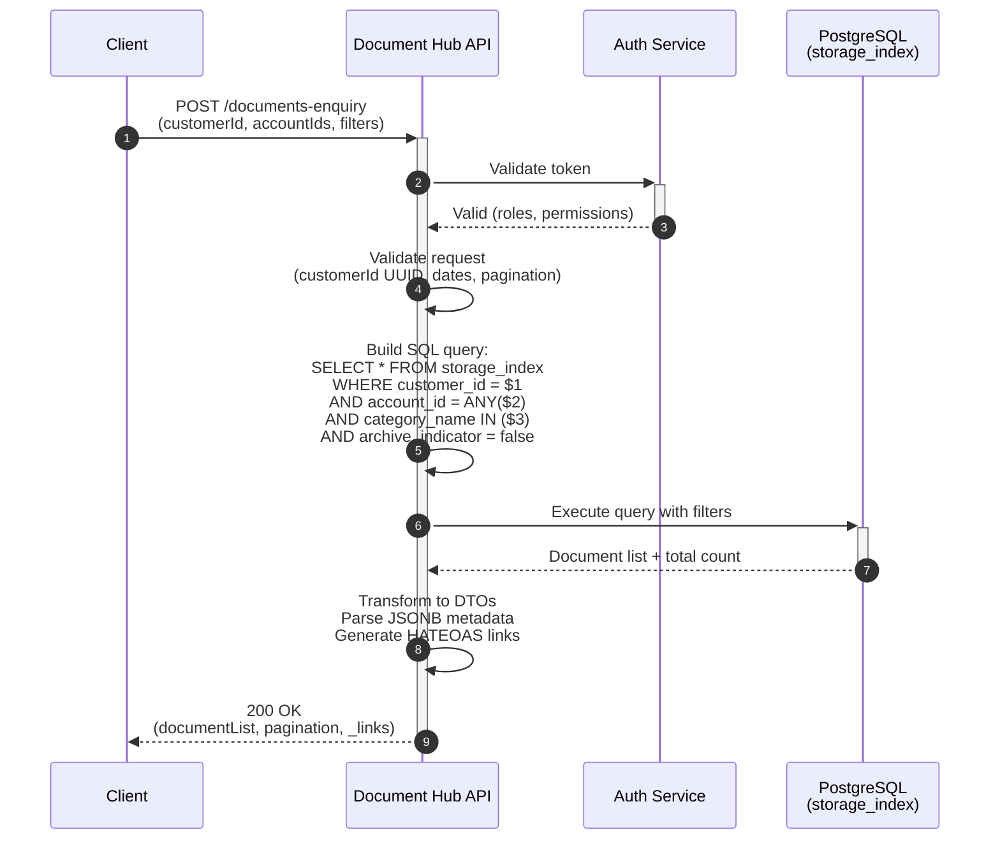
```mermaid
sequenceDiagram
    autonumber

    participant Client
    participant API as Document Hub API
    participant Auth as Auth Service
    participant DB as PostgreSQL<br/>(storage_index)

    Client->>+API: POST /documents-enquiry<br/>(customerId, accountIds, filters)
    API->>+Auth: Validate token
    Auth-->>-API: Valid (roles, permissions)

    API->>API: Validate request<br/>(customerId UUID, dates, pagination)

    API->>API: Build SQL query:<br/>SELECT * FROM storage_index<br/>WHERE customer_id = $1<br/>AND account_id = ANY($2)<br/>AND category_name IN ($3)<br/>AND archive_indicator = false

    API->>+DB: Execute query with filters
    DB-->>-API: Document list + total count

    API->>API: Transform to DTOs<br/>Parse JSONB metadata<br/>Generate HATEOAS links

    API-->>-Client: 200 OK<br/>(documentList, pagination, _links)
```

**Key Points:**
- **Zero-join** performance using denormalized storage_index table
- Filters: customer, accounts, categories, document types, date ranges
- JSONB metadata with GIN indexes
- Pagination with total count
- HATEOAS links for navigation

---

## 2. Document Upload API

**Endpoint:** `POST /documents`

**Purpose:** Upload document file with metadata to ECMS/S3 and create storage index entry

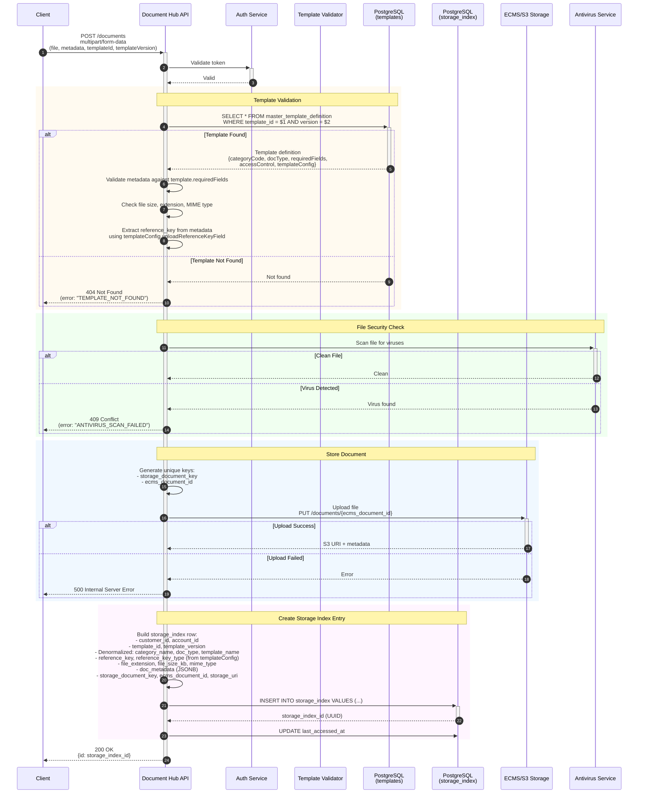
```mermaid
sequenceDiagram
    autonumber

    participant Client
    participant API as Document Hub API
    participant Auth as Auth Service
    participant Validator as Template Validator
    participant TemplateDB as PostgreSQL<br/>(templates)
    participant StorageDB as PostgreSQL<br/>(storage_index)
    participant ECMS as ECMS/S3 Storage
    participant Virus as Antivirus Service

    Client->>+API: POST /documents<br/>multipart/form-data<br/>(file, metadata, templateId, templateVersion)

    API->>+Auth: Validate token
    Auth-->>-API: Valid

    rect rgb(255, 250, 240)
        Note over API,TemplateDB: Template Validation
        API->>+TemplateDB: SELECT * FROM master_template_definition<br/>WHERE template_id = $1 AND version = $2

        alt Template Found
            TemplateDB-->>-API: Template definition<br/>{categoryCode, docType, requiredFields,<br/>accessControl, templateConfig}
            API->>API: Validate metadata against template.requiredFields
            API->>API: Check file size, extension, MIME type
            API->>API: Extract reference_key from metadata<br/>using templateConfig.uploadReferenceKeyField
        else Template Not Found
            TemplateDB-->>API: Not found
            API-->>Client: 404 Not Found<br/>(error: "TEMPLATE_NOT_FOUND")
        end
    end

    rect rgb(240, 255, 240)
        Note over API,Virus: File Security Check
        API->>+Virus: Scan file for viruses

        alt Clean File
            Virus-->>-API: Clean
        else Virus Detected
            Virus-->>API: Virus found
            API-->>Client: 409 Conflict<br/>(error: "ANTIVIRUS_SCAN_FAILED")
        end
    end

    rect rgb(240, 248, 255)
        Note over API,ECMS: Store Document
        API->>API: Generate unique keys:<br/>- storage_document_key<br/>- ecms_document_id

        API->>+ECMS: Upload file<br/>PUT /documents/{ecms_document_id}

        alt Upload Success
            ECMS-->>-API: S3 URI + metadata
        else Upload Failed
            ECMS-->>API: Error
            API-->>Client: 500 Internal Server Error
        end
    end

    rect rgb(255, 245, 255)
        Note over API,StorageDB: Create Storage Index Entry
        API->>API: Build storage_index row:<br/>- customer_id, account_id<br/>- template_id, template_version<br/>- Denormalized: category_name, doc_type, template_name<br/>- reference_key, reference_key_type (from templateConfig)<br/>- file_extension, file_size_kb, mime_type<br/>- doc_metadata (JSONB)<br/>- storage_document_key, ecms_document_id, storage_uri

        API->>+StorageDB: INSERT INTO storage_index VALUES (...)
        StorageDB-->>-API: storage_index_id (UUID)

        API->>StorageDB: UPDATE last_accessed_at
    end

    API-->>-Client: 200 OK<br/>{id: storage_index_id}
```

**Key Points:**
- **Multipart upload** with file and JSON metadata
- Template validation before upload
- Antivirus scanning (optional in current implementation)
- ECMS/S3 storage integration
- Denormalized storage_index for fast retrieval
- BOM preservation for text files

---

## 3. Document Download API

**Endpoint:** `GET /documents/{documentId}`

**Purpose:** Download document binary content from ECMS/S3 storage

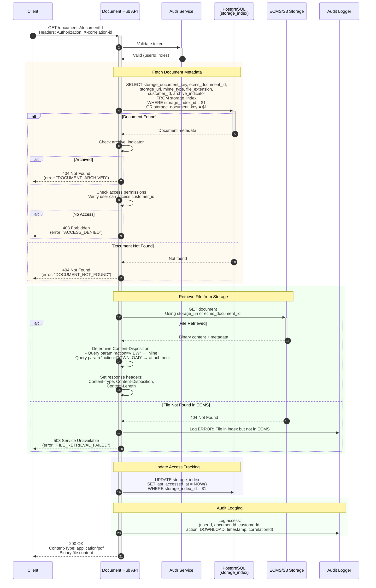
```mermaid
sequenceDiagram
    autonumber

    participant Client
    participant API as Document Hub API
    participant Auth as Auth Service
    participant DB as PostgreSQL<br/>(storage_index)
    participant ECMS as ECMS/S3 Storage
    participant Logger as Audit Logger

    Client->>+API: GET /documents/documentId<br/>Headers: Authorization, X-correlation-id

    API->>+Auth: Validate token
    Auth-->>-API: Valid (userId, roles)

    rect rgb(255, 250, 240)
        Note over API,DB: Fetch Document Metadata
        API->>+DB: SELECT storage_document_key, ecms_document_id,<br/>storage_uri, mime_type, file_extension,<br/>customer_id, archive_indicator<br/>FROM storage_index<br/>WHERE storage_index_id = $1<br/>OR storage_document_key = $1

        alt Document Found
            DB-->>-API: Document metadata

            API->>API: Check archive_indicator
            alt Archived
                API-->>Client: 404 Not Found<br/>(error: "DOCUMENT_ARCHIVED")
            end

            API->>API: Check access permissions<br/>Verify user can access customer_id
            alt No Access
                API-->>Client: 403 Forbidden<br/>(error: "ACCESS_DENIED")
            end
        else Document Not Found
            DB-->>API: Not found
            API-->>Client: 404 Not Found<br/>(error: "DOCUMENT_NOT_FOUND")
        end
    end

    rect rgb(240, 255, 240)
        Note over API,ECMS: Retrieve File from Storage
        API->>+ECMS: GET document<br/>Using storage_uri or ecms_document_id

        alt File Retrieved
            ECMS-->>-API: Binary content + metadata

            API->>API: Determine Content-Disposition:<br/>- Query param "action=VIEW" → inline<br/>- Query param "action=DOWNLOAD" → attachment

            API->>API: Set response headers:<br/>Content-Type, Content-Disposition,<br/>Content-Length

        else File Not Found in ECMS
            ECMS-->>API: 404 Not Found
            API->>Logger: Log ERROR: File in index but not in ECMS
            API-->>Client: 503 Service Unavailable<br/>(error: "FILE_RETRIEVAL_FAILED")
        end
    end

    rect rgb(245, 245, 255)
        Note over API,DB: Update Access Tracking
        API->>DB: UPDATE storage_index<br/>SET last_accessed_at = NOW()<br/>WHERE storage_index_id = $1
    end

    rect rgb(245, 255, 245)
        Note over API,Logger: Audit Logging
        API->>Logger: Log access:<br/>(userId, documentId, customerId,<br/>action: DOWNLOAD, timestamp, correlationId)
    end

    API-->>-Client: 200 OK<br/>Content-Type: application/pdf<br/>Binary file content
```

**Key Points:**
- Supports document ID or storage key lookup
- Access control validation
- Archive status check
- Two modes: VIEW (inline) vs DOWNLOAD (attachment)
- Access tracking and audit logging
- Handles missing files gracefully

---

## 4. Document Delete API

**Endpoint:** `DELETE /documents/{documentId}`

**Purpose:** Soft-delete document (set archive_indicator = true)

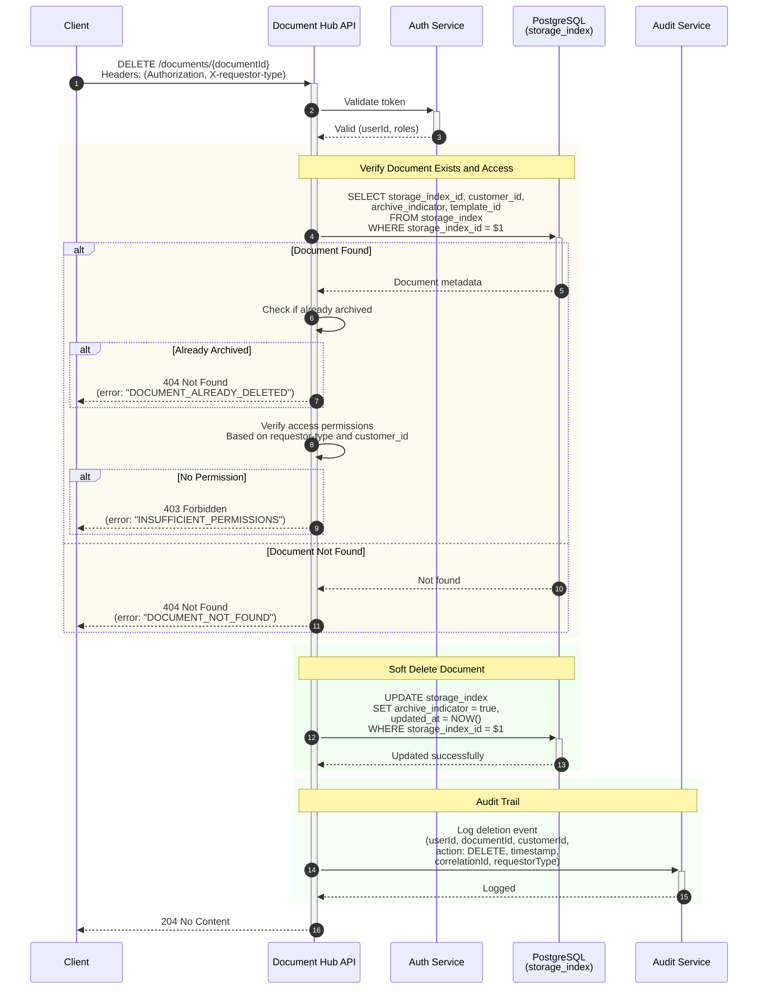
```mermaid
sequenceDiagram
    autonumber

    participant Client
    participant API as Document Hub API
    participant Auth as Auth Service
    participant DB as PostgreSQL<br/>(storage_index)
    participant AuditLog as Audit Service

    Client->>+API: DELETE /documents/{documentId}<br/>Headers: (Authorization, X-requestor-type)

    API->>+Auth: Validate token
    Auth-->>-API: Valid (userId, roles)

    rect rgb(255, 250, 240)
        Note over API,DB: Verify Document Exists and Access
        API->>+DB: SELECT storage_index_id, customer_id,<br/>archive_indicator, template_id<br/>FROM storage_index<br/>WHERE storage_index_id = $1

        alt Document Found
            DB-->>-API: Document metadata

            API->>API: Check if already archived
            alt Already Archived
                API-->>Client: 404 Not Found<br/>(error: "DOCUMENT_ALREADY_DELETED")
            end

            API->>API: Verify access permissions<br/>Based on requestor-type and customer_id
            alt No Permission
                API-->>Client: 403 Forbidden<br/>(error: "INSUFFICIENT_PERMISSIONS")
            end

        else Document Not Found
            DB-->>API: Not found
            API-->>Client: 404 Not Found<br/>(error: "DOCUMENT_NOT_FOUND")
        end
    end

    rect rgb(240, 255, 240)
        Note over API,DB: Soft Delete Document
        API->>+DB: UPDATE storage_index<br/>SET archive_indicator = true,<br/>    updated_at = NOW()<br/>WHERE storage_index_id = $1

        DB-->>-API: Updated successfully
    end

    rect rgb(245, 255, 245)
        Note over API,AuditLog: Audit Trail
        API->>+AuditLog: Log deletion event<br/>(userId, documentId, customerId,<br/>action: DELETE, timestamp,<br/>correlationId, requestorType)
        AuditLog-->>-API: Logged
    end

    API-->>-Client: 204 No Content
```

**Key Points:**
- **Soft delete** (archive_indicator = true)
- Not physically deleted from storage
- Access control based on requestor type
- Audit trail for compliance
- Idempotent (already deleted → 404)

---

## 5. Document Metadata API

**Endpoint:** `GET /documents/{documentId}/metadata`

**Purpose:** Retrieve document metadata without downloading file content

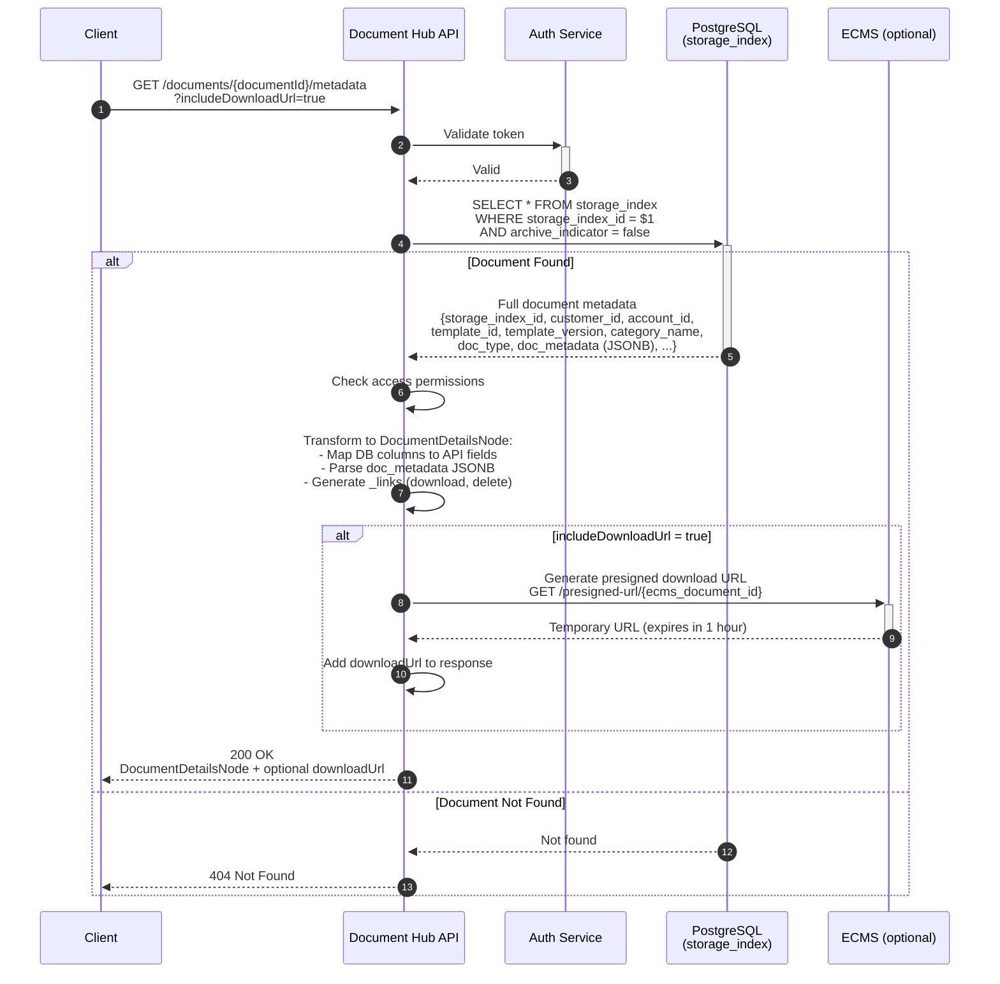
```mermaid
sequenceDiagram
    autonumber

    participant Client
    participant API as Document Hub API
    participant Auth as Auth Service
    participant DB as PostgreSQL<br/>(storage_index)
    participant ECMS as ECMS (optional)

    Client->>+API: GET /documents/{documentId}/metadata<br/>?includeDownloadUrl=true

    API->>+Auth: Validate token
    Auth-->>-API: Valid

    API->>+DB: SELECT * FROM storage_index<br/>WHERE storage_index_id = $1<br/>AND archive_indicator = false

    alt Document Found
        DB-->>-API: Full document metadata<br/>{storage_index_id, customer_id, account_id,<br/>template_id, template_version, category_name,<br/>doc_type, doc_metadata (JSONB), ...}

        API->>API: Check access permissions

        API->>API: Transform to DocumentDetailsNode:<br/>- Map DB columns to API fields<br/>- Parse doc_metadata JSONB<br/>- Generate _links (download, delete)

        alt includeDownloadUrl = true
            API->>+ECMS: Generate presigned download URL<br/>GET /presigned-url/{ecms_document_id}
            ECMS-->>-API: Temporary URL (expires in 1 hour)
            API->>API: Add downloadUrl to response
        end

        API-->>Client: 200 OK<br/>DocumentDetailsNode + optional downloadUrl

    else Document Not Found
        DB-->>API: Not found
        API-->>Client: 404 Not Found
    end
```

**Key Points:**
- Fast metadata retrieval (no file download)
- Optional presigned download URL generation
- JSONB metadata parsing
- HATEOAS links
- Zero-join query on storage_index

---

## 6. Template Management APIs

### 6.1. Create Template

**Endpoint:** `POST /templates`

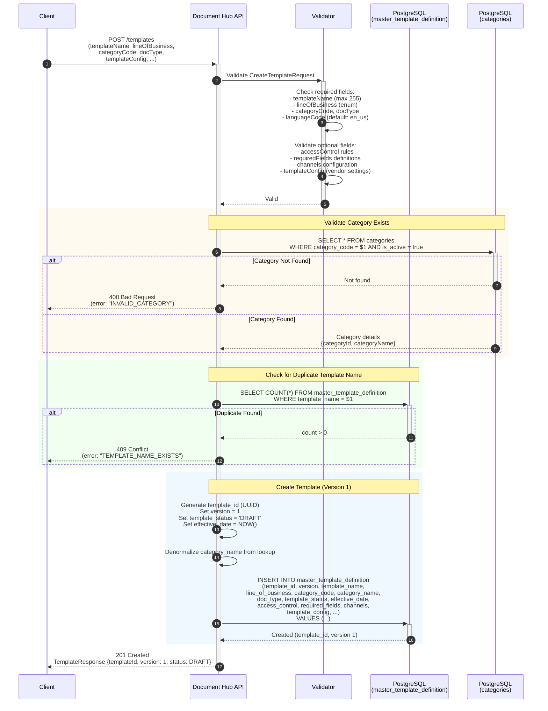
```mermaid
sequenceDiagram
    autonumber

    participant Client
    participant API as Document Hub API
    participant Validator
    participant TemplateDB as PostgreSQL<br/>(master_template_definition)
    participant CategoryDB as PostgreSQL<br/>(categories)

    Client->>+API: POST /templates<br/>(templateName, lineOfBusiness,<br/>categoryCode, docType,<br/>templateConfig, ...)

    API->>+Validator: Validate CreateTemplateRequest

    Validator->>Validator: Check required fields:<br/>- templateName (max 255)<br/>- lineOfBusiness (enum)<br/>- categoryCode, docType<br/>- languageCode (default: en_us)

    Validator->>Validator: Validate optional fields:<br/>- accessControl rules<br/>- requiredFields definitions<br/>- channels configuration<br/>- templateConfig (vendor settings)

    Validator-->>-API: Valid

    rect rgb(255, 250, 240)
        Note over API,CategoryDB: Validate Category Exists
        API->>+CategoryDB: SELECT * FROM categories<br/>WHERE category_code = $1 AND is_active = true

        alt Category Not Found
            CategoryDB-->>-API: Not found
            API-->>Client: 400 Bad Request<br/>(error: "INVALID_CATEGORY")
        else Category Found
            CategoryDB-->>API: Category details<br/>{categoryId, categoryName}
        end
    end

    rect rgb(240, 255, 240)
        Note over API,TemplateDB: Check for Duplicate Template Name
        API->>+TemplateDB: SELECT COUNT(*) FROM master_template_definition<br/>WHERE template_name = $1

        alt Duplicate Found
            TemplateDB-->>-API: count > 0
            API-->>Client: 409 Conflict<br/>(error: "TEMPLATE_NAME_EXISTS")
        end
    end

    rect rgb(240, 248, 255)
        Note over API,TemplateDB: Create Template (Version 1)
        API->>API: Generate template_id (UUID)<br/>Set version = 1<br/>Set template_status = 'DRAFT'<br/>Set effective_date = NOW()

        API->>API: Denormalize category_name from lookup

        API->>+TemplateDB: INSERT INTO master_template_definition<br/>(template_id, version, template_name,<br/>line_of_business, category_code, category_name,<br/>doc_type, template_status, effective_date,<br/>access_control, required_fields, channels,<br/>template_config, ...)<br/>VALUES (...)

        TemplateDB-->>-API: Created (template_id, version 1)
    end

    API-->>-Client: 201 Created<br/>TemplateResponse {templateId, version: 1, status: DRAFT}
```

### 6.2. List Templates

**Endpoint:** `GET /templates?lineOfBusiness=credit_card&status=APPROVED`

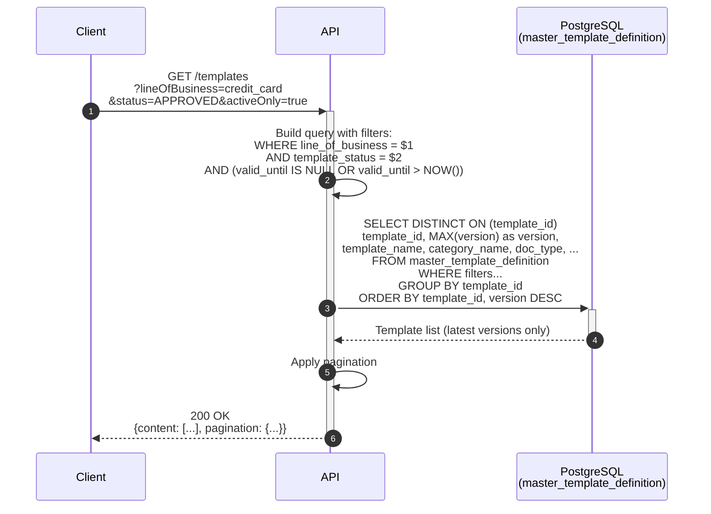
```mermaid
sequenceDiagram
    autonumber

    participant Client
    participant API
    participant DB as PostgreSQL<br/>(master_template_definition)

    Client->>+API: GET /templates<br/>?lineOfBusiness=credit_card<br/>&status=APPROVED&activeOnly=true

    API->>API: Build query with filters:<br/>WHERE line_of_business = $1<br/>AND template_status = $2<br/>AND (valid_until IS NULL OR valid_until > NOW())

    API->>+DB: SELECT DISTINCT ON (template_id)<br/>  template_id, MAX(version) as version,<br/>  template_name, category_name, doc_type, ...<br/>FROM master_template_definition<br/>WHERE filters...<br/>GROUP BY template_id<br/>ORDER BY template_id, version DESC

    DB-->>-API: Template list (latest versions only)

    API->>API: Apply pagination

    API-->>-Client: 200 OK<br/>{content: [...], pagination: {...}}
```

### 6.3. Create Template Version

**Endpoint:** `POST /templates/{templateId}/versions`

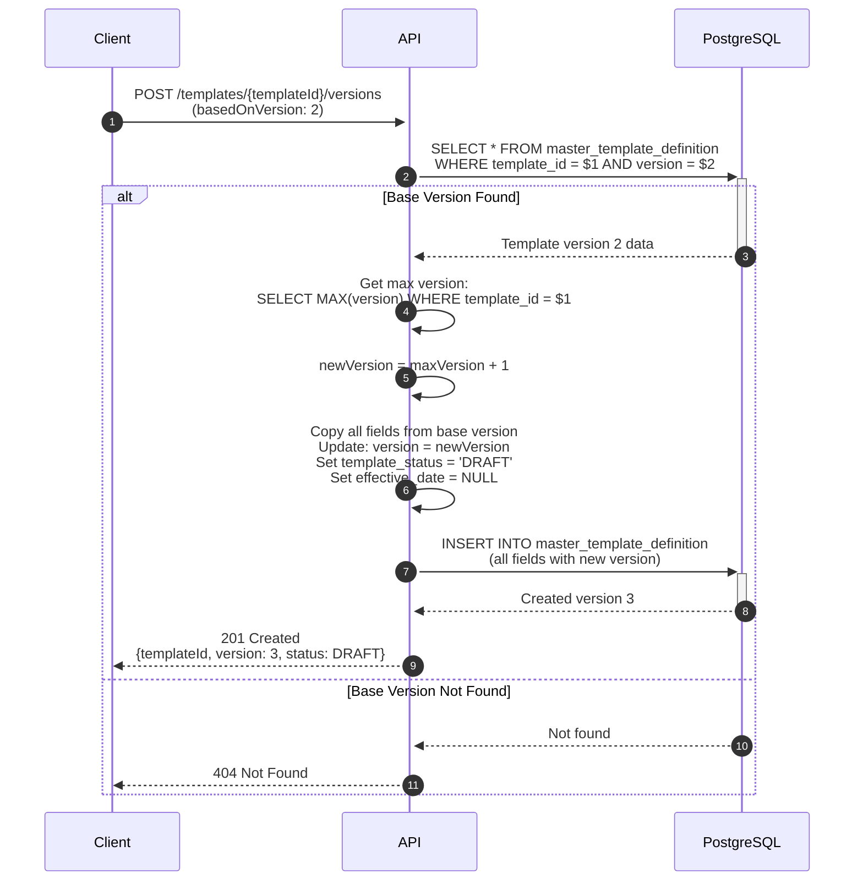
```mermaid
sequenceDiagram
    autonumber

    participant Client
    participant API
    participant DB as PostgreSQL

    Client->>+API: POST /templates/{templateId}/versions<br/>(basedOnVersion: 2)

    API->>+DB: SELECT * FROM master_template_definition<br/>WHERE template_id = $1 AND version = $2

    alt Base Version Found
        DB-->>-API: Template version 2 data

        API->>API: Get max version:<br/>SELECT MAX(version) WHERE template_id = $1
        API->>API: newVersion = maxVersion + 1

        API->>API: Copy all fields from base version<br/>Update: version = newVersion<br/>Set template_status = 'DRAFT'<br/>Set effective_date = NULL

        API->>+DB: INSERT INTO master_template_definition<br/>(all fields with new version)
        DB-->>-API: Created version 3

        API-->>Client: 201 Created<br/>{templateId, version: 3, status: DRAFT}

    else Base Version Not Found
        DB-->>API: Not found
        API-->>Client: 404 Not Found
    end
```

**Key Points - Templates:**
- **Composite primary key** (template_id, version)
- Version 1 created automatically on template creation
- New versions based on previous versions
- Status workflow: DRAFT → APPROVED → ARCHIVED
- Denormalized category_name for performance

---

## 7. Vendor Mapping APIs

### 7.1. Create Vendor Mapping

**Endpoint:** `POST /vendor-mappings`

**Purpose:** Map template to vendor (SMARTCOMM, ASSENTIS, etc.) with field definitions

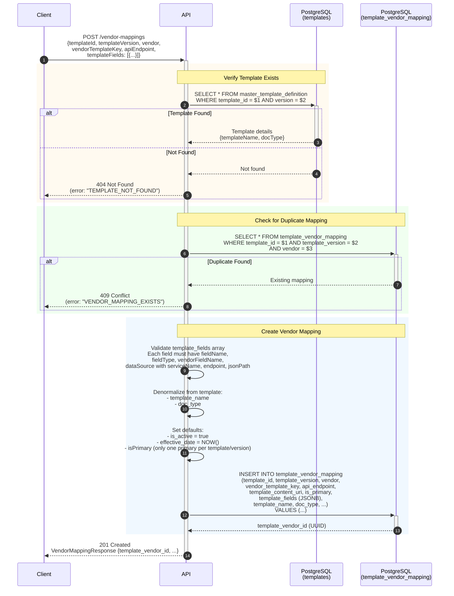
```mermaid
sequenceDiagram
    autonumber

    participant Client
    participant API
    participant TemplateDB as PostgreSQL<br/>(templates)
    participant VendorDB as PostgreSQL<br/>(template_vendor_mapping)

    Client->>+API: POST /vendor-mappings<br/>{templateId, templateVersion, vendor,<br/>vendorTemplateKey, apiEndpoint,<br/>templateFields: [{...}]}

    rect rgb(255, 250, 240)
        Note over API,TemplateDB: Verify Template Exists
        API->>+TemplateDB: SELECT * FROM master_template_definition<br/>WHERE template_id = $1 AND version = $2

        alt Template Found
            TemplateDB-->>-API: Template details<br/>{templateName, docType}
        else Not Found
            TemplateDB-->>API: Not found
            API-->>Client: 404 Not Found<br/>(error: "TEMPLATE_NOT_FOUND")
        end
    end

    rect rgb(240, 255, 240)
        Note over API,VendorDB: Check for Duplicate Mapping
        API->>+VendorDB: SELECT * FROM template_vendor_mapping<br/>WHERE template_id = $1 AND template_version = $2<br/>AND vendor = $3

        alt Duplicate Found
            VendorDB-->>-API: Existing mapping
            API-->>Client: 409 Conflict<br/>(error: "VENDOR_MAPPING_EXISTS")
        end
    end

    rect rgb(240, 248, 255)
        Note over API,VendorDB: Create Vendor Mapping
        API->>API: Validate template_fields array<br/>Each field must have fieldName,<br/>fieldType, vendorFieldName,<br/>dataSource with serviceName, endpoint, jsonPath

        API->>API: Denormalize from template:<br/>- template_name<br/>- doc_type

        API->>API: Set defaults:<br/>- is_active = true<br/>- effective_date = NOW()<br/>- isPrimary (only one primary per template/version)

        API->>+VendorDB: INSERT INTO template_vendor_mapping<br/>(template_id, template_version, vendor,<br/>vendor_template_key, api_endpoint,<br/>template_content_uri, is_primary,<br/>template_fields (JSONB),<br/>template_name, doc_type, ...)<br/>VALUES (...)

        VendorDB-->>-API: template_vendor_id (UUID)
    end

    API-->>-Client: 201 Created<br/>VendorMappingResponse {template_vendor_id, ...}
```

### 7.2. Get Primary Vendor Mapping

**Endpoint:** `GET /templates/{templateId}/versions/{version}/vendor-mappings/primary`

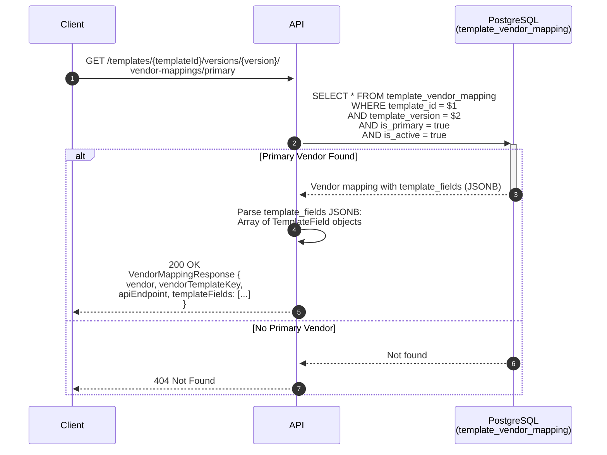
```mermaid
sequenceDiagram
    autonumber

    participant Client
    participant API
    participant DB as PostgreSQL<br/>(template_vendor_mapping)

    Client->>+API: GET /templates/{templateId}/versions/{version}/<br/>vendor-mappings/primary

    API->>+DB: SELECT * FROM template_vendor_mapping<br/>WHERE template_id = $1<br/>AND template_version = $2<br/>AND is_primary = true<br/>AND is_active = true

    alt Primary Vendor Found
        DB-->>-API: Vendor mapping with template_fields (JSONB)

        API->>API: Parse template_fields JSONB:<br/>Array of TemplateField objects

        API-->>Client: 200 OK<br/>VendorMappingResponse {<br/>  vendor, vendorTemplateKey,<br/>  apiEndpoint, templateFields: [...]<br/>}

    else No Primary Vendor
        DB-->>API: Not found
        API-->>Client: 404 Not Found
    end
```

**Key Points - Vendor Mapping:**
- One primary vendor per template version
- template_fields stored as JSONB array
- Denormalized template_name and doc_type
- Supports multiple vendors (SMARTCOMM, ASSENTIS, HANDLEBAR, CUSTOM)

---

## 8. Template Fields & Data Sources APIs

### 8.1. Get Template Fields

**Endpoint:** `GET /templates/{templateId}/versions/{version}/fields`

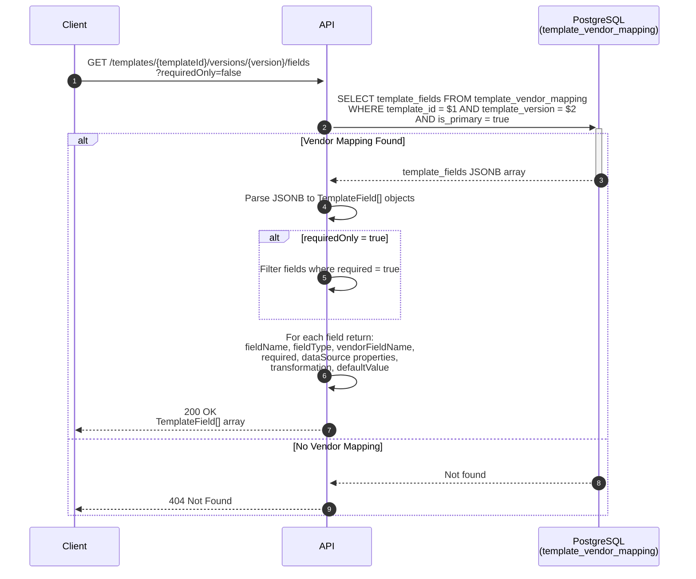
```mermaid
sequenceDiagram
    autonumber

    participant Client
    participant API
    participant DB as PostgreSQL<br/>(template_vendor_mapping)

    Client->>+API: GET /templates/{templateId}/versions/{version}/fields<br/>?requiredOnly=false

    API->>+DB: SELECT template_fields FROM template_vendor_mapping<br/>WHERE template_id = $1 AND template_version = $2<br/>AND is_primary = true

    alt Vendor Mapping Found
        DB-->>-API: template_fields JSONB array

        API->>API: Parse JSONB to TemplateField[] objects

        alt requiredOnly = true
            API->>API: Filter fields where required = true
        end

        API->>API: For each field return:<br/>fieldName, fieldType, vendorFieldName,<br/>required, dataSource properties,<br/>transformation, defaultValue

        API-->>Client: 200 OK<br/>TemplateField[] array

    else No Vendor Mapping
        DB-->>API: Not found
        API-->>Client: 404 Not Found
    end
```

### 8.2. Get Fields Grouped by Service

**Endpoint:** `GET /templates/{templateId}/versions/{version}/fields/by-service`

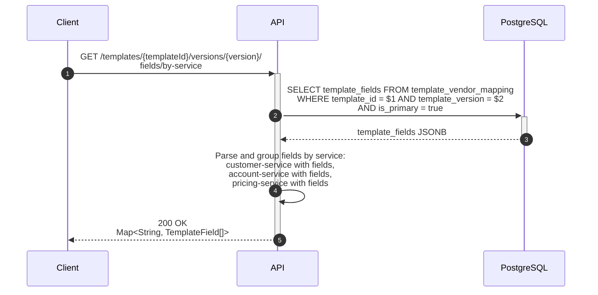
```mermaid
sequenceDiagram
    autonumber

    participant Client
    participant API
    participant DB as PostgreSQL

    Client->>+API: GET /templates/{templateId}/versions/{version}/<br/>fields/by-service

    API->>+DB: SELECT template_fields FROM template_vendor_mapping<br/>WHERE template_id = $1 AND template_version = $2<br/>AND is_primary = true

    DB-->>-API: template_fields JSONB

    API->>API: Parse and group fields by service:<br/>customer-service with fields,<br/>account-service with fields,<br/>pricing-service with fields

    API-->>-Client: 200 OK<br/>Map<String, TemplateField[]>
```

### 8.3. Get Data Sources

**Endpoint:** `GET /templates/{templateId}/versions/{version}/data-sources`

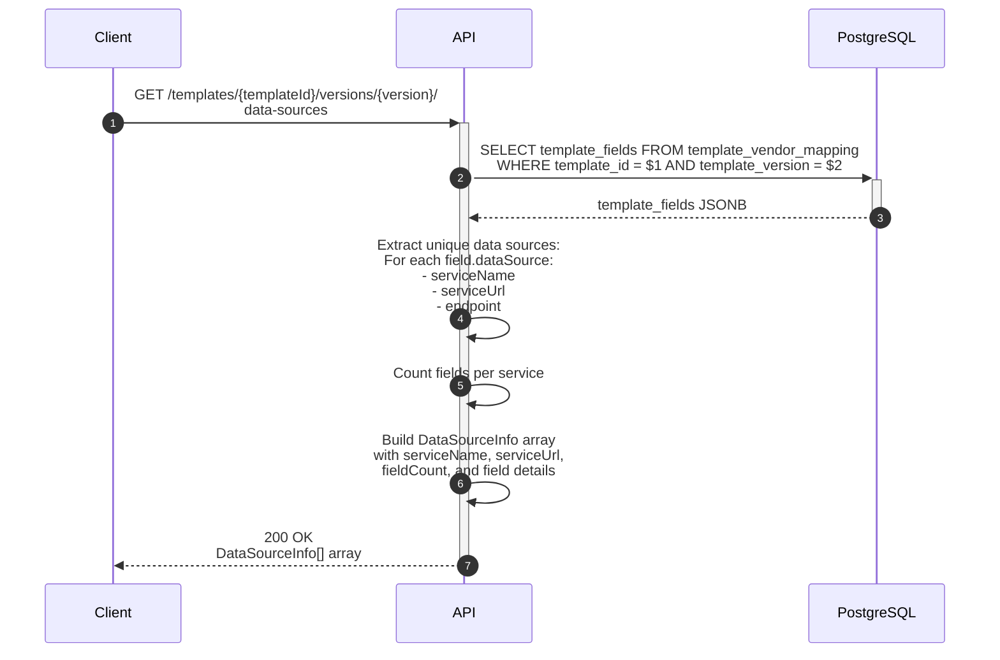
```mermaid
sequenceDiagram
    autonumber

    participant Client
    participant API
    participant DB as PostgreSQL

    Client->>+API: GET /templates/{templateId}/versions/{version}/<br/>data-sources

    API->>+DB: SELECT template_fields FROM template_vendor_mapping<br/>WHERE template_id = $1 AND template_version = $2

    DB-->>-API: template_fields JSONB

    API->>API: Extract unique data sources:<br/>For each field.dataSource:<br/>- serviceName<br/>- serviceUrl<br/>- endpoint

    API->>API: Count fields per service

    API->>API: Build DataSourceInfo array<br/>with serviceName, serviceUrl,<br/>fieldCount, and field details

    API-->>-Client: 200 OK<br/>DataSourceInfo[] array
```

**Key Points - Template Fields:**
- Fields stored in JSONB within template_vendor_mapping
- Each field has its own data source configuration
- Supports grouping by service for optimization
- Data source includes retry, cache, and fallback config

---

## 9. Document Generation with Multi-Service Data Aggregation

**Purpose:** Generate document by calling multiple services to fetch data based on template field definitions

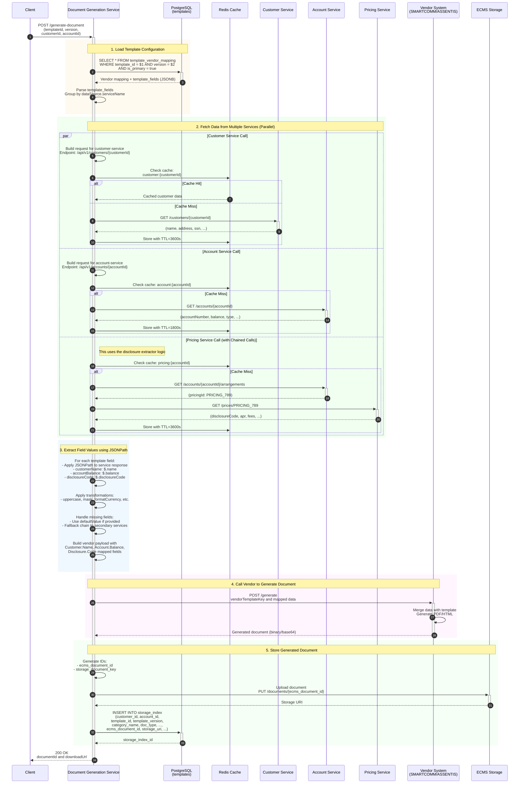
```mermaid
sequenceDiagram
    autonumber

    participant Client
    participant DocGen as Document Generation Service
    participant TemplateDB as PostgreSQL<br/>(templates)
    participant Cache as Redis Cache
    participant CustomerAPI as Customer Service
    participant AccountAPI as Account Service
    participant PricingAPI as Pricing Service
    participant Vendor as Vendor System<br/>(SMARTCOMM/ASSENTIS)
    participant ECMS as ECMS Storage

    Client->>+DocGen: POST /generate-document<br/>(templateId, version,<br/>customerId, accountId)

    rect rgb(255, 250, 240)
        Note over DocGen,TemplateDB: 1. Load Template Configuration
        DocGen->>+TemplateDB: SELECT * FROM template_vendor_mapping<br/>WHERE template_id = $1 AND version = $2<br/>AND is_primary = true

        TemplateDB-->>-DocGen: Vendor mapping + template_fields (JSONB)

        DocGen->>DocGen: Parse template_fields<br/>Group by dataSource.serviceName
    end

    rect rgb(240, 255, 240)
        Note over DocGen,PricingAPI: 2. Fetch Data from Multiple Services (Parallel)

        par Customer Service Call
            DocGen->>DocGen: Build request for customer-service<br/>Endpoint: /api/v1/customers/{customerId}

            DocGen->>Cache: Check cache:<br/>customer:{customerId}
            alt Cache Hit
                Cache-->>DocGen: Cached customer data
            else Cache Miss
                DocGen->>+CustomerAPI: GET /customers/{customerId}
                CustomerAPI-->>-DocGen: (name, address, ssn, ...)
                DocGen->>Cache: Store with TTL=3600s
            end

        and Account Service Call
            DocGen->>DocGen: Build request for account-service<br/>Endpoint: /api/v1/accounts/{accountId}

            DocGen->>Cache: Check cache: account:{accountId}
            alt Cache Miss
                DocGen->>+AccountAPI: GET /accounts/{accountId}
                AccountAPI-->>-DocGen: (accountNumber, balance, type, ...)
                DocGen->>Cache: Store with TTL=1800s
            end

        and Pricing Service Call (with Chained Calls)
            Note right of DocGen: This uses the disclosure extractor logic

            DocGen->>Cache: Check cache: pricing:{accountId}
            alt Cache Miss
                DocGen->>+AccountAPI: GET /accounts/{accountId}/arrangements
                AccountAPI-->>-DocGen: (pricingId: PRICING_789)

                DocGen->>+PricingAPI: GET /prices/PRICING_789
                PricingAPI-->>-DocGen: (disclosureCode, apr, fees, ...)
                DocGen->>Cache: Store with TTL=3600s
            end
        end
    end

    rect rgb(240, 248, 255)
        Note over DocGen,DocGen: 3. Extract Field Values using JSONPath
        DocGen->>DocGen: For each template field:<br/>- Apply JSONPath to service response<br/>- customerName: $.name<br/>- accountBalance: $.balance<br/>- disclosureCode: $.disclosureCode

        DocGen->>DocGen: Apply transformations:<br/>- uppercase, mask, formatCurrency, etc.

        DocGen->>DocGen: Handle missing fields:<br/>- Use defaultValue if provided<br/>- Fallback chain to secondary services

        DocGen->>DocGen: Build vendor payload with<br/>Customer.Name, Account.Balance,<br/>Disclosure.Code mapped fields
    end

    rect rgb(255, 245, 255)
        Note over DocGen,Vendor: 4. Call Vendor to Generate Document
        DocGen->>+Vendor: POST /generate<br/>vendorTemplateKey and mapped data

        Vendor->>Vendor: Merge data with template<br/>Generate PDF/HTML

        Vendor-->>-DocGen: Generated document (binary/base64)
    end

    rect rgb(245, 255, 245)
        Note over DocGen,ECMS: 5. Store Generated Document
        DocGen->>DocGen: Generate IDs:<br/>- ecms_document_id<br/>- storage_document_key

        DocGen->>+ECMS: Upload document<br/>PUT /documents/{ecms_document_id}
        ECMS-->>-DocGen: Storage URI

        DocGen->>+TemplateDB: INSERT INTO storage_index<br/>(customer_id, account_id,<br/>template_id, template_version,<br/>category_name, doc_type, ...,<br/>ecms_document_id, storage_uri, ...)

        TemplateDB-->>-DocGen: storage_index_id
    end

    DocGen-->>-Client: 200 OK<br/>documentId and downloadUrl
```

**Key Points - Document Generation:**
- **Multi-service orchestration** based on template field definitions
- **Parallel API calls** for performance
- **Redis caching** to reduce redundant service calls
- **JSONPath extraction** from service responses
- **Data transformations** applied per field
- **Fallback chains** for resilience
- **Vendor abstraction** - works with SMARTCOMM, ASSENTIS, HANDLEBAR
- **Automatic storage indexing** with denormalized metadata

---

## Summary

This comprehensive set of sequence diagrams covers:

1. ✅ **Document Retrieval** - Zero-join queries with denormalized storage_index
2. ✅ **Document Upload** - Template validation, antivirus, ECMS storage
3. ✅ **Document Download** - Access control, presigned URLs, audit logging
4. ✅ **Document Delete** - Soft delete with audit trail
5. ✅ **Document Metadata** - Fast metadata-only retrieval
6. ✅ **Template Management** - Versioning with composite keys
7. ✅ **Vendor Mapping** - Multi-vendor support with field definitions
8. ✅ **Template Fields** - Data source configuration in JSONB
9. ✅ **Document Generation** - Multi-service data aggregation

### Architecture Highlights

- **Denormalization** for read performance (storage_index)
- **Composite keys** for template versioning (template_id + version)
- **JSONB** for flexible metadata and field definitions
- **Multi-vendor** support through abstraction layer
- **Caching** at multiple levels (Redis for API responses)
- **Parallel processing** for multi-service data aggregation
- **Audit logging** for compliance
- **Access control** at document and template levels

### Performance Optimizations

- Zero-join queries (denormalized tables)
- GIN indexes on JSONB columns
- Redis caching with configurable TTL
- Parallel API calls during document generation
- Presigned URLs to offload downloads to S3/ECMS
- Pagination for large result sets

### Security Features

- JWT authentication on all endpoints
- Role-based access control (RBAC)
- Row-level security based on customer ownership
- Audit logging for all operations
- Soft deletes (never lose audit trail)
- Antivirus scanning on uploads
