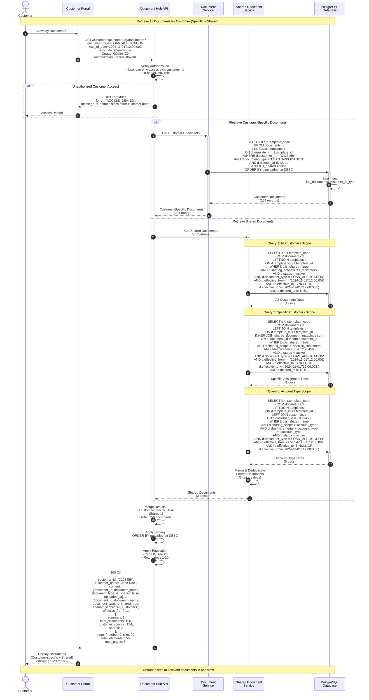
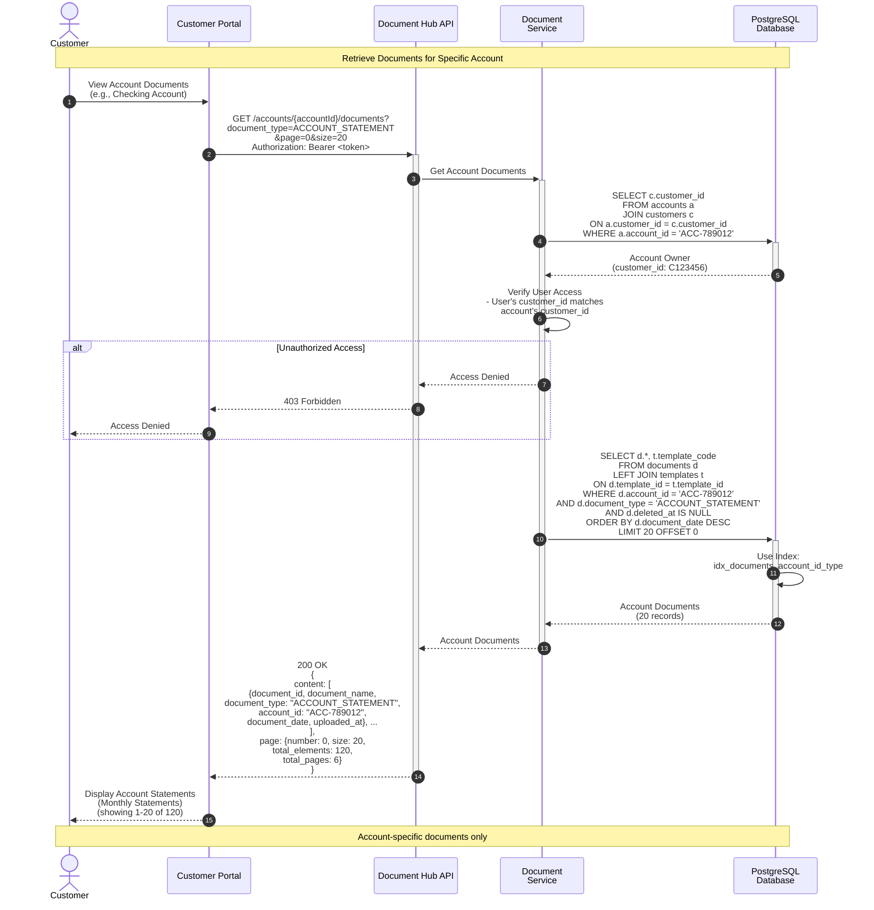

# Customer Document Retrieval Flow - Sequence Diagram

**Note:** Authentication is handled by the API Gateway before requests reach the API.

This sequence diagram illustrates how the Document Hub API retrieves all documents for a specific customer, combining both customer-specific documents and shared documents with timeline-based filtering.

## Mermaid Sequence Diagram - Customer Documents Retrieval



## Mermaid Sequence Diagram - Account Documents Retrieval



## Flow Descriptions

### Customer Documents Retrieval Flow

1. **Authorization** (Step 1)
   - Customer requests their documents via portal
   - API Gateway validates JWT token before request reaches API
   - Verify user can only access own customer data
   - Admins can access any customer's documents
   - If unauthorized → 403 Forbidden

2. **Parallel Document Retrieval** (Steps 2-17)

   **Customer-Specific Documents (Steps 3-6):**
   - Query documents table for customer_id match
   - Filter by document_type if specified
   - Exclude deleted documents
   - Exclude shared documents (is_shared = false)
   - Use optimized index on (customer_id, document_type)

   **Shared Documents - Multiple Queries (Steps 7-17):**

   - **Query 1: All Customers Scope** (Steps 9-11)
     - Documents with `sharing_scope='all_customers'`
     - Check effective date range (effective_from, effective_to)
     - Match document_type filter
     - Active status only

   - **Query 2: Specific Customers** (Steps 13-15)
     - Documents with `sharing_scope='specific_customers'`
     - JOIN with `shared_document_mappings` table
     - Check customer_id assignment
     - Check effective date range

   - **Query 3: Account Type Scope** (Steps 16-17)
     - Documents with `sharing_scope='account_type'`
     - Match customer's account type
     - Check effective date range

   - **Merge and Deduplicate** (Step 18)
     - Combine results from all shared document queries
     - Remove duplicates
     - Total shared documents found

3. **Result Aggregation** (Steps 19-21)
   - Merge customer-specific and shared documents
   - Calculate totals (customer_specific: 154, shared: 2)
   - Apply global sorting (uploaded_at DESC)
   - Apply pagination (page 0, size 20)

4. **Response** (Steps 22-23)
   - Return paginated results
   - Include summary statistics
   - Mark documents as shared or customer-specific
   - Display to customer

### Account Documents Retrieval Flow

1. **Document Access** (Steps 1-2)
   - Customer requests documents for specific account
   - API Gateway validates JWT token before request reaches API

2. **Account Ownership Verification** (Steps 3-5)
   - Lookup account owner (customer_id)
   - Verify requesting user owns the account
   - If not owner and not admin → 403 Forbidden

3. **Document Query** (Steps 6-8)
   - Query documents by account_id
   - Filter by document_type if specified
   - Use account_id index for performance
   - Sort by document_date (most recent first)

4. **Response** (Steps 9-11)
   - Return account-specific documents
   - Paginated results
   - Display to customer

## API Endpoint Details

### Get Customer Documents

```
GET /api/v1/customers/{customerId}/documents?document_type=LOAN_APPLICATION&as_of_date=2024-11-01T12:00:00Z&include_shared=true&page=0&size=20
Authorization: Bearer <token>
```

**Query Parameters:**
- `document_type` - Filter by type (optional)
- `document_category` - Filter by category (optional)
- `as_of_date` - Timeline query: documents effective at this date (ISO 8601)
- `include_shared` - Include shared documents (default: true)
- `page` - Page number (default: 0)
- `size` - Page size (default: 20, max: 100)

**Success Response (200 OK):**
```json
{
  "customer_id": "C123456",
  "customer_name": "John Doe",
  "content": [
    {
      "document_id": "bb0e8400-e29b-41d4-a716-446655440020",
      "document_name": "Loan Application - John Doe",
      "document_type": "LOAN_APPLICATION",
      "is_shared": false,
      "file_extension": "pdf",
      "document_date": "2024-11-01",
      "uploaded_at": "2024-11-01T12:00:00Z"
    },
    {
      "document_id": "cc0e8400-e29b-41d4-a716-446655440030",
      "document_name": "Privacy Policy 2024",
      "document_type": "PRIVACY_POLICY",
      "is_shared": true,
      "sharing_scope": "all_customers",
      "effective_from": "2024-01-01T00:00:00Z",
      "effective_to": null,
      "uploaded_at": "2024-01-01T10:00:00Z"
    }
  ],
  "summary": {
    "total_documents": 156,
    "customer_specific": 154,
    "shared": 2
  },
  "page": {
    "number": 0,
    "size": 20,
    "total_elements": 156,
    "total_pages": 8
  }
}
```

### Get Account Documents

```
GET /api/v1/accounts/{accountId}/documents?document_type=ACCOUNT_STATEMENT&page=0&size=20
Authorization: Bearer <token>
```

**Success Response (200 OK):**
```json
{
  "content": [
    {
      "document_id": "dd0e8400-e29b-41d4-a716-446655440040",
      "document_name": "October 2024 Statement",
      "document_type": "ACCOUNT_STATEMENT",
      "account_id": "ACC-789012",
      "document_date": "2024-10-31",
      "uploaded_at": "2024-11-01T00:00:00Z"
    }
  ],
  "page": {
    "number": 0,
    "size": 20,
    "total_elements": 120,
    "total_pages": 6
  }
}
```

## Sharing Scopes Explained

### 1. All Customers (`all_customers`)
- **Use Case**: Company-wide documents (policies, terms, regulatory notices)
- **Query**: Simple filter on `sharing_scope='all_customers'`
- **Example**: Privacy Policy 2024, Terms of Service

### 2. Specific Customers (`specific_customers`)
- **Use Case**: Targeted documents for select customers
- **Query**: JOIN with `shared_document_mappings` table
- **Example**: Special promotion for high-value customers, regional notices

### 3. Account Type (`account_type`)
- **Use Case**: Documents for customers with specific account types
- **Query**: Match customer's account_type with document criteria
- **Example**: Savings Account Guidelines, Premium Account Benefits

### 4. Customer Segment (`customer_segment`)
- **Use Case**: Documents for customer segments (VIP, Standard, etc.)
- **Query**: Match customer's segment with document criteria
- **Example**: VIP Lounge Access, Loyalty Program Details

## Timeline-Based Retrieval

### The `as_of_date` Parameter

When querying with `as_of_date`, the system returns documents that were effective at that specific point in time.

**Example Scenarios:**

1. **Current Documents** (as_of_date = now)
   ```sql
   effective_from <= NOW()
   AND (effective_to IS NULL OR effective_to >= NOW())
   ```
   Returns: All currently active shared documents

2. **Historical Documents** (as_of_date = 2023-01-01)
   ```sql
   effective_from <= '2023-01-01'
   AND (effective_to IS NULL OR effective_to >= '2023-01-01')
   ```
   Returns: Documents that were active on Jan 1, 2023

3. **Future Documents** (as_of_date = 2025-01-01)
   ```sql
   effective_from <= '2025-01-01'
   AND (effective_to IS NULL OR effective_to >= '2025-01-01')
   ```
   Returns: Documents that will be active on Jan 1, 2025

### Use Cases
- **Compliance Audits**: "What documents did customer see on date X?"
- **Historical Research**: "What policies were in effect last year?"
- **Customer Support**: "Show customer documents as they appeared in the past"

## Performance Optimizations

### Database Indexes
```sql
-- Customer-specific documents
CREATE INDEX idx_documents_customer_id_type
ON documents(customer_id, document_type, uploaded_at DESC);

-- Account documents
CREATE INDEX idx_documents_account_id_type
ON documents(account_id, document_type, document_date DESC);

-- Shared documents - all customers
CREATE INDEX idx_documents_shared_all
ON documents(is_shared, sharing_scope, effective_from, effective_to)
WHERE is_shared = true AND sharing_scope = 'all_customers';

-- Shared document assignments
CREATE INDEX idx_shared_mappings_customer
ON shared_document_mappings(customer_id, document_id);

-- Effective date range (for timeline queries)
CREATE INDEX idx_documents_effective_dates
ON documents(effective_from, effective_to, status)
WHERE is_shared = true;
```

### Query Performance Targets
- **Customer documents query**: <50ms
- **Shared documents query**: <100ms (3 queries in parallel)
- **Total response time**: <200ms
- **With pagination**: <100ms for subsequent pages

### Caching Strategy
- Cache customer document counts
- Cache shared document lists (15 min TTL)
- Invalidate on document create/update/delete

## Security & Access Control

### Customer Data Isolation
```javascript
// Verify user can only access own customer data
if (user.customer_id !== requestedCustomerId && !user.hasRole('ADMIN')) {
  throw new AccessDeniedException("Cannot access other customer data");
}
```

### Confidential Documents
- Filter out confidential documents unless user has permission
- Check `is_confidential` flag
- Verify `access_level` (CUSTOMER_ONLY, INTERNAL, PUBLIC)

### Shared Document Visibility
- Respect effective date ranges
- Check sharing scope assignments
- Verify document status (active only)

## Error Scenarios

| Scenario | HTTP Status | Error Code | Action |
|----------|-------------|------------|--------|
| Authentication (401 Unauthorized) | 401 | UNAUTHORIZED | Handled by API Gateway; not shown in this diagram |
| Unauthorized customer access | 403 | ACCESS_DENIED | Users can only access own data |
| Customer not found | 404 | CUSTOMER_NOT_FOUND | Check customer ID |
| Account not found | 404 | ACCOUNT_NOT_FOUND | Check account ID |
| Account not owned | 403 | ACCOUNT_ACCESS_DENIED | User doesn't own account |
| Invalid date format | 400 | INVALID_DATE_FORMAT | Use ISO 8601 format |

## Best Practices

1. **Always Include Shared Documents**
   - Set `include_shared=true` by default
   - Customers expect to see all relevant documents
   - Important for compliance (regulatory notices)

2. **Use Timeline Queries for Audits**
   - Implement `as_of_date` for compliance
   - Essential for historical research
   - Required for regulatory audits

3. **Optimize for Common Queries**
   - Most queries are for current customer viewing all documents
   - Index accordingly
   - Cache customer document counts

4. **Clear Visual Distinction**
   - Mark shared documents clearly in UI
   - Show effective dates for shared documents
   - Indicate source (company-wide vs. specific assignment)

5. **Efficient Pagination**
   - Don't query all documents to count them
   - Use COUNT(*) in parallel with data query
   - Cache total counts when possible
