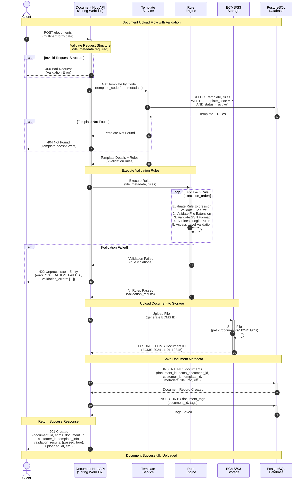

# Document Upload Flow - Sequence Diagram

This sequence diagram illustrates the complete document upload flow in the Document Hub API, including validation, rule execution, and storage. Authentication is handled by the API Gateway before requests reach the API.

## Mermaid Sequence Diagram



## Flow Description

### Steps Breakdown

1. **Request Initiation** (Step 1)
   - Client sends POST request with multipart form data (file + metadata JSON)
   - Authentication handled by API Gateway (not shown in diagram)

2. **Request Validation** (Step 2)
   - API validates request structure
   - Checks file and metadata are present
   - If invalid → 400 Bad Request

3. **Template Retrieval** (Steps 3-5)
   - API fetches template by `template_code` from metadata
   - Retrieves active template version with associated rules
   - If template not found → 404 Not Found

4. **Rule Execution** (Steps 6-8)
   - Rule Engine executes validation rules in order:
     1. **File Size Validation**: `file_size_bytes <= 10485760` (10 MB)
     2. **File Extension Validation**: `file_extension IN ('pdf', 'docx')`
     3. **SSN Format Validation**: `REGEX_MATCH(metadata.ssn, '^\\d{3}-\\d{2}-\\d{4}$')`
     4. **Business Logic Rules**: Custom validation based on document type
     5. **Access Level Validation**: Verify user permissions
   - If any rule fails → 422 Unprocessable Entity with validation errors

5. **File Storage** (Steps 9-10)
   - Upload file to ECMS/S3 storage
   - Generate unique ECMS Document ID (e.g., `ECMS-2024-11-01-12345`)
   - Store file in organized path structure

6. **Metadata Storage** (Steps 11-13)
   - Insert document record into PostgreSQL database
   - Store all metadata (customer_id, template_id, file info, custom metadata)
   - Store document tags in separate table

7. **Success Response** (Step 14)
   - Return 201 Created with complete document details
   - Include validation results, document IDs, timestamps

### Alternative Flows

| Condition | HTTP Status | Response |
|-----------|-------------|----------|
| Missing file/metadata | 400 Bad Request | `{error: "VALIDATION_ERROR"}` |
| Template not found | 404 Not Found | `{error: "TEMPLATE_NOT_FOUND"}` |
| Rule validation failed | 422 Unprocessable Entity | `{error: "VALIDATION_FAILED", validation_errors: [...]}` |
| File upload error | 500 Internal Server Error | `{error: "INTERNAL_ERROR"}` |

**Note:** Authentication (401 Unauthorized) is handled by the API Gateway and not shown in this diagram.

## Key Components

### 1. Document Hub API (Spring WebFlux)
- Reactive, non-blocking API built with Spring WebFlux
- Handles multipart file uploads
- Orchestrates the entire upload workflow

### 2. Template Service
- Manages templates and their versions
- Retrieves active templates with business rules
- Supports template versioning

### 3. Rule Engine
- Executes validation rules in specified order
- Supports multiple rule types (validation, transformation, business logic)
- Returns detailed error messages on failure

### 4. ECMS/S3 Storage
- Stores actual document files
- Generates unique ECMS document IDs
- Provides file URLs for retrieval

### 5. PostgreSQL Database
- Stores document metadata
- Indexes for fast query performance (<100ms)
- Supports customer-specific and shared documents

## API Endpoint Details

```
POST /api/v1/documents
Content-Type: multipart/form-data
Authorization: Bearer <JWT_TOKEN>

Form Data:
- file: (binary)
- metadata: (JSON)
  {
    "customer_id": "C123456",
    "customer_name": "John Doe",
    "account_id": "ACC-789012",
    "document_name": "Loan Application - John Doe",
    "document_type": "LOAN_APPLICATION",
    "template_code": "LOAN_APPLICATION",
    "is_confidential": true,
    "tags": ["urgent", "new-customer"],
    "metadata": {
      "loan_amount": 50000,
      "ssn": "123-45-6789"
    }
  }
```

### Success Response (201 Created)
```json
{
  "document_id": "bb0e8400-e29b-41d4-a716-446655440020",
  "ecms_document_id": "ECMS-2024-11-01-12345",
  "customer_id": "C123456",
  "document_name": "Loan Application - John Doe",
  "template_id": "550e8400-e29b-41d4-a716-446655440000",
  "template_version": 3,
  "file_extension": "pdf",
  "file_size_bytes": 1048576,
  "status": "active",
  "validation_results": {
    "passed": true,
    "rules_executed": 5,
    "warnings": []
  },
  "uploaded_at": "2024-11-01T12:00:00Z"
}
```

### Error Response (422 Unprocessable Entity)
```json
{
  "error": "VALIDATION_FAILED",
  "message": "Document validation failed",
  "validation_errors": [
    {
      "rule_name": "Validate File Size",
      "rule_type": "validation",
      "severity": "error",
      "message": "File size must not exceed 10 MB",
      "actual_value": "15728640 bytes"
    }
  ]
}
```

## Performance Characteristics

- **Target Response Time**: < 2 seconds for document upload
- **Rule Execution**: < 100ms for all validation rules
- **Database Query**: < 50ms for template retrieval
- **File Upload**: Varies based on file size and network speed

## Related Flows

1. **Document Retrieval Flow**: Get document download URL
2. **Customer Documents Flow**: Retrieve all documents for a customer
3. **Shared Document Assignment**: Assign shared documents to customers
4. **Template Publishing Flow**: Create and publish new template versions
