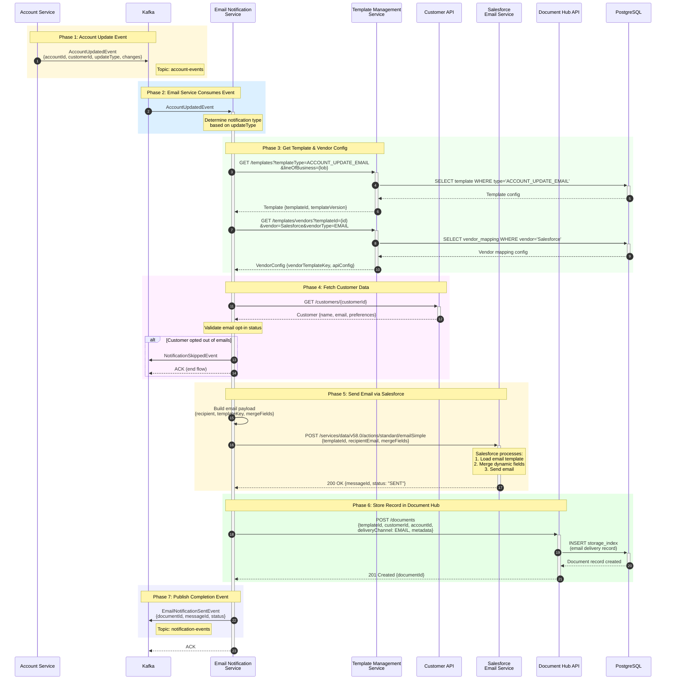
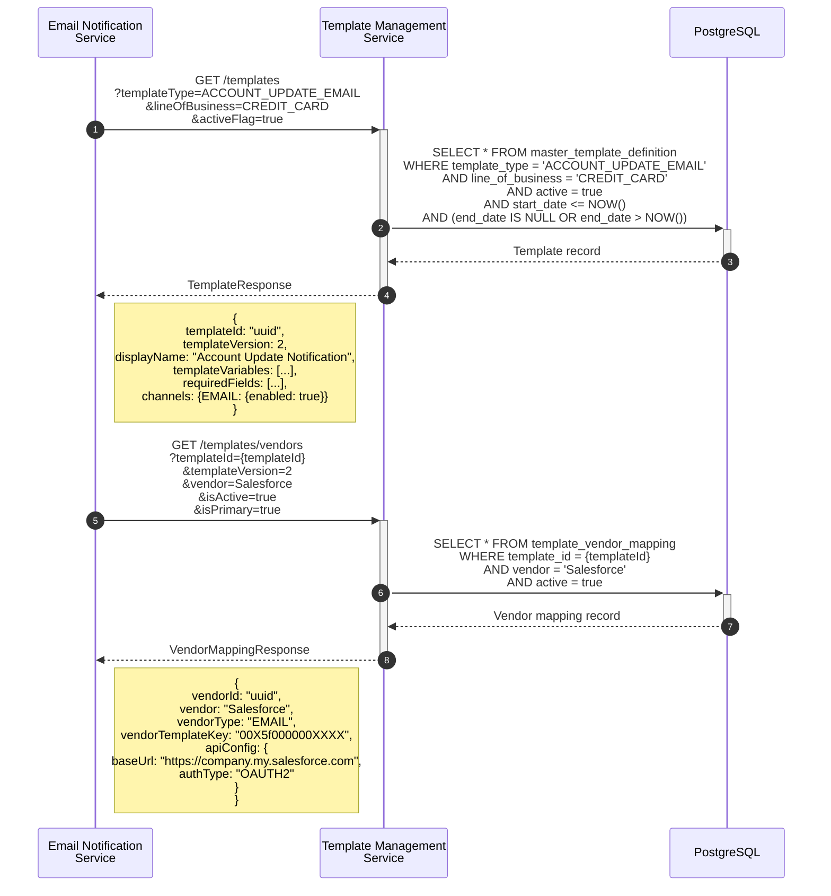
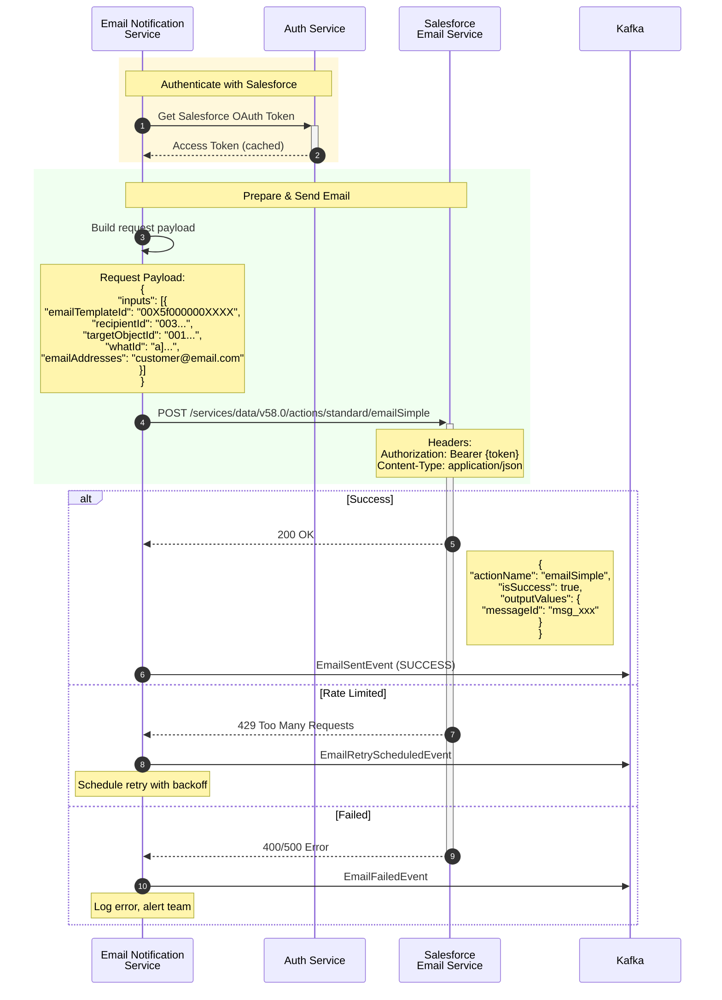
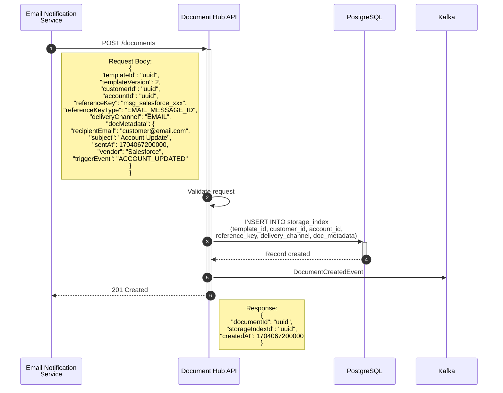
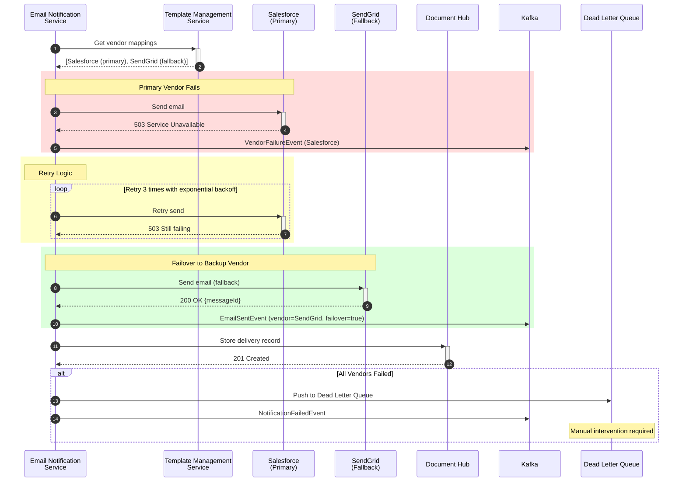
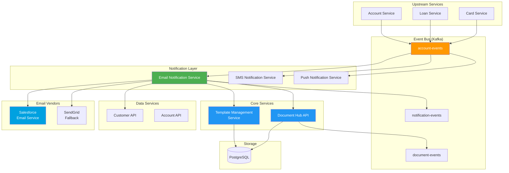

# Account Update Email Notification Flow

## Overview

This document illustrates the complete flow when an account update event triggers an email notification. The flow involves multiple services working together to send a personalized email via Salesforce Email Service and store the record in Document Hub.

---

## Components

| Component | Type | Description |
|-----------|------|-------------|
| **Account Service** | Upstream Service | Manages account data, triggers events on updates |
| **Kafka** | Message Broker | Event streaming between services |
| **Email Notification Service** | Core Service | Orchestrates email sending workflow |
| **Template Management Service** | Core Service | Provides template config and vendor mappings |
| **Customer API** | Data Service | Customer contact information |
| **Salesforce Email Service** | Vendor Service | Sends transactional emails |
| **Document Hub API** | Core Service | Stores email delivery records |
| **PostgreSQL** | Database | Persistent storage |

---

## 1. Complete End-to-End Flow



---

## 2. Detailed Template & Vendor Lookup



---

## 3. Salesforce Email Service Integration



---

## 4. Document Hub Storage



---

## 5. Error Handling & Retry Flow



---

## 6. Complete System Architecture



---

## 7. Event Schemas

### AccountUpdatedEvent (Input)

```json
{
  "eventId": "uuid",
  "eventType": "ACCOUNT_UPDATED",
  "timestamp": 1704067200000,
  "correlationId": "uuid",
  "payload": {
    "accountId": "uuid",
    "customerId": "uuid",
    "updateType": "ADDRESS_CHANGE",
    "lineOfBusiness": "CREDIT_CARD",
    "changes": {
      "previousAddress": {
        "street": "123 Old St",
        "city": "Old City"
      },
      "newAddress": {
        "street": "456 New Ave",
        "city": "New City"
      }
    },
    "updatedBy": "CUSTOMER",
    "updatedAt": 1704067200000
  }
}
```

### EmailNotificationSentEvent (Output)

```json
{
  "eventId": "uuid",
  "eventType": "EMAIL_NOTIFICATION_SENT",
  "timestamp": 1704067201000,
  "correlationId": "uuid",
  "payload": {
    "notificationId": "uuid",
    "documentId": "uuid",
    "templateId": "uuid",
    "templateVersion": 2,
    "customerId": "uuid",
    "accountId": "uuid",
    "channel": "EMAIL",
    "vendor": "Salesforce",
    "vendorMessageId": "msg_salesforce_xxx",
    "recipientEmail": "customer@email.com",
    "subject": "Your Account Has Been Updated",
    "status": "SENT",
    "triggerEvent": "ACCOUNT_UPDATED",
    "sentAt": 1704067201000,
    "failover": false
  }
}
```

---

## 8. Database Records

### Template Management Service - Template Record

```sql
-- master_template_definition
{
  template_id: 'uuid',
  template_version: 2,
  template_type: 'ACCOUNT_UPDATE_EMAIL',
  display_name: 'Account Update Notification',
  line_of_business: 'CREDIT_CARD',
  communication_type: 'TRANSACTIONAL',
  active: true,
  template_variables: [
    {name: 'customerName', type: 'STRING', source: 'CUSTOMER_API'},
    {name: 'accountLast4', type: 'STRING', source: 'ACCOUNT_API'},
    {name: 'updateType', type: 'STRING', source: 'EVENT_PAYLOAD'},
    {name: 'updateDate', type: 'DATE', source: 'EVENT_PAYLOAD'}
  ]
}
```

### Template Management Service - Vendor Mapping

```sql
-- template_vendor_mapping
{
  vendor_mapping_id: 'uuid',
  template_id: 'uuid',
  template_version: 2,
  vendor: 'Salesforce',
  vendor_type: 'EMAIL',
  vendor_template_key: '00X5f000000XXXX',
  primary: true,
  active: true,
  api_config: {
    base_url: 'https://company.my.salesforce.com',
    auth_type: 'OAUTH2',
    timeout_ms: 30000
  }
}
```

### Document Hub - Storage Index Record

```sql
-- storage_index
{
  storage_index_id: 'uuid',
  master_template_id: 'uuid',
  template_version: 2,
  customer_key: 'uuid',
  account_key: 'uuid',
  reference_key: 'msg_salesforce_xxx',
  reference_key_type: 'EMAIL_MESSAGE_ID',
  delivery_channel: 'EMAIL',
  doc_creation_date: 1704067201000,
  accessible_flag: true,
  doc_metadata: {
    recipientEmail: 'customer@email.com',
    subject: 'Your Account Has Been Updated',
    vendor: 'Salesforce',
    triggerEvent: 'ACCOUNT_UPDATED',
    status: 'SENT'
  }
}
```

---

## 9. Sequence Summary

| Step | Service | Action |
|------|---------|--------|
| 1 | Account Service | Publishes `AccountUpdatedEvent` to Kafka |
| 2 | Email Notification Service | Consumes event, determines notification needed |
| 3 | Email Notification Service | Calls Template Management Service for template config |
| 4 | Email Notification Service | Calls Template Management Service for Salesforce vendor mapping |
| 5 | Email Notification Service | Calls Customer API for customer email and preferences |
| 6 | Email Notification Service | Validates customer has not opted out |
| 7 | Email Notification Service | Sends email via Salesforce Email Service |
| 8 | Email Notification Service | Stores delivery record in Document Hub |
| 9 | Email Notification Service | Publishes `EmailNotificationSentEvent` to Kafka |

---

## View These Diagrams

1. **GitHub/GitLab**: Mermaid diagrams render automatically
2. **VS Code**: Install "Markdown Preview Mermaid Support" extension
3. **Online**: Use [Mermaid Live Editor](https://mermaid.live)
