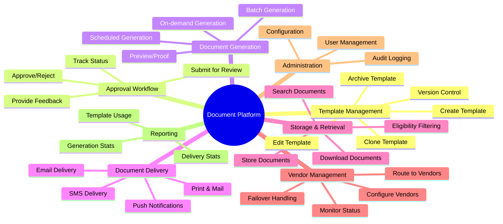

# Comprehensive Business Use Cases
## Configurable Document Management Platform

This document outlines all business use cases for a configurable document management platform that supports the full document lifecycle - from template creation through generation, delivery, and retrieval.

---

## Table of Contents

1. [Platform Overview](#platform-overview)
2. [Actor Definitions](#actor-definitions)
3. [Use Case Categories](#use-case-categories)
4. [Template Management Use Cases](#1-template-management-use-cases)
5. [Approval Workflow Use Cases](#2-approval-workflow-use-cases)
6. [Document Generation Use Cases](#3-document-generation-use-cases)
7. [Document Delivery Use Cases](#4-document-delivery-use-cases)
8. [Document Storage & Retrieval Use Cases](#5-document-storage--retrieval-use-cases)
9. [Vendor Management Use Cases](#6-vendor-management-use-cases)
10. [Configuration & Administration Use Cases](#7-configuration--administration-use-cases)
11. [Reporting & Analytics Use Cases](#8-reporting--analytics-use-cases)
12. [Integration Use Cases](#9-integration-use-cases)
13. [Use Case Summary Matrix](#use-case-summary-matrix)

---

## Platform Overview

### Scope

The platform manages the complete lifecycle of customer communications across multiple channels:

| Channel | Template Types | Delivery Methods |
|---------|---------------|------------------|
| **Print** | Letters, Statements, Notices | Physical mail vendors |
| **Email** | HTML emails, Plain text | Email service providers |
| **SMS** | Text messages | SMS gateways |
| **Push** | Mobile notifications | Push notification services |
| **Digital** | PDFs, Documents | Customer portal, API |

### Core Capabilities

```
┌─────────────────────────────────────────────────────────────────────────────┐
│                    DOCUMENT MANAGEMENT PLATFORM                              │
├─────────────────────────────────────────────────────────────────────────────┤
│                                                                              │
│  ┌──────────────┐    ┌──────────────┐    ┌──────────────┐    ┌───────────┐ │
│  │   TEMPLATE   │───▶│   APPROVAL   │───▶│  GENERATION  │───▶│  DELIVERY │ │
│  │  MANAGEMENT  │    │   WORKFLOW   │    │    ENGINE    │    │  CHANNELS │ │
│  └──────────────┘    └──────────────┘    └──────────────┘    └───────────┘ │
│         │                                        │                   │      │
│         ▼                                        ▼                   ▼      │
│  ┌──────────────┐                        ┌──────────────┐    ┌───────────┐ │
│  │    VENDOR    │                        │   STORAGE    │    │ RETRIEVAL │ │
│  │  MANAGEMENT  │                        │    INDEX     │    │    API    │ │
│  └──────────────┘                        └──────────────┘    └───────────┘ │
│                                                                              │
└─────────────────────────────────────────────────────────────────────────────┘
```

---

## Actor Definitions

| Actor | Role | Responsibilities |
|-------|------|------------------|
| **Template Author** | Back-office employee | Creates and edits templates |
| **Template Reviewer** | Senior staff / Compliance | Reviews and provides feedback |
| **Template Approver** | Manager / Legal | Final approval authority |
| **System Administrator** | IT Operations | Platform configuration, vendor setup |
| **Business Administrator** | Business Operations | Business rules, eligibility criteria |
| **Customer** | End user | Views/downloads their documents |
| **Agent** | Customer service | Accesses documents on behalf of customers |
| **External System** | Upstream/downstream apps | Triggers generation, retrieves documents |

---

## Use Case Categories



---

## 1. Template Management Use Cases

### UC-TM-001: Create New Template

| Attribute | Description |
|-----------|-------------|
| **Actor** | Template Author |
| **Description** | Create a new template for document generation |
| **Preconditions** | User has template authoring permissions |
| **Trigger** | Business need for new communication type |

**Main Flow:**
1. Author selects template type (Letter, Email, SMS, Push)
2. Author enters template metadata (name, description, category, LOB)
3. Author designs template content with placeholders/variables
4. Author defines required data fields for generation
5. Author configures channel-specific settings
6. System validates template structure
7. System saves template as DRAFT
8. System assigns version 1.0

**Template Types:**

| Type | Content Format | Variables | Attachments |
|------|---------------|-----------|-------------|
| Letter | HTML/PDF template | Merge fields | Yes |
| Email | HTML + Plain text | Dynamic content | Yes |
| SMS | Plain text (160 chars) | Short codes | No |
| Push | Title + Body | Deep links | No |

---

### UC-TM-002: Edit Existing Template

| Attribute | Description |
|-----------|-------------|
| **Actor** | Template Author |
| **Description** | Modify an existing template |
| **Preconditions** | Template exists, not locked by approval process |

**Main Flow:**
1. Author searches/selects template to edit
2. System checks template status (must be DRAFT or APPROVED)
3. If APPROVED, system creates new version as DRAFT
4. Author makes changes to content/configuration
5. System tracks change history
6. Author saves changes
7. System increments minor version (1.0 → 1.1)

**Version States:**

```
DRAFT ──▶ IN_REVIEW ──▶ APPROVED ──▶ ACTIVE
   │          │             │
   │          ▼             ▼
   │      REJECTED      DEPRECATED
   │          │
   └──────────┘ (revise and resubmit)
```

---

### UC-TM-003: Clone Template

| Attribute | Description |
|-----------|-------------|
| **Actor** | Template Author |
| **Description** | Create a copy of an existing template as starting point |
| **Preconditions** | Source template exists |

**Main Flow:**
1. Author selects source template
2. Author chooses "Clone Template"
3. System creates copy with new ID
4. Author modifies template name and metadata
5. System saves as new DRAFT template (version 1.0)

---

### UC-TM-004: Configure Template Variables

| Attribute | Description |
|-----------|-------------|
| **Actor** | Template Author |
| **Description** | Define dynamic variables/placeholders in template |

**Variable Types:**

| Type | Example | Source |
|------|---------|--------|
| Customer Data | `{{customerName}}` | Customer API |
| Account Data | `{{accountBalance}}` | Account API |
| Calculated | `{{paymentDueDate}}` | Business logic |
| Static | `{{companyAddress}}` | Configuration |
| Conditional | `{{#if isPremium}}...{{/if}}` | Logic |

---

### UC-TM-005: Preview Template

| Attribute | Description |
|-----------|-------------|
| **Actor** | Template Author, Reviewer |
| **Description** | Generate preview with sample data |

**Main Flow:**
1. User opens template preview
2. System loads sample data set (or user provides custom data)
3. System renders template with merged data
4. User views rendered output (PDF, HTML, text)
5. User can switch between sample data sets
6. User can export preview for sharing

---

### UC-TM-006: Archive Template

| Attribute | Description |
|-----------|-------------|
| **Actor** | Template Author, Administrator |
| **Description** | Retire a template from active use |

**Main Flow:**
1. User selects template to archive
2. System checks for active usage/schedules
3. System warns about dependent configurations
4. User confirms archival
5. System marks template as ARCHIVED
6. Template no longer available for new generation
7. Existing generated documents remain accessible

---

### UC-TM-007: Manage Template Versions

| Attribute | Description |
|-----------|-------------|
| **Actor** | Template Author |
| **Description** | View and manage template version history |

**Main Flow:**
1. User views template version history
2. System displays all versions with metadata
3. User can compare versions side-by-side
4. User can rollback to previous version (creates new version)
5. User can view which version generated specific documents

---

## 2. Approval Workflow Use Cases

### UC-AW-001: Submit Template for Review

| Attribute | Description |
|-----------|-------------|
| **Actor** | Template Author |
| **Description** | Submit draft template for approval process |
| **Preconditions** | Template in DRAFT status, passes validation |

**Main Flow:**
1. Author completes template edits
2. Author clicks "Submit for Review"
3. System validates template completeness
4. System validates all required fields defined
5. Author selects approval workflow type
6. Author adds submission notes
7. System changes status to IN_REVIEW
8. System notifies assigned reviewers
9. System locks template from further edits

**Approval Workflow Types:**

| Type | Steps | Use Case |
|------|-------|----------|
| Standard | Author → Reviewer → Approver | Normal templates |
| Express | Author → Approver | Minor changes |
| Compliance | Author → Legal → Compliance → Approver | Regulatory docs |

---

### UC-AW-002: Review Template

| Attribute | Description |
|-----------|-------------|
| **Actor** | Template Reviewer |
| **Description** | Review submitted template and provide feedback |

**Main Flow:**
1. Reviewer receives notification of pending review
2. Reviewer opens template in review mode
3. Reviewer examines content, variables, formatting
4. Reviewer previews with sample data
5. Reviewer adds inline comments/annotations
6. Reviewer provides overall feedback
7. Reviewer chooses action:
   - **Approve** → Forward to next step
   - **Request Changes** → Return to author
   - **Reject** → End workflow

---

### UC-AW-003: Provide Feedback on Template

| Attribute | Description |
|-----------|-------------|
| **Actor** | Template Reviewer, Approver |
| **Description** | Add specific feedback requiring changes |

**Main Flow:**
1. Reviewer identifies issue in template
2. Reviewer highlights specific section
3. Reviewer adds comment with:
   - Issue description
   - Suggested change
   - Priority (Critical/Major/Minor)
4. System tracks feedback item
5. Author receives notification
6. Author can respond to feedback
7. Feedback history maintained for audit

---

### UC-AW-004: Revise Template Based on Feedback

| Attribute | Description |
|-----------|-------------|
| **Actor** | Template Author |
| **Description** | Update template to address review feedback |

**Main Flow:**
1. Author receives "Changes Requested" notification
2. Author views feedback items
3. Author makes required changes
4. Author marks each feedback item as addressed
5. Author adds response notes
6. Author resubmits for review
7. System increments revision number
8. Reviewers can see diff from previous submission

---

### UC-AW-005: Approve Template

| Attribute | Description |
|-----------|-------------|
| **Actor** | Template Approver |
| **Description** | Grant final approval for template to go live |

**Main Flow:**
1. Approver receives notification
2. Approver reviews template and feedback history
3. Approver verifies all feedback addressed
4. Approver grants approval
5. System changes status to APPROVED
6. System records approval timestamp and approver
7. Template available for activation

---

### UC-AW-006: Activate Approved Template

| Attribute | Description |
|-----------|-------------|
| **Actor** | Template Author, Administrator |
| **Description** | Make approved template available for generation |

**Main Flow:**
1. User selects approved template
2. User sets activation date (immediate or scheduled)
3. If replacing existing version:
   - System deactivates previous version
   - System maintains document linkage
4. System changes status to ACTIVE
5. Template available for document generation

---

### UC-AW-007: Track Approval Status

| Attribute | Description |
|-----------|-------------|
| **Actor** | Template Author, Administrator |
| **Description** | Monitor templates in approval pipeline |

**Dashboard View:**
```
┌─────────────────────────────────────────────────────────────────┐
│ APPROVAL PIPELINE                                                │
├─────────────────────────────────────────────────────────────────┤
│                                                                  │
│  DRAFT (5)     IN_REVIEW (3)    APPROVED (2)    ACTIVE (45)    │
│  ┌─────┐       ┌─────┐          ┌─────┐         ┌─────┐        │
│  │ ░░░ │       │ ▓▓▓ │          │ ███ │         │ ███ │        │
│  │ ░░░ │       │ ▓▓▓ │          │ ███ │         │ ███ │        │
│  │ ░░░ │       │     │          │     │         │ ███ │        │
│  └─────┘       └─────┘          └─────┘         └─────┘        │
│                                                                  │
│  Pending My Review: 3                                           │
│  Awaiting Feedback: 2                                           │
│  Overdue Reviews: 1 ⚠️                                          │
└─────────────────────────────────────────────────────────────────┘
```

---

## 3. Document Generation Use Cases

### UC-DG-001: Generate Single Document On-Demand

| Attribute | Description |
|-----------|-------------|
| **Actor** | Agent, External System |
| **Description** | Generate one document for specific customer/account |

**Main Flow:**
1. Requestor specifies template ID and data
2. System validates required data fields present
3. System selects appropriate generation vendor
4. System sends request to vendor
5. Vendor generates document
6. System receives generated document
7. System stores in storage index
8. System returns document ID/URL

**Request Example:**
```json
{
  "templateId": "uuid",
  "templateVersion": 2,
  "customerId": "uuid",
  "accountId": "uuid",
  "data": {
    "customerName": "John Doe",
    "accountBalance": 1234.56,
    "statementDate": "2024-01-31"
  },
  "deliveryChannel": "DIGITAL",
  "priority": "NORMAL"
}
```

---

### UC-DG-002: Generate Batch Documents

| Attribute | Description |
|-----------|-------------|
| **Actor** | External System, Scheduler |
| **Description** | Generate multiple documents in bulk |

**Main Flow:**
1. System receives batch request with list of recipients
2. System validates batch size limits
3. System creates batch job record
4. System processes each record:
   - Validate data
   - Generate document
   - Store result
5. System tracks progress (success/failure counts)
6. System sends completion notification
7. Failed items available for retry

**Batch Types:**

| Type | Volume | Processing | Example |
|------|--------|------------|---------|
| Small | < 100 | Synchronous | Ad-hoc mailing |
| Medium | 100-10K | Async queue | Weekly notices |
| Large | 10K+ | Distributed | Monthly statements |

---

### UC-DG-003: Schedule Document Generation

| Attribute | Description |
|-----------|-------------|
| **Actor** | Business Administrator |
| **Description** | Configure recurring document generation |

**Main Flow:**
1. Admin selects template
2. Admin defines schedule (cron expression or calendar)
3. Admin configures data source (query, file, API)
4. Admin sets delivery channel and vendor
5. System saves schedule configuration
6. Scheduler triggers at specified times
7. System generates batch per schedule
8. Results logged and reported

**Schedule Examples:**

| Schedule | Expression | Use Case |
|----------|------------|----------|
| Daily 6 AM | `0 6 * * *` | Daily notifications |
| Monthly 1st | `0 0 1 * *` | Monthly statements |
| Weekly Mon | `0 9 * * 1` | Weekly reports |
| Quarterly | `0 0 1 1,4,7,10 *` | Quarterly reviews |

---

### UC-DG-004: Preview Document Before Generation

| Attribute | Description |
|-----------|-------------|
| **Actor** | Agent |
| **Description** | Preview document with actual customer data before sending |

**Main Flow:**
1. Agent selects template and customer
2. System fetches actual customer data
3. System generates preview (watermarked)
4. Agent reviews content accuracy
5. Agent can modify variable data if allowed
6. Agent confirms generation
7. System generates final document

---

### UC-DG-005: Regenerate Failed Document

| Attribute | Description |
|-----------|-------------|
| **Actor** | System, Administrator |
| **Description** | Retry failed document generation |

**Main Flow:**
1. System identifies failed generation
2. System checks retry policy (max attempts, backoff)
3. System selects alternate vendor if configured
4. System retries generation
5. On success: Update status, proceed to delivery
6. On failure: Log error, alert administrator

---

### UC-DG-006: Generate Multi-Channel Document

| Attribute | Description |
|-----------|-------------|
| **Actor** | External System |
| **Description** | Generate same content for multiple channels |

**Main Flow:**
1. System receives multi-channel request
2. System identifies channel-specific templates
3. For each channel:
   - Generate channel-appropriate version
   - Apply channel-specific formatting
4. System coordinates delivery across channels
5. System tracks which channels succeeded

**Example:**
```
Single Request → Letter (PDF) + Email (HTML) + SMS (Text)
```

---

## 4. Document Delivery Use Cases

### UC-DD-001: Deliver via Print/Mail

| Attribute | Description |
|-----------|-------------|
| **Actor** | System |
| **Description** | Send physical mail through print vendor |

**Main Flow:**
1. System receives print delivery request
2. System selects print vendor based on:
   - Document type
   - Destination region
   - Cost/SLA requirements
3. System formats document per vendor specs
4. System transmits to print vendor API
5. Vendor confirms receipt
6. System tracks mail status updates
7. System records delivery confirmation

**Print Vendor Integration:**

| Vendor | Capabilities | Regions |
|--------|--------------|---------|
| Vendor A | Letters, Statements | US, Canada |
| Vendor B | Marketing, Postcards | US |
| Vendor C | International | Global |

---

### UC-DD-002: Deliver via Email

| Attribute | Description |
|-----------|-------------|
| **Actor** | System |
| **Description** | Send email through email service provider |

**Main Flow:**
1. System receives email delivery request
2. System validates recipient email address
3. System selects email vendor
4. System prepares email:
   - HTML body
   - Plain text fallback
   - Attachments (if any)
5. System sends via vendor API
6. System tracks:
   - Sent status
   - Delivery status
   - Open/click events (if tracked)
7. System handles bounces

**Email Features:**

| Feature | Description |
|---------|-------------|
| Attachments | PDF documents up to 10MB |
| Tracking | Open rates, click tracking |
| Personalization | Dynamic content blocks |
| Unsubscribe | Automatic footer links |

---

### UC-DD-003: Deliver via SMS

| Attribute | Description |
|-----------|-------------|
| **Actor** | System |
| **Description** | Send text message through SMS gateway |

**Main Flow:**
1. System receives SMS delivery request
2. System validates phone number format
3. System checks opt-in status
4. System selects SMS vendor
5. System formats message (≤160 chars or segments)
6. System sends via vendor API
7. System tracks delivery status
8. System handles delivery failures

**SMS Constraints:**

| Constraint | Value |
|------------|-------|
| Max length | 160 chars (or multi-segment) |
| Character set | GSM-7 or Unicode |
| Short codes | Configurable sender ID |

---

### UC-DD-004: Deliver via Push Notification

| Attribute | Description |
|-----------|-------------|
| **Actor** | System |
| **Description** | Send mobile push notification |

**Main Flow:**
1. System receives push request
2. System looks up device tokens for user
3. System formats notification:
   - Title
   - Body
   - Deep link
   - Badge count
4. System sends to push service (APNs, FCM)
5. System tracks delivery status

---

### UC-DD-005: Route to Preferred Channel

| Attribute | Description |
|-----------|-------------|
| **Actor** | System |
| **Description** | Automatically select delivery channel based on preferences |

**Main Flow:**
1. System receives delivery request
2. System checks customer channel preferences
3. System checks channel availability (email valid, phone valid)
4. System selects highest priority available channel
5. System delivers via selected channel
6. If failed, fallback to next preferred channel

**Channel Priority Example:**
```
1. Email (preferred) → Success ✓
2. SMS (fallback) → Not needed
3. Mail (last resort) → Not needed
```

---

### UC-DD-006: Track Delivery Status

| Attribute | Description |
|-----------|-------------|
| **Actor** | Agent, System |
| **Description** | Monitor delivery progress and status |

**Delivery States:**

```
PENDING → SENT → DELIVERED → VIEWED
            │         │
            ▼         ▼
         FAILED    BOUNCED
            │
            ▼
        RETRY_SCHEDULED
```

---

### UC-DD-007: Handle Delivery Failures

| Attribute | Description |
|-----------|-------------|
| **Actor** | System |
| **Description** | Manage failed deliveries with retry/fallback |

**Failure Handling:**

| Failure Type | Action |
|--------------|--------|
| Temporary (rate limit) | Retry with backoff |
| Invalid address | Mark invalid, try alternate |
| Vendor down | Failover to backup vendor |
| Permanent | Log, alert, manual review |

---

## 5. Document Storage & Retrieval Use Cases

### UC-SR-001: Store Generated Document

| Attribute | Description |
|-----------|-------------|
| **Actor** | System |
| **Description** | Store document instance after generation |

**Main Flow:**
1. System receives generated document from vendor
2. System creates storage index record
3. System uploads document to storage (S3, ECMS)
4. System extracts/stores metadata
5. System links to template and customer/account
6. System sets accessibility flags
7. Document available for retrieval

**Storage Index Record:**
```json
{
  "storageIndexId": "uuid",
  "masterTemplateId": "uuid",
  "templateVersion": 2,
  "accountKey": "uuid",
  "customerKey": "uuid",
  "storageVendor": "S3",
  "storageDocumentKey": "uuid",
  "fileName": "statement_2024_01.pdf",
  "docCreationDate": 1706745600000,
  "accessibleFlag": true,
  "sharedFlag": false,
  "referenceKey": "D164",
  "referenceKeyType": "DISCLOSURE_CODE",
  "docMetadata": {
    "statementDate": "2024-01-31",
    "balance": 1234.56
  }
}
```

---

### UC-SR-002: Retrieve Customer Documents

| Attribute | Description |
|-----------|-------------|
| **Actor** | Customer, Agent |
| **Description** | Get list of documents for customer/account |

**Main Flow:**
1. User requests document list
2. System identifies applicable templates
3. System evaluates eligibility for shared documents
4. System queries storage index
5. System filters by validity dates
6. System applies pagination
7. System returns document list with download links

*This is the current document-enquiry implementation.*

---

### UC-SR-003: Download Document

| Attribute | Description |
|-----------|-------------|
| **Actor** | Customer, Agent |
| **Description** | Download specific document content |

**Main Flow:**
1. User requests document by ID
2. System validates access permissions
3. System retrieves from storage vendor
4. System returns document stream
5. System logs access for audit

---

### UC-SR-004: Search Documents

| Attribute | Description |
|-----------|-------------|
| **Actor** | Agent, Administrator |
| **Description** | Search across documents with various criteria |

**Search Criteria:**

| Criteria | Description |
|----------|-------------|
| Customer/Account | By customer or account ID |
| Date Range | Document creation date |
| Template Type | Category of document |
| Reference Key | Specific reference value |
| Metadata | Custom metadata fields |
| Full Text | Content search (if indexed) |

---

### UC-SR-005: Delete Document

| Attribute | Description |
|-----------|-------------|
| **Actor** | Administrator |
| **Description** | Remove document from system |

**Main Flow:**
1. Admin requests document deletion
2. System validates deletion permissions
3. System checks retention policy
4. If allowed:
   - Soft delete (set accessible_flag = false)
   - Or hard delete (remove from storage)
5. System logs deletion for audit

---

### UC-SR-006: Apply Retention Policy

| Attribute | Description |
|-----------|-------------|
| **Actor** | System (Scheduled) |
| **Description** | Automatically archive/delete documents per policy |

**Main Flow:**
1. Scheduler triggers retention job
2. System identifies documents past retention period
3. Per document type policy:
   - Archive to cold storage
   - Delete permanently
4. System logs actions for compliance

**Retention Policies:**

| Document Type | Retention | Action |
|---------------|-----------|--------|
| Statements | 7 years | Archive |
| Marketing | 1 year | Delete |
| Regulatory | 10 years | Archive |

---

## 6. Vendor Management Use Cases

### UC-VM-001: Configure Document Generation Vendor

| Attribute | Description |
|-----------|-------------|
| **Actor** | System Administrator |
| **Description** | Set up integration with document generation vendor |

**Configuration:**
```json
{
  "vendorId": "vendor-a",
  "vendorName": "Document Gen Corp",
  "vendorType": "GENERATION",
  "endpoint": {
    "baseUrl": "https://api.vendor.com/v1",
    "authType": "OAUTH2",
    "credentials": "vault:///secrets/vendor-a"
  },
  "capabilities": ["PDF", "HTML", "LETTER"],
  "rateLimit": 1000,
  "timeout": 30000,
  "retryPolicy": {
    "maxAttempts": 3,
    "backoffMs": 1000
  },
  "active": true
}
```

---

### UC-VM-002: Configure Print Vendor

| Attribute | Description |
|-----------|-------------|
| **Actor** | System Administrator |
| **Description** | Set up integration with print/mail vendor |

**Configuration:**
```json
{
  "vendorId": "print-vendor-a",
  "vendorName": "PrintCo",
  "vendorType": "PRINT",
  "supportedRegions": ["US", "CA"],
  "supportedMailClasses": ["FIRST_CLASS", "STANDARD"],
  "formats": ["PDF", "POSTSCRIPT"],
  "trackingEnabled": true,
  "costPerPiece": {
    "FIRST_CLASS": 0.55,
    "STANDARD": 0.35
  }
}
```

---

### UC-VM-003: Configure Email Vendor

| Attribute | Description |
|-----------|-------------|
| **Actor** | System Administrator |
| **Description** | Set up integration with email service provider |

**Configuration:**
```json
{
  "vendorId": "email-vendor-a",
  "vendorName": "SendGrid",
  "vendorType": "EMAIL",
  "endpoint": {
    "apiUrl": "https://api.sendgrid.com/v3/mail/send",
    "apiKey": "vault:///secrets/sendgrid"
  },
  "fromAddress": "noreply@company.com",
  "replyToAddress": "support@company.com",
  "trackingEnabled": true,
  "webhookUrl": "https://our-api.com/webhooks/email"
}
```

---

### UC-VM-004: Configure SMS Vendor

| Attribute | Description |
|-----------|-------------|
| **Actor** | System Administrator |
| **Description** | Set up integration with SMS gateway |

**Configuration:**
```json
{
  "vendorId": "sms-vendor-a",
  "vendorName": "Twilio",
  "vendorType": "SMS",
  "endpoint": {
    "apiUrl": "https://api.twilio.com/2010-04-01",
    "accountSid": "vault:///secrets/twilio-sid",
    "authToken": "vault:///secrets/twilio-token"
  },
  "fromNumber": "+1234567890",
  "supportedCountries": ["US", "CA", "UK"]
}
```

---

### UC-VM-005: Route to Appropriate Vendor

| Attribute | Description |
|-----------|-------------|
| **Actor** | System |
| **Description** | Select best vendor based on routing rules |

**Routing Criteria:**

| Criteria | Description |
|----------|-------------|
| Document Type | Different vendors for different types |
| Region | Geographic routing for print |
| Cost | Select lowest cost option |
| Availability | Skip unavailable vendors |
| Load Balancing | Distribute across vendors |

**Routing Rules Example:**
```json
{
  "rules": [
    {
      "condition": "templateType == 'STATEMENT' AND region == 'US'",
      "vendorId": "print-vendor-a",
      "priority": 1
    },
    {
      "condition": "templateType == 'STATEMENT' AND region == 'INTL'",
      "vendorId": "print-vendor-b",
      "priority": 1
    }
  ],
  "defaultVendor": "print-vendor-a"
}
```

---

### UC-VM-006: Monitor Vendor Health

| Attribute | Description |
|-----------|-------------|
| **Actor** | System, Administrator |
| **Description** | Track vendor availability and performance |

**Health Metrics:**

| Metric | Description |
|--------|-------------|
| Availability | Uptime percentage |
| Latency | Response time (p50, p99) |
| Error Rate | Failed requests percentage |
| Throughput | Requests per second |

---

### UC-VM-007: Handle Vendor Failover

| Attribute | Description |
|-----------|-------------|
| **Actor** | System |
| **Description** | Automatically switch to backup vendor on failure |

**Main Flow:**
1. System detects primary vendor failure
2. System checks failover configuration
3. System routes to backup vendor
4. System alerts administrators
5. System continues monitoring primary
6. System auto-recovers when primary healthy

---

## 7. Configuration & Administration Use Cases

### UC-CA-001: Manage User Permissions

| Attribute | Description |
|-----------|-------------|
| **Actor** | System Administrator |
| **Description** | Configure role-based access control |

**Roles:**

| Role | Permissions |
|------|-------------|
| Template Author | Create, Edit, Submit templates |
| Template Reviewer | Review, Comment, Approve/Reject |
| Template Approver | Final approval, Activate |
| Business Admin | Configure rules, eligibility |
| System Admin | All configuration, vendors |
| Viewer | Read-only access |

---

### UC-CA-002: Configure Business Rules

| Attribute | Description |
|-----------|-------------|
| **Actor** | Business Administrator |
| **Description** | Set up eligibility criteria and sharing rules |

**Rule Configuration:**
```json
{
  "templateId": "uuid",
  "eligibilityCriteria": {
    "operator": "AND",
    "rules": [
      {"field": "accountType", "operator": "EQUALS", "value": "credit_card"},
      {"field": "region", "operator": "IN", "value": ["US_WEST", "US_EAST"]}
    ]
  },
  "sharingScope": "CUSTOM_RULES"
}
```

---

### UC-CA-003: Configure Data Extraction

| Attribute | Description |
|-----------|-------------|
| **Actor** | Business Administrator |
| **Description** | Set up external API data extraction for eligibility |

*See existing data_extraction_config documentation.*

---

### UC-CA-004: Audit Trail Viewing

| Attribute | Description |
|-----------|-------------|
| **Actor** | Administrator, Compliance |
| **Description** | View history of all system actions |

**Audit Events:**

| Event Type | Details Captured |
|------------|------------------|
| Template Created | Who, when, template details |
| Template Approved | Approver, timestamp |
| Document Generated | Template, recipient, vendor |
| Document Accessed | Who accessed, when |
| Configuration Changed | What changed, by whom |

---

### UC-CA-005: System Configuration

| Attribute | Description |
|-----------|-------------|
| **Actor** | System Administrator |
| **Description** | Configure global system settings |

**Settings:**

| Setting | Description |
|---------|-------------|
| Default Retention | Document retention periods |
| Rate Limits | API rate limiting |
| Timeouts | Service timeouts |
| Feature Flags | Enable/disable features |
| Notifications | Alert configurations |

---

## 8. Reporting & Analytics Use Cases

### UC-RA-001: Template Usage Report

| Attribute | Description |
|-----------|-------------|
| **Actor** | Business Administrator |
| **Description** | View template generation statistics |

**Report Contents:**
- Documents generated per template
- Generation trends over time
- Success/failure rates
- Average generation time

---

### UC-RA-002: Delivery Performance Report

| Attribute | Description |
|-----------|-------------|
| **Actor** | Administrator |
| **Description** | View delivery channel performance |

**Report Contents:**
- Delivery success rates by channel
- Average delivery time
- Bounce/failure rates
- Vendor performance comparison

---

### UC-RA-003: Vendor Cost Report

| Attribute | Description |
|-----------|-------------|
| **Actor** | Business Administrator |
| **Description** | Track costs by vendor and document type |

**Report Contents:**
- Cost per document by vendor
- Total spend by time period
- Cost comparison across vendors
- Volume discounts achieved

---

### UC-RA-004: Approval Workflow Report

| Attribute | Description |
|-----------|-------------|
| **Actor** | Administrator |
| **Description** | Track approval process metrics |

**Report Contents:**
- Average time in each approval stage
- Rejection rates
- Reviewer workload
- Bottleneck identification

---

## 9. Integration Use Cases

### UC-INT-001: Trigger Generation from External System

| Attribute | Description |
|-----------|-------------|
| **Actor** | External System |
| **Description** | API to trigger document generation |

**API Endpoint:**
```
POST /api/v1/documents/generate
```

**Request:**
```json
{
  "templateId": "uuid",
  "customerId": "uuid",
  "accountId": "uuid",
  "data": {...},
  "deliveryChannels": ["EMAIL", "DIGITAL"],
  "priority": "HIGH"
}
```

---

### UC-INT-002: Webhook Notifications

| Attribute | Description |
|-----------|-------------|
| **Actor** | External System |
| **Description** | Receive event notifications via webhooks |

**Events:**
- `document.generated`
- `document.delivered`
- `document.failed`
- `template.approved`
- `template.activated`

---

### UC-INT-003: Retrieve Document via API

| Attribute | Description |
|-----------|-------------|
| **Actor** | External System |
| **Description** | API to retrieve document content |

**API Endpoints:**
```
GET /api/v1/documents/{documentId}
GET /api/v1/documents/{documentId}/metadata
GET /api/v1/documents-enquiry (POST)
```

---

### UC-INT-004: Data Source Integration

| Attribute | Description |
|-----------|-------------|
| **Actor** | System |
| **Description** | Fetch data from external APIs for generation |

**Data Sources:**
- Customer API
- Account API
- Product API
- Pricing API
- Custom data endpoints

---

## Use Case Summary Matrix

### By Category

| Category | Count | Priority |
|----------|-------|----------|
| Template Management | 7 | High |
| Approval Workflow | 7 | High |
| Document Generation | 6 | High |
| Document Delivery | 7 | High |
| Storage & Retrieval | 6 | High |
| Vendor Management | 7 | Medium |
| Administration | 5 | Medium |
| Reporting | 4 | Medium |
| Integration | 4 | High |
| **TOTAL** | **53** | |

### Implementation Priority

| Phase | Use Cases | Focus |
|-------|-----------|-------|
| **Phase 1** | UC-TM-001 to 003, UC-DG-001, UC-SR-001 to 003 | Core template & document lifecycle |
| **Phase 2** | UC-AW-001 to 007 | Full approval workflow |
| **Phase 3** | UC-DD-001 to 007, UC-VM-001 to 007 | Multi-channel delivery, vendor management |
| **Phase 4** | UC-RA-001 to 004, UC-INT-001 to 004 | Reporting, advanced integrations |

---

## Appendix: Data Model Overview

```
┌─────────────────────────────────────────────────────────────────────────────┐
│                           DATA MODEL OVERVIEW                                │
├─────────────────────────────────────────────────────────────────────────────┤
│                                                                              │
│  ┌──────────────────┐     ┌──────────────────┐     ┌──────────────────┐    │
│  │ master_template  │     │ template_version │     │ approval_workflow│    │
│  │   _definition    │────▶│    _history      │────▶│     _record      │    │
│  └──────────────────┘     └──────────────────┘     └──────────────────┘    │
│           │                                                                  │
│           ▼                                                                  │
│  ┌──────────────────┐     ┌──────────────────┐     ┌──────────────────┐    │
│  │ template_vendor  │     │   storage_index  │     │  delivery_record │    │
│  │    _mapping      │────▶│   (documents)    │────▶│                  │    │
│  └──────────────────┘     └──────────────────┘     └──────────────────┘    │
│           │                        │                        │               │
│           ▼                        ▼                        ▼               │
│  ┌──────────────────┐     ┌──────────────────┐     ┌──────────────────┐    │
│  │  vendor_config   │     │  document_access │     │   vendor_status  │    │
│  │                  │     │      _log        │     │     _tracking    │    │
│  └──────────────────┘     └──────────────────┘     └──────────────────┘    │
│                                                                              │
└─────────────────────────────────────────────────────────────────────────────┘
```

---

## Next Steps

1. **Prioritize use cases** based on business needs
2. **Map to existing implementation** - identify gaps
3. **Design database schema** for new entities (approval workflow, vendors)
4. **Define API contracts** for each use case
5. **Plan integration patterns** for external systems
