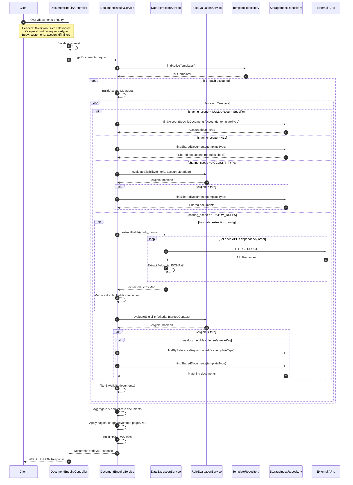
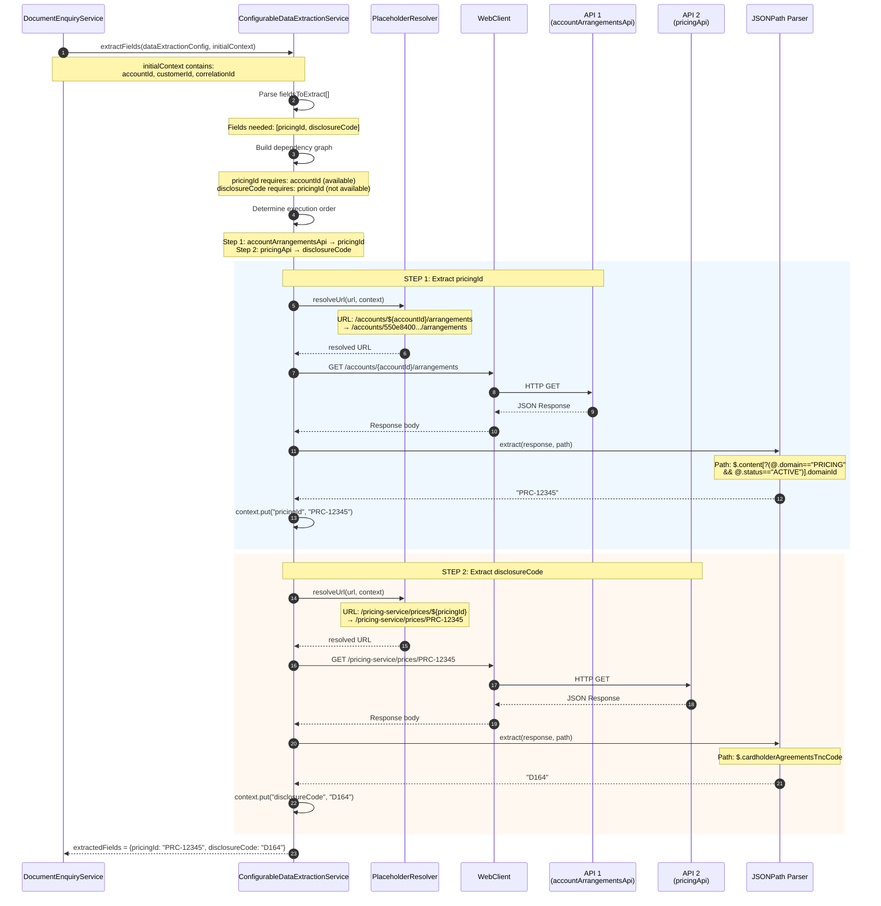
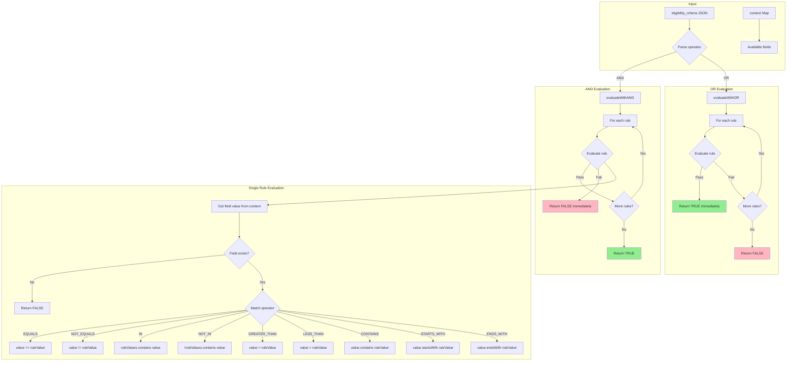
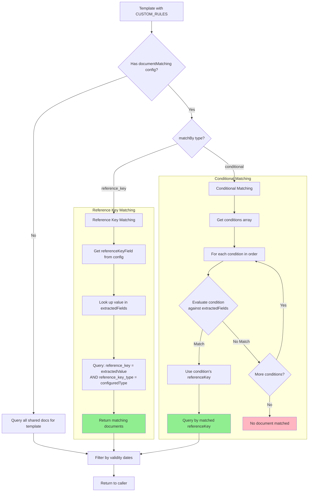
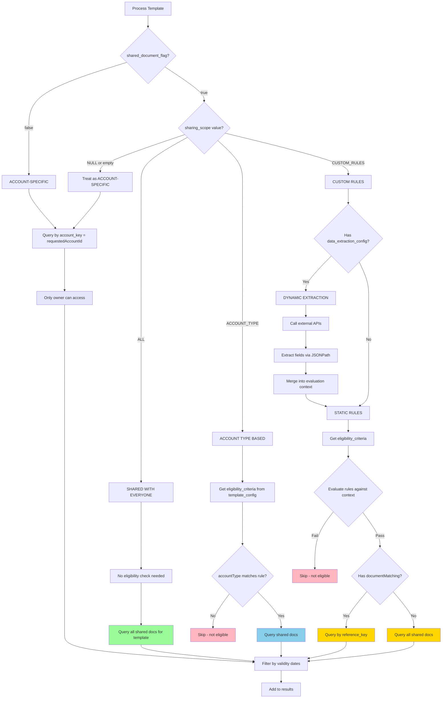
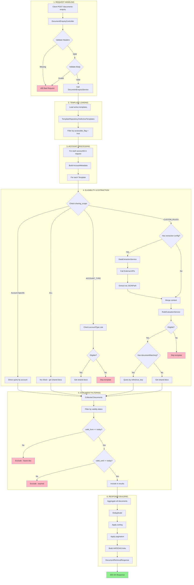

# Document Enquiry Flow - Architecture Documentation

This document provides detailed visual diagrams of the document-enquiry endpoint logic flow.

## Table of Contents
1. [High-Level Sequence Diagram](#1-high-level-sequence-diagram)
2. [Data Extraction Chain Flow](#2-data-extraction-chain-flow)
3. [Rule Evaluation Logic](#3-rule-evaluation-logic)
4. [Document Matching Strategy](#4-document-matching-strategy)
5. [Sharing Scope Decision Tree](#5-sharing-scope-decision-tree)
6. [Complete End-to-End Flow](#6-complete-end-to-end-flow)

---

## 1. High-Level Sequence Diagram

This diagram shows the main interaction flow between components when processing a document enquiry request.



---

## 2. Data Extraction Chain Flow

This diagram details how the `ConfigurableDataExtractionService` processes multi-step API chains to extract fields needed for eligibility evaluation and document matching.



### Data Extraction Configuration Example

```json
{
  "fieldsToExtract": ["pricingId", "disclosureCode"],
  "fieldSources": {
    "pricingId": {
      "sourceApi": "accountArrangementsApi",
      "extractionPath": "$.content[?(@.domain==\"PRICING\" && @.status==\"ACTIVE\")].domainId",
      "requiredInputs": ["accountId"]
    },
    "disclosureCode": {
      "sourceApi": "pricingApi",
      "extractionPath": "$.cardholderAgreementsTncCode",
      "requiredInputs": ["pricingId"]
    }
  },
  "dataSources": {
    "accountArrangementsApi": {
      "endpoint": {
        "url": "http://api/accounts/${accountId}/arrangements",
        "method": "GET"
      }
    },
    "pricingApi": {
      "endpoint": {
        "url": "http://api/pricing-service/prices/${pricingId}",
        "method": "GET"
      }
    }
  }
}
```

---

## 3. Rule Evaluation Logic

This diagram shows how the `RuleEvaluationService` processes eligibility criteria with AND/OR operators.



### Supported Operators

| Operator | Description | Example |
|----------|-------------|---------|
| `EQUALS` | Exact match | `accountType == "credit_card"` |
| `NOT_EQUALS` | Not equal | `region != "RESTRICTED"` |
| `IN` | Value in list | `state IN ["CA", "NY", "TX"]` |
| `NOT_IN` | Value not in list | `segment NOT_IN ["BLOCKED"]` |
| `GREATER_THAN` | Numeric greater | `creditScore > 700` |
| `GREATER_THAN_OR_EQUAL` | Numeric >= | `income >= 50000` |
| `LESS_THAN` | Numeric less | `age < 65` |
| `LESS_THAN_OR_EQUAL` | Numeric <= | `balance <= 10000` |
| `CONTAINS` | String contains | `email CONTAINS "@company"` |
| `STARTS_WITH` | String prefix | `zipcode STARTS_WITH "94"` |
| `ENDS_WITH` | String suffix | `phone ENDS_WITH "0000"` |

### Example Eligibility Criteria

```json
{
  "operator": "AND",
  "rules": [
    { "field": "customerSegment", "operator": "EQUALS", "value": "VIP" },
    { "field": "region", "operator": "IN", "value": ["US_WEST", "US_EAST"] },
    { "field": "creditScore", "operator": "GREATER_THAN_OR_EQUAL", "value": 750 }
  ]
}
```

---

## 4. Document Matching Strategy

This diagram shows how documents are matched based on the `documentMatching` configuration in `data_extraction_config`.



### Reference Key Matching Example

```json
{
  "documentMatching": {
    "matchBy": "reference_key",
    "referenceKeyField": "disclosureCode",
    "referenceKeyType": "DISCLOSURE_CODE"
  }
}
```

**Flow:**
1. Extract `disclosureCode` = "D164" from APIs
2. Query: `SELECT * FROM storage_index WHERE reference_key = 'D164' AND reference_key_type = 'DISCLOSURE_CODE'`
3. Returns: `Credit_Card_Terms_D164_v1.pdf`

### Conditional Matching Example

```json
{
  "documentMatching": {
    "matchBy": "conditional",
    "referenceKeyType": "BALANCE_TIER",
    "conditions": [
      { "field": "accountBalance", "operator": ">=", "value": 50000, "referenceKey": "PLATINUM" },
      { "field": "accountBalance", "operator": ">=", "value": 25000, "referenceKey": "GOLD" },
      { "field": "accountBalance", "operator": ">=", "value": 10000, "referenceKey": "SILVER" },
      { "field": "accountBalance", "operator": ">=", "value": 0, "referenceKey": "STANDARD" }
    ]
  }
}
```

**Flow:**
1. Extract `accountBalance` = 35000 from API
2. Evaluate conditions in order:
   - 35000 >= 50000? No
   - 35000 >= 25000? **Yes** → Use "GOLD"
3. Query: `SELECT * FROM storage_index WHERE reference_key = 'GOLD' AND reference_key_type = 'BALANCE_TIER'`

---

## 5. Sharing Scope Decision Tree

This diagram provides a complete decision tree for how documents are retrieved based on template configuration.



### Sharing Scope Summary

| Scope | Description | Eligibility Check | Document Query |
|-------|-------------|-------------------|----------------|
| `NULL` | Account-specific | None | By `account_key` |
| `ALL` | Everyone | None | All shared docs |
| `ACCOUNT_TYPE` | Product-based | `accountType` rule | Shared if eligible |
| `CUSTOM_RULES` | Complex criteria | Full rule evaluation | By reference_key or all shared |

---

## 6. Complete End-to-End Flow

This comprehensive diagram shows the entire document enquiry process from request to response.



---

## Key Components Reference

| Component | File | Responsibility |
|-----------|------|----------------|
| `DocumentEnquiryController` | `controller/DocumentEnquiryController.java` | HTTP handling, validation |
| `DocumentEnquiryService` | `service/DocumentEnquiryService.java` | Main orchestration logic |
| `ConfigurableDataExtractionService` | `service/ConfigurableDataExtractionService.java` | External API calls, JSONPath extraction |
| `RuleEvaluationService` | `service/RuleEvaluationService.java` | Eligibility criteria evaluation |
| `MasterTemplateDefinitionRepository` | `repository/MasterTemplateDefinitionRepository.java` | Template data access |
| `StorageIndexRepository` | `repository/StorageIndexRepository.java` | Document data access |

---

## Related Documentation

- [Template Onboarding Guide](../Template_Onboarding_Guide.md) - How to configure templates
- [Interactive Template Builder](../Interactive_Template_Builder_Concept.md) - UI for template creation
- [Current Status](../CURRENT_STATUS.md) - Project status and roadmap
