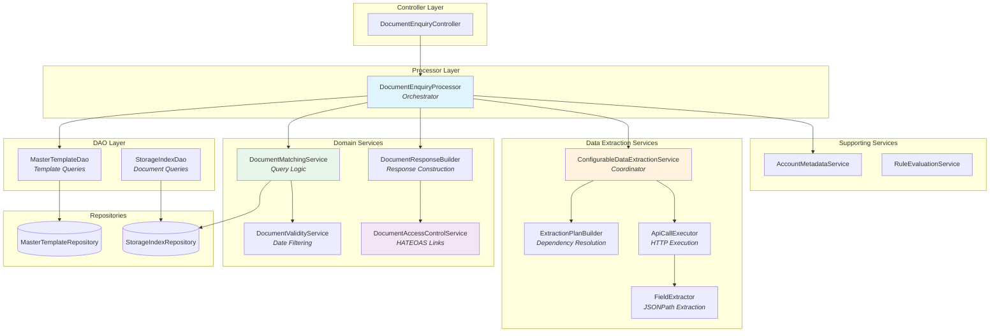
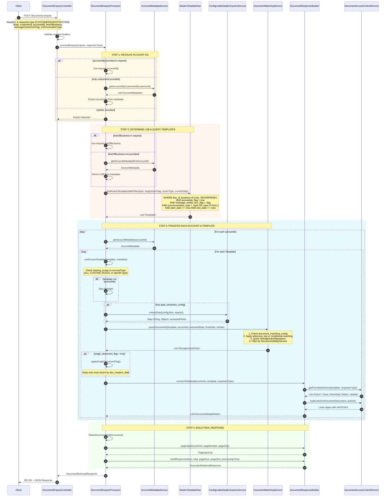
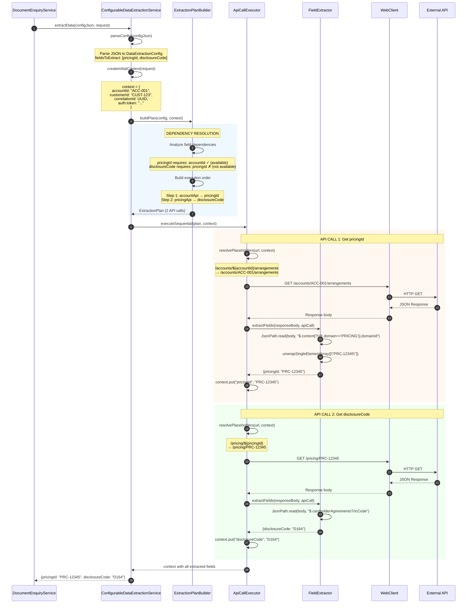
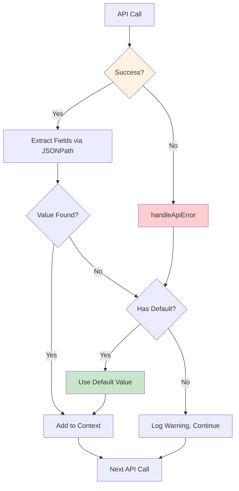
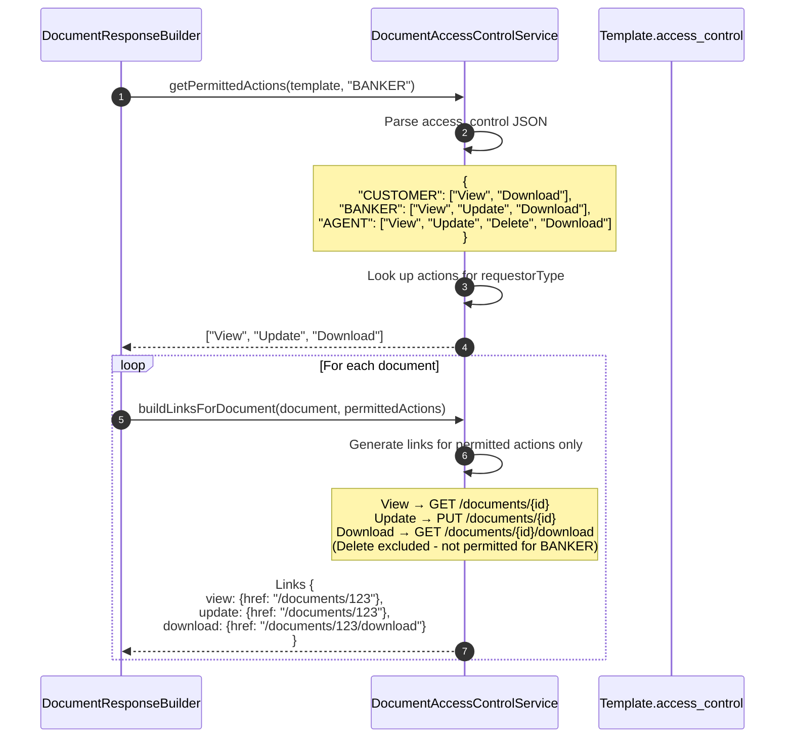
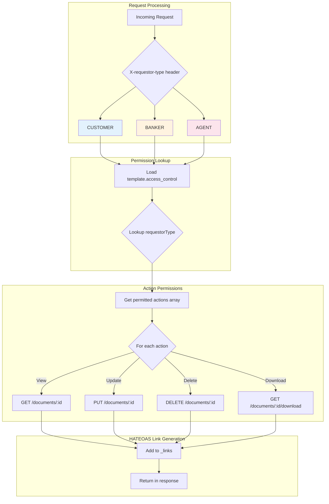
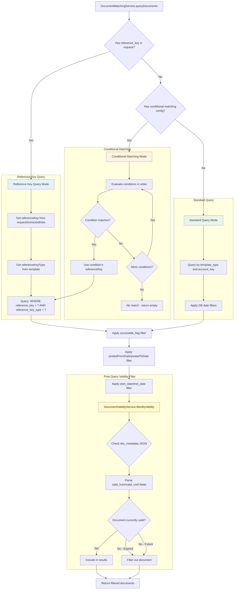

# Document Enquiry Flow - Architecture Documentation

This document provides detailed visual diagrams of the document-enquiry endpoint logic flow, reflecting the refactored service architecture.

## Table of Contents
1. [Architecture Overview](#1-architecture-overview)
2. [High-Level Sequence Diagram](#2-high-level-sequence-diagram)
3. [Data Extraction Flow](#3-data-extraction-flow)
4. [Access Control & HATEOAS Links](#4-access-control--hateoas-links)
5. [Document Matching Strategy](#5-document-matching-strategy)
6. [Complete End-to-End Flow](#6-complete-end-to-end-flow)
7. [Component Reference](#7-component-reference)

---

## 1. Architecture Overview

The document enquiry system has been refactored into focused, single-responsibility services:

### Service Architecture



### Key Design Principles

| Principle | Implementation |
|-----------|----------------|
| **Single Responsibility** | Each service handles one concern |
| **Separation of Concerns** | Orchestration separated from domain logic |
| **Dependency Injection** | All services are Spring-managed beans |
| **Reactive Streams** | Uses Project Reactor (Mono/Flux) throughout |

---

## 2. High-Level Sequence Diagram

This diagram shows the main interaction flow between the components based on the actual implementation.

### Key Filters Applied

| Step | Filter | Location | Purpose |
|------|--------|----------|---------|
| 1 | `accessible_flag` | Template query | Only accessible templates |
| 2 | `line_of_business` | Template query | Business unit filtering |
| 3 | `message_center_doc_flag` | Template query | Web display eligibility |
| 4 | `communication_type` | Template query | Letter/Email/SMS/Push |
| 5 | `start_date`/`end_date` | Template query | Template validity period |
| 6 | `sharing_scope` | Per template | Access control logic |
| 7 | `start_date`/`end_date` | Document query | Document validity (DB columns) |
| 8 | `valid_from`/`valid_until` | DocumentValidityService | Document validity (JSON metadata) |
| 9 | `single_document_flag` | Per template | Return only latest document |



---

## 3. Data Extraction Flow

The data extraction system has been refactored into specialized components:

### 3.1 Extraction Architecture

```mermaid
flowchart LR
    subgraph "ConfigurableDataExtractionService"
        A[extractData] --> B[Parse JSON Config]
        B --> C[Create Initial Context]
        C --> D[Build Extraction Plan]
    end

    subgraph "ExtractionPlanBuilder"
        D --> E[Analyze Dependencies]
        E --> F[Determine API Order]
        F --> G[Create ExtractionPlan]
    end

    subgraph "ApiCallExecutor"
        G --> H{Execution Mode?}
        H -->|Sequential| I[Execute in Order]
        H -->|Parallel| J[Execute Concurrently]
        I --> K[Resolve Placeholders]
        J --> K
        K --> L[Make HTTP Call]
        L --> M[Handle Response]
    end

    subgraph "FieldExtractor"
        M --> N[Execute JSONPath]
        N --> O[Unwrap Single Arrays]
        O --> P[Apply Defaults]
        P --> Q[Return Extracted Fields]
    end

    style A fill:#fff3e0
    style G fill:#e3f2fd
    style L fill:#fce4ec
    style Q fill:#e8f5e9
```



### 3.2 Detailed Extraction Sequence



### 3.3 Error Handling in Extraction



---

## 4. Access Control & HATEOAS Links

The access control system determines which actions are available based on the requestor type and template configuration.

### 4.1 Access Control Flow



### 4.2 Access Control Matrix



### 4.3 Default Access Control

If no `access_control` is configured on the template, defaults are applied:

| Requestor Type | Default Permissions |
|----------------|---------------------|
| `CUSTOMER` | View, Download |
| `BANKER` | View, Update, Download |
| `AGENT` | View, Update, Delete, Download |

### 4.4 Response Example with HATEOAS Links

```json
{
  "documents": [
    {
      "documentId": "doc-123",
      "documentType": "STATEMENT",
      "documentName": "January 2024 Statement",
      "lineOfBusiness": "CREDIT_CARD",
      "_links": {
        "view": {
          "href": "/api/v1/documents/doc-123",
          "method": "GET"
        },
        "download": {
          "href": "/api/v1/documents/doc-123/download",
          "method": "GET"
        }
      }
    }
  ],
  "pagination": {
    "pageNumber": 1,
    "pageSize": 20,
    "totalElements": 45,
    "totalPages": 3
  }
}
```

---

## 5. Document Matching Strategy

The `DocumentMatchingService` handles document query logic based on template configuration.

### 5.1 Matching Decision Flow



### 5.2 Two-Level Date Filtering

The system applies date filtering at two levels:

| Level | Location | Fields | Purpose |
|-------|----------|--------|---------|
| **Database Query** | `StorageIndexRepository` | `start_date`, `end_date` columns | Efficient filtering at DB level |
| **Post-Query Filter** | `DocumentValidityService` | `valid_from`, `valid_until` in `doc_metadata` JSON | Fine-grained validity from metadata |

**Important**: Documents can be filtered out at either level. A document must pass BOTH filters to be returned:
1. DB columns `start_date`/`end_date` must be NULL or within range
2. JSON metadata `valid_from`/`valid_until` must be NULL or within range

### 5.3 Query Filters Applied

| Filter | Location | Description |
|--------|----------|-------------|
| `template_type` | Storage query | Match document to template |
| `account_key` | Storage query | Filter by account |
| `accessible_flag` | Storage query | Only accessible documents |
| `reference_key` | Storage query | Match specific document version |
| `postedFromDate` | Storage query | Document creation date >= |
| `postedToDate` | Storage query | Document creation date <= |

---

## 6. Complete End-to-End Flow

This comprehensive diagram shows the entire document enquiry process with all filters and validations.

```mermaid
flowchart TB
    subgraph "1. REQUEST HANDLING"
        A[Client POST /documents-enquiry] --> B[DocumentEnquiryController]
        B --> C{Validate Headers}
        C -->|Missing| D[400 Bad Request]
        C -->|Valid| E{Validate Body}
        E -->|Invalid| D
        E -->|Valid| F[Extract requestorType from header]
        F --> G[Call DocumentEnquiryService]
    end

    subgraph "2. TEMPLATE FILTERING"
        G --> H{LOB in request?}
        H -->|No| I[Get AccountMetadata]
        I --> J[Derive LOB]
        H -->|Yes| K[Use request LOB]
        J --> K

        K --> L[TemplateRepository.findActiveTemplatesWithFilters]
        L --> L1[Filter: accessible_flag = true]
        L1 --> L2[Filter: line_of_business match]
        L2 --> L3[Filter: message_center_doc_flag match]
        L3 --> L4[Filter: communication_type match]
        L4 --> L5[Filter: template validity period]
        L5 --> M[Filtered Templates]
    end

    subgraph "3. TEMPLATE PROCESSING"
        M --> N[For each Account]
        N --> O[Get AccountMetadata]
        O --> P[For each Template]

        P --> Q{Check sharing_scope<br/>vs accountType}
        Q -->|Mismatch| R[Skip Template]
        Q -->|Match| S{Has data_extraction_config?}

        S -->|Yes| T[ConfigurableDataExtractionService]
        T --> T1[ExtractionPlanBuilder.buildPlan]
        T1 --> T2[ApiCallExecutor.execute]
        T2 --> T3[FieldExtractor.extractFields]
        T3 --> U[Extracted Fields]

        S -->|No| U
        U --> V[DocumentMatchingService.queryDocuments]
        V --> W[Apply reference_key matching]
        W --> X[Apply DB date filters: start_date/end_date]
        X --> X1[DocumentValidityService.filterByValidity]
        X1 --> X2{Check doc_metadata<br/>valid_from/valid_until}
        X2 -->|Valid| X3[Include document]
        X2 -->|Expired/Future| X4[Filter out document]
        X3 --> Y{single_document_flag?}
        X4 --> Y
        Y -->|Yes| Z[Keep only latest document]
        Y -->|No| AA[Keep all documents]
    end

    subgraph "4. RESPONSE BUILDING"
        Z --> AB[Documents collected]
        AA --> AB
        R --> AB

        AB --> AC[DocumentResponseBuilder.convertToNodes]
        AC --> AD[DocumentAccessControlService.getPermittedActions]
        AD --> AE[Generate HATEOAS links per action]
        AE --> AF[Add lineOfBusiness from template]
        AF --> AG[Apply pagination]
        AG --> AH[Build final response]
    end

    AH --> AI[200 OK Response]

    style D fill:#ffcdd2
    style R fill:#ffcdd2
    style X4 fill:#ffcdd2
    style AI fill:#c8e6c9
    style X3 fill:#c8e6c9
    style T fill:#fff3e0
    style X1 fill:#fff9c4
    style AD fill:#e1bee7
```



---

## 7. Component Reference

### Core Components

| Component | File | Responsibility |
|-----------|------|----------------|
| `DocumentEnquiryController` | `controller/DocumentEnquiryController.java` | HTTP handling, request validation |
| `DocumentEnquiryProcessor` | `processor/DocumentEnquiryProcessor.java` | **Orchestrator** - coordinates all services |
| `DocumentMatchingService` | `service/DocumentMatchingService.java` | Document query logic, reference key matching |
| `DocumentResponseBuilder` | `service/DocumentResponseBuilder.java` | Response construction, pagination |
| `DocumentAccessControlService` | `service/DocumentAccessControlService.java` | HATEOAS link generation, permission checking |
| `DocumentValidityService` | `service/DocumentValidityService.java` | Date validation, validity filtering |

### DAO Layer

| Component | File | Responsibility |
|-----------|------|----------------|
| `MasterTemplateDao` | `dao/MasterTemplateDao.java` | Template queries with filters |
| `StorageIndexDao` | `dao/StorageIndexDao.java` | Document storage operations |

### Data Extraction Services

| Component | File | Responsibility |
|-----------|------|----------------|
| `ConfigurableDataExtractionService` | `service/ConfigurableDataExtractionService.java` | **Coordinator** - orchestrates extraction |
| `ExtractionPlanBuilder` | `service/extraction/ExtractionPlanBuilder.java` | Dependency resolution, execution ordering |
| `ApiCallExecutor` | `service/extraction/ApiCallExecutor.java` | HTTP call execution (sequential/parallel) |
| `FieldExtractor` | `service/extraction/FieldExtractor.java` | JSONPath extraction, default value handling |
| `ExtractionPlan` | `service/extraction/ExtractionPlan.java` | Data class - ordered API calls |
| `ApiCall` | `service/extraction/ApiCall.java` | Data class - single API call config |

### Supporting Services

| Component | File | Responsibility |
|-----------|------|----------------|
| `AccountMetadataService` | `service/AccountMetadataService.java` | Account metadata lookup |
| `RuleEvaluationService` | `service/RuleEvaluationService.java` | Eligibility criteria evaluation |

### Repositories

| Component | File | Responsibility |
|-----------|------|----------------|
| `MasterTemplateRepository` | `repository/MasterTemplateRepository.java` | Template queries with filters |
| `StorageIndexRepository` | `repository/StorageIndexRepository.java` | Document queries |

---

## Related Documentation

- [Template Onboarding Guide](../Template_Onboarding_Guide.md) - How to configure templates
- [Interactive Template Builder](../Interactive_Template_Builder_Concept.md) - UI for template creation
- [Implementation Status](../IMPLEMENTATION_STATUS.md) - Current implementation status
