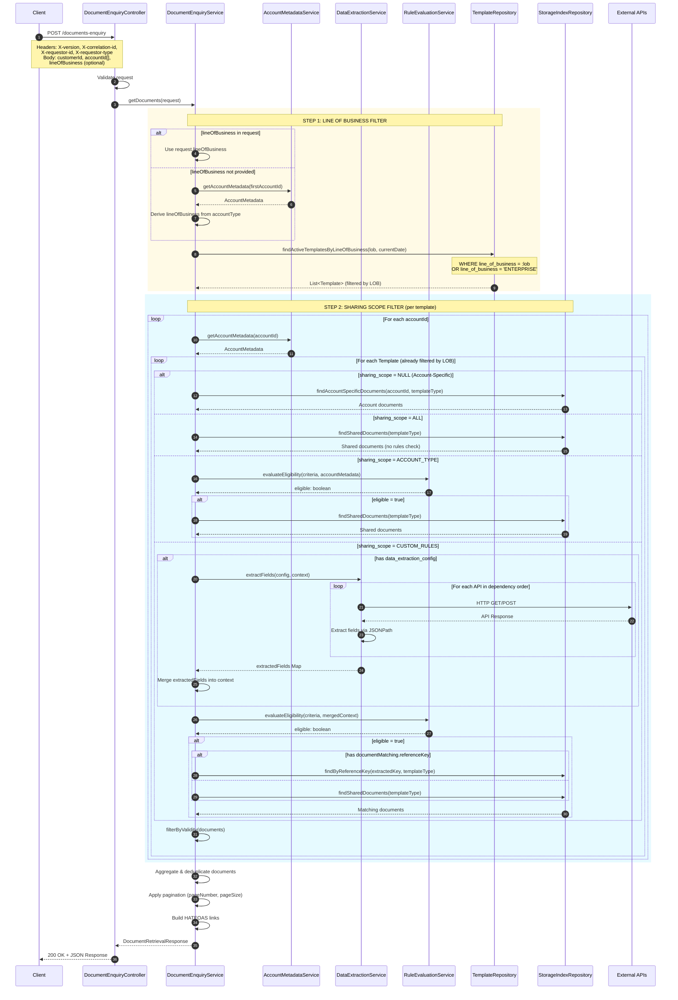
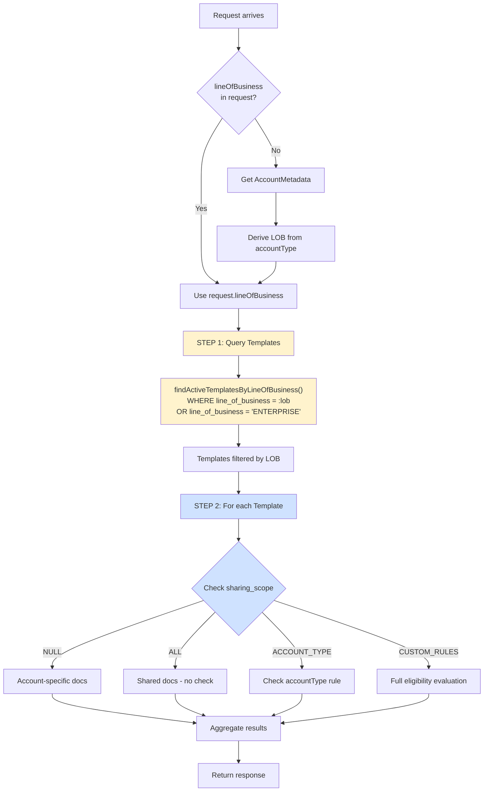
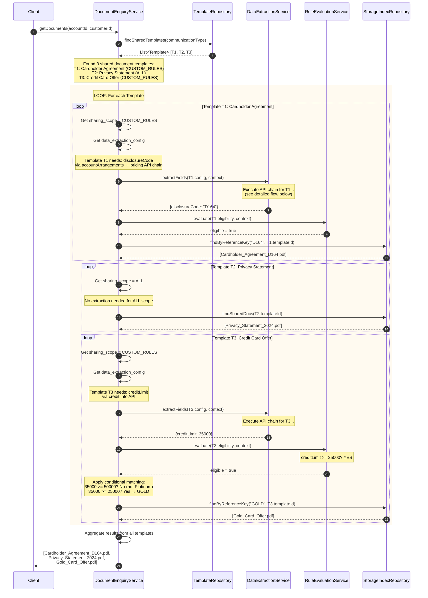
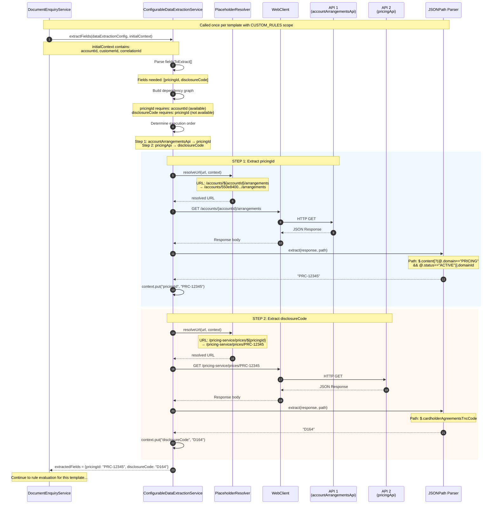
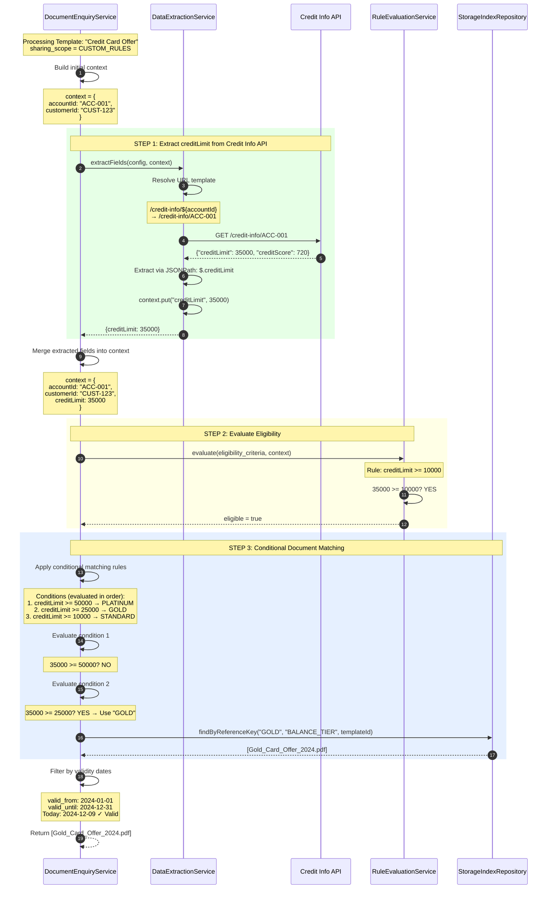
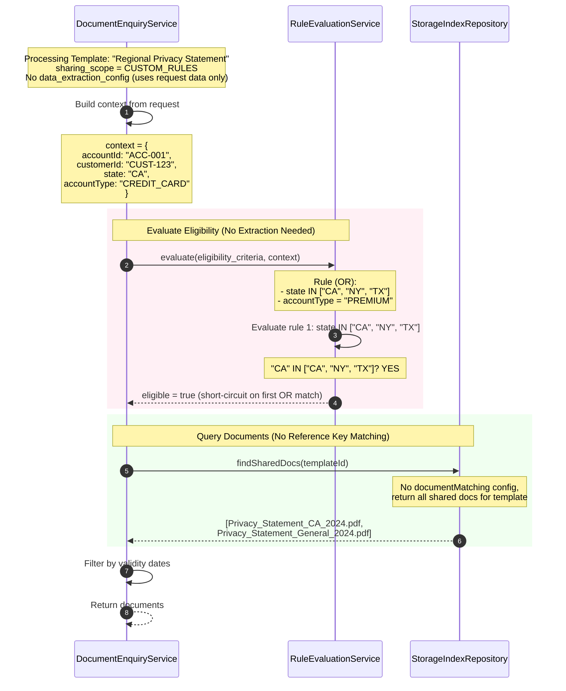
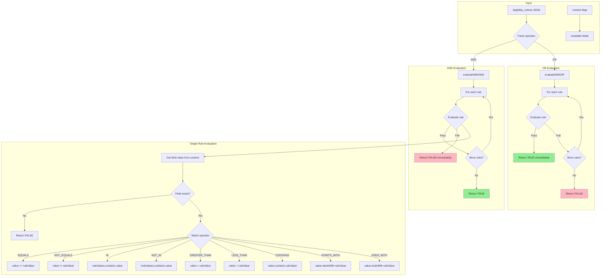
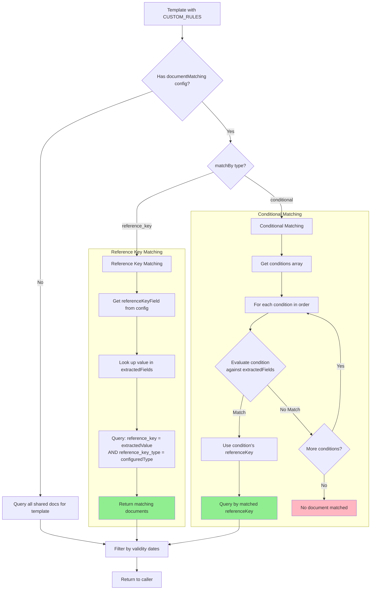
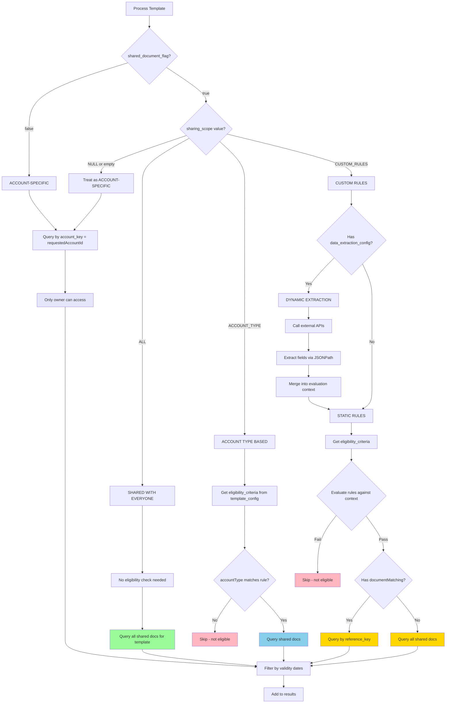
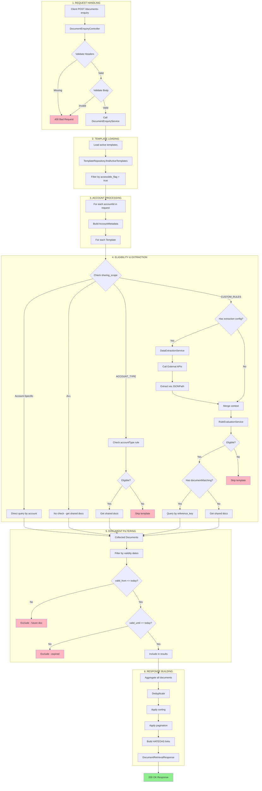

# Document Enquiry Flow - Architecture Documentation

This document provides detailed visual diagrams of the document-enquiry endpoint logic flow.

## Table of Contents
1. [High-Level Sequence Diagram](#1-high-level-sequence-diagram)
2. [Data Extraction Chain Flow](#2-data-extraction-chain-flow)
3. [Rule Evaluation Logic](#3-rule-evaluation-logic)
4. [Document Matching Strategy](#4-document-matching-strategy)
5. [Sharing Scope Decision Tree](#5-sharing-scope-decision-tree)
6. [Complete End-to-End Flow](#6-complete-end-to-end-flow)

---

## 1. High-Level Sequence Diagram

This diagram shows the main interaction flow between components when processing a document enquiry request.

### Key Concept: Two-Step Filtering

Based on John's clarification, the API implements **two separate filters**:

| Step | Filter | Purpose | Values |
|------|--------|---------|--------|
| **STEP 1** | `line_of_business` | Which business unit's templates to load | `CREDIT_CARD`, `DIGITAL_BANK`, `ENTERPRISE` |
| **STEP 2** | `sharing_scope` | Who can access within those templates | `NULL`, `ALL`, `ACCOUNT_TYPE`, `CUSTOM_RULES` |

- `ENTERPRISE` in line_of_business = template applies to ALL business units
- `ALL` in sharing_scope = document is accessible to ALL users (no eligibility check)

**These are NOT interchangeable** - they are applied in sequence.



### Two-Step Filtering Flowchart



---

## 2. Data Extraction Chain Flow

This diagram details how the system **loops through each shared document template** and uses the `ConfigurableDataExtractionService` to process multi-step API chains for extracting fields needed for eligibility evaluation and document matching.

### 2.1 Template Looping Overview



### 2.2 Detailed API Chain Extraction (Per Template)

This diagram shows the detailed extraction process that happens **for each template** during the loop above.



### 2.3 Looping Logic Pseudocode

```java
// DocumentEnquiryService.getDocuments()
public Flux<Document> getDocuments(DocumentEnquiryRequest request) {

    // 1. Load all active shared document templates
    List<Template> sharedTemplates = templateRepository
        .findActiveSharedTemplates(request.getCommunicationType());

    List<Document> allDocuments = new ArrayList<>();

    // 2. LOOP through each template
    for (Template template : sharedTemplates) {

        // Build initial context with request data
        Map<String, Object> context = buildContext(request);

        // 3. Check sharing scope and process accordingly
        switch (template.getSharingScope()) {

            case NULL:
                // Account-specific: query directly by accountId
                documents = storageRepo.findByAccountKey(request.getAccountId());
                break;

            case ALL:
                // Shared with everyone: no eligibility check
                documents = storageRepo.findSharedDocs(template.getId());
                break;

            case ACCOUNT_TYPE:
                // Check simple account type rule
                if (ruleService.evaluate(template.getEligibility(), context)) {
                    documents = storageRepo.findSharedDocs(template.getId());
                }
                break;

            case CUSTOM_RULES:
                // 4. Extract external data if configured
                if (template.hasDataExtractionConfig()) {
                    Map<String, Object> extracted = dataExtractionService
                        .extractFields(template.getDataExtractionConfig(), context);
                    context.putAll(extracted);  // Merge extracted fields
                }

                // 5. Evaluate eligibility with merged context
                if (ruleService.evaluate(template.getEligibility(), context)) {

                    // 6. Match documents based on configuration
                    if (template.hasDocumentMatching()) {
                        String refKey = getMatchedReferenceKey(template, context);
                        documents = storageRepo.findByReferenceKey(refKey, template.getId());
                    } else {
                        documents = storageRepo.findSharedDocs(template.getId());
                    }
                }
                break;
        }

        // 7. Filter by validity dates
        documents = filterByValidity(documents, LocalDate.now());

        // 8. Add to aggregated results
        allDocuments.addAll(documents);
    }

    // 9. Deduplicate, sort, and paginate
    return buildResponse(allDocuments, request.getPagination());
}
```

### 2.4 Example 2: Credit Tier Offer Selection

This example shows a different scenario - selecting a credit card offer based on the customer's credit limit tier (Platinum/Gold/Standard).



### 2.5 Example 3: Privacy Statement with Region-Based Rules

This example shows eligibility based on customer region without external API calls (static rules).



### 2.6 Key Points About the Loop

| Aspect | Description |
|--------|-------------|
| **What triggers the loop** | A document inquiry request with one or more accountIds |
| **What is looped over** | Each active shared document template |
| **When extraction runs** | Only for templates with `sharing_scope = CUSTOM_RULES` AND `data_extraction_config` is present |
| **Context accumulation** | Each template starts with initial request context; extracted fields are merged in |
| **Document aggregation** | Results from all templates are collected, deduplicated, and returned together |
| **Performance consideration** | API calls are made per-template; consider caching common API responses |

### Data Extraction Configuration Example

```json
{
  "fieldsToExtract": ["pricingId", "disclosureCode"],
  "fieldSources": {
    "pricingId": {
      "sourceApi": "accountArrangementsApi",
      "extractionPath": "$.content[?(@.domain==\"PRICING\" && @.status==\"ACTIVE\")].domainId",
      "requiredInputs": ["accountId"]
    },
    "disclosureCode": {
      "sourceApi": "pricingApi",
      "extractionPath": "$.cardholderAgreementsTncCode",
      "requiredInputs": ["pricingId"]
    }
  },
  "dataSources": {
    "accountArrangementsApi": {
      "endpoint": {
        "url": "http://api/accounts/${accountId}/arrangements",
        "method": "GET"
      }
    },
    "pricingApi": {
      "endpoint": {
        "url": "http://api/pricing-service/prices/${pricingId}",
        "method": "GET"
      }
    }
  }
}
```

---

## 3. Rule Evaluation Logic

This diagram shows how the `RuleEvaluationService` processes eligibility criteria with AND/OR operators.



### Supported Operators

| Operator | Description | Example |
|----------|-------------|---------|
| `EQUALS` | Exact match | `accountType == "credit_card"` |
| `NOT_EQUALS` | Not equal | `region != "RESTRICTED"` |
| `IN` | Value in list | `state IN ["CA", "NY", "TX"]` |
| `NOT_IN` | Value not in list | `segment NOT_IN ["BLOCKED"]` |
| `GREATER_THAN` | Numeric greater | `creditScore > 700` |
| `GREATER_THAN_OR_EQUAL` | Numeric >= | `income >= 50000` |
| `LESS_THAN` | Numeric less | `age < 65` |
| `LESS_THAN_OR_EQUAL` | Numeric <= | `balance <= 10000` |
| `CONTAINS` | String contains | `email CONTAINS "@company"` |
| `STARTS_WITH` | String prefix | `zipcode STARTS_WITH "94"` |
| `ENDS_WITH` | String suffix | `phone ENDS_WITH "0000"` |

### Example Eligibility Criteria

```json
{
  "operator": "AND",
  "rules": [
    { "field": "customerSegment", "operator": "EQUALS", "value": "VIP" },
    { "field": "region", "operator": "IN", "value": ["US_WEST", "US_EAST"] },
    { "field": "creditScore", "operator": "GREATER_THAN_OR_EQUAL", "value": 750 }
  ]
}
```

---

## 4. Document Matching Strategy

This diagram shows how documents are matched based on the `documentMatching` configuration in `data_extraction_config`.



### Reference Key Matching Example

```json
{
  "documentMatching": {
    "matchBy": "reference_key",
    "referenceKeyField": "disclosureCode",
    "referenceKeyType": "DISCLOSURE_CODE"
  }
}
```

**Flow:**
1. Extract `disclosureCode` = "D164" from APIs
2. Query: `SELECT * FROM storage_index WHERE reference_key = 'D164' AND reference_key_type = 'DISCLOSURE_CODE'`
3. Returns: `Credit_Card_Terms_D164_v1.pdf`

### Conditional Matching Example

```json
{
  "documentMatching": {
    "matchBy": "conditional",
    "referenceKeyType": "BALANCE_TIER",
    "conditions": [
      { "field": "accountBalance", "operator": ">=", "value": 50000, "referenceKey": "PLATINUM" },
      { "field": "accountBalance", "operator": ">=", "value": 25000, "referenceKey": "GOLD" },
      { "field": "accountBalance", "operator": ">=", "value": 10000, "referenceKey": "SILVER" },
      { "field": "accountBalance", "operator": ">=", "value": 0, "referenceKey": "STANDARD" }
    ]
  }
}
```

**Flow:**
1. Extract `accountBalance` = 35000 from API
2. Evaluate conditions in order:
   - 35000 >= 50000? No
   - 35000 >= 25000? **Yes** → Use "GOLD"
3. Query: `SELECT * FROM storage_index WHERE reference_key = 'GOLD' AND reference_key_type = 'BALANCE_TIER'`

---

## 5. Sharing Scope Decision Tree

This diagram provides a complete decision tree for how documents are retrieved based on template configuration.



### Sharing Scope Summary

| Scope | Description | Eligibility Check | Document Query |
|-------|-------------|-------------------|----------------|
| `NULL` | Account-specific | None | By `account_key` |
| `ALL` | Everyone | None | All shared docs |
| `ACCOUNT_TYPE` | Product-based | `accountType` rule | Shared if eligible |
| `CUSTOM_RULES` | Complex criteria | Full rule evaluation | By reference_key or all shared |

---

## 6. Complete End-to-End Flow

This comprehensive diagram shows the entire document enquiry process from request to response.



---

## Key Components Reference

| Component | File | Responsibility |
|-----------|------|----------------|
| `DocumentEnquiryController` | `controller/DocumentEnquiryController.java` | HTTP handling, validation |
| `DocumentEnquiryService` | `service/DocumentEnquiryService.java` | Main orchestration logic |
| `ConfigurableDataExtractionService` | `service/ConfigurableDataExtractionService.java` | External API calls, JSONPath extraction |
| `RuleEvaluationService` | `service/RuleEvaluationService.java` | Eligibility criteria evaluation |
| `MasterTemplateDefinitionRepository` | `repository/MasterTemplateDefinitionRepository.java` | Template data access |
| `StorageIndexRepository` | `repository/StorageIndexRepository.java` | Document data access |

---

## Related Documentation

- [Template Onboarding Guide](../Template_Onboarding_Guide.md) - How to configure templates
- [Interactive Template Builder](../Interactive_Template_Builder_Concept.md) - UI for template creation
- [Current Status](../CURRENT_STATUS.md) - Project status and roadmap
