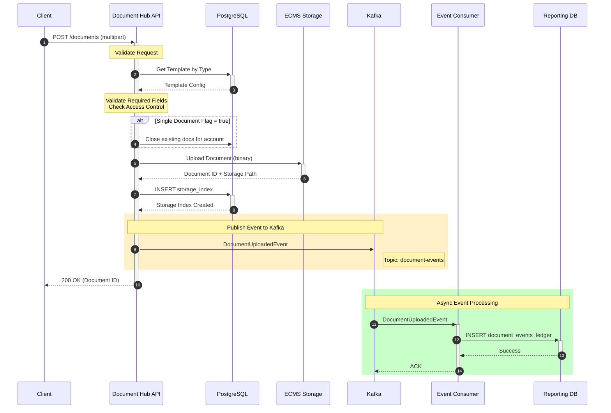
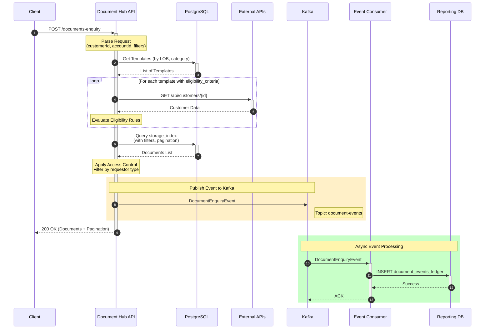
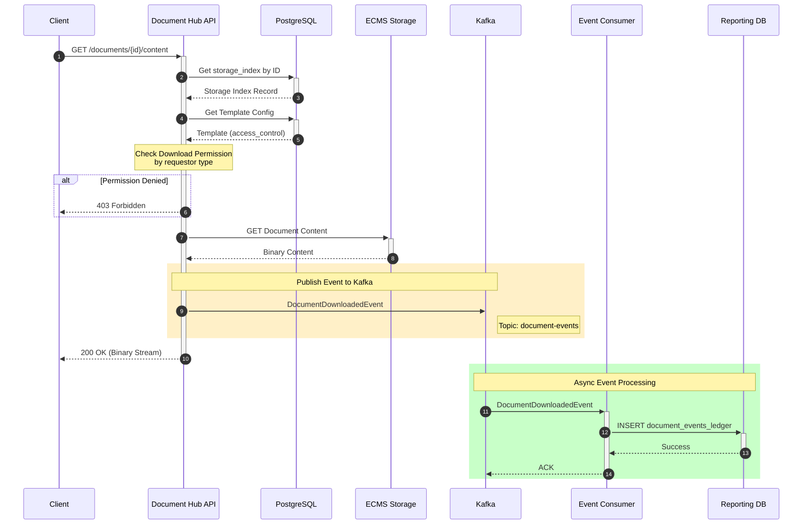
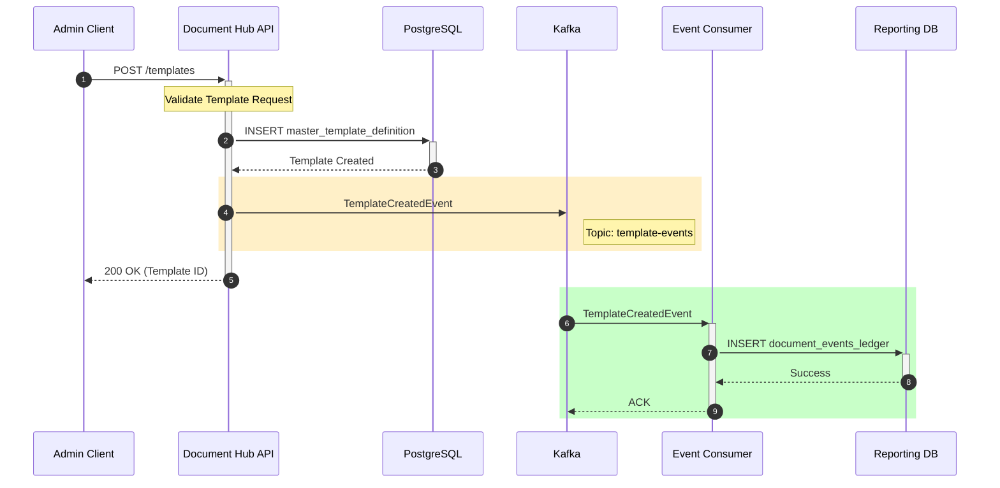
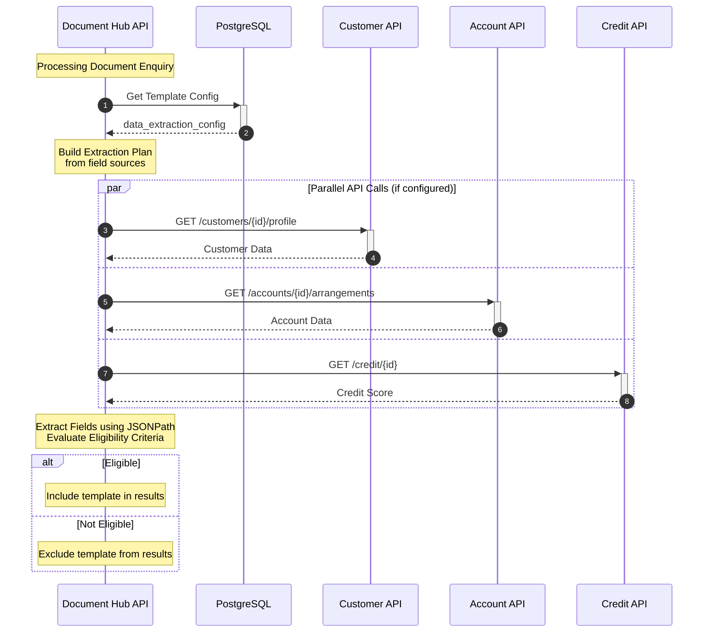
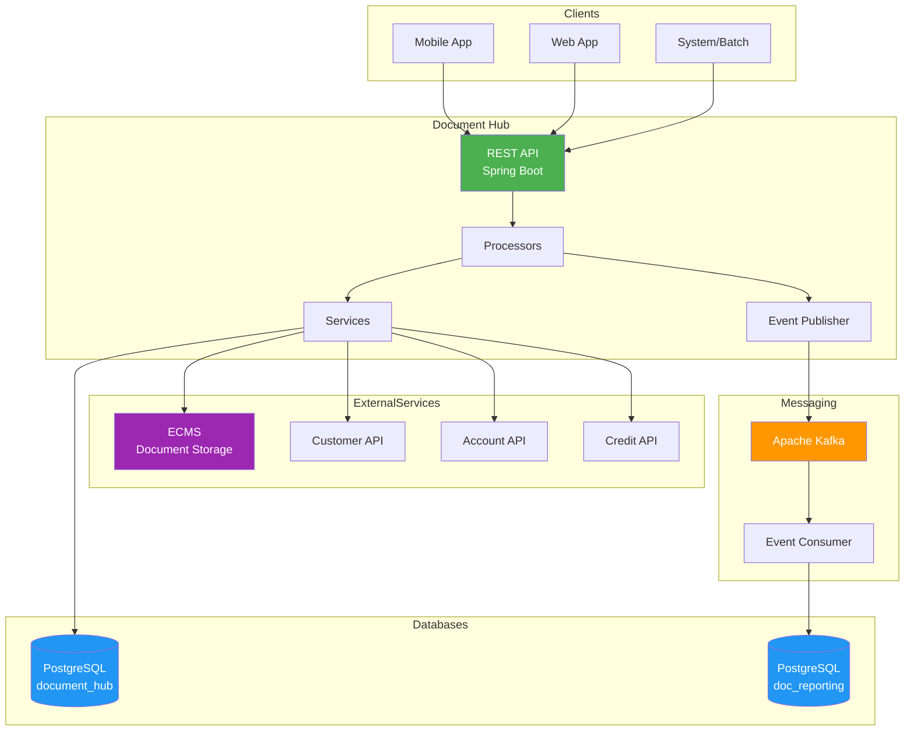

# Document Hub - System Sequence Diagrams

## Overview

This document provides sequence diagrams showing how Document Hub communicates with different components including databases, external services, and Kafka for event streaming.

---

## Components

| Component | Type | Description |
|-----------|------|-------------|
| **Client** | External | Mobile App, Web App, or API Consumer |
| **Document Hub API** | Service | Main application (Spring Boot) |
| **PostgreSQL** | Database | Primary database for templates and storage index |
| **ECMS** | External Service | Enterprise Content Management System (document storage) |
| **Mock APIs** | External Service | Customer, Account, Credit APIs for data enrichment |
| **Kafka** | Message Broker | Event streaming for document events |
| **Reporting DB** | Database | `doc_reporting.document_events_ledger` table |
| **Event Consumer** | Service | Consumes Kafka events and updates reporting |

---

## 1. Document Upload Flow



---

## 2. Document Enquiry Flow



---

## 3. Document Download Flow



---

## 4. Template Management Flow



---

## 5. Data Extraction Flow (Eligibility Check)



---

## 6. Kafka Event Schema

### Topic: `document-events`

```json
{
  "eventId": "uuid",
  "eventType": "DOCUMENT_UPLOADED | DOCUMENT_DOWNLOADED | DOCUMENT_VIEWED | DOCUMENT_DELETED",
  "timestamp": 1704067200000,
  "correlationId": "uuid",
  "payload": {
    "documentId": "uuid",
    "templateType": "Statement",
    "templateVersion": 1,
    "customerId": "uuid",
    "accountId": "uuid",
    "requestorId": "uuid",
    "requestorType": "CUSTOMER | AGENT | SYSTEM",
    "action": "UPLOAD | DOWNLOAD | VIEW | DELETE",
    "metadata": {
      "fileName": "statement_jan_2024.pdf",
      "fileSize": 102400,
      "mimeType": "application/pdf"
    }
  }
}
```

### Topic: `template-events`

```json
{
  "eventId": "uuid",
  "eventType": "TEMPLATE_CREATED | TEMPLATE_UPDATED | TEMPLATE_ACTIVATED | TEMPLATE_DEACTIVATED",
  "timestamp": 1704067200000,
  "correlationId": "uuid",
  "payload": {
    "masterTemplateId": "uuid",
    "templateVersion": 1,
    "templateType": "Statement",
    "lineOfBusiness": "CREDIT_CARD",
    "action": "CREATE | UPDATE | ACTIVATE | DEACTIVATE",
    "changedBy": "admin-user-id",
    "changes": {}
  }
}
```

---

## 7. Document Events Ledger Schema

```sql
CREATE TABLE doc_reporting.document_events_ledger (
    event_id UUID PRIMARY KEY DEFAULT gen_random_uuid(),
    event_type VARCHAR(50) NOT NULL,
    event_timestamp TIMESTAMP NOT NULL DEFAULT NOW(),
    correlation_id UUID,

    -- Document Info
    document_id UUID,
    template_type VARCHAR(100),
    template_version INTEGER,

    -- Actor Info
    customer_id UUID,
    account_id UUID,
    requestor_id UUID,
    requestor_type VARCHAR(20),

    -- Event Details
    action VARCHAR(50) NOT NULL,
    status VARCHAR(20) DEFAULT 'SUCCESS',
    error_message TEXT,

    -- Metadata
    metadata JSONB,

    -- Audit
    created_at TIMESTAMP NOT NULL DEFAULT NOW(),

    -- Indexes
    INDEX idx_event_timestamp (event_timestamp),
    INDEX idx_document_id (document_id),
    INDEX idx_customer_id (customer_id),
    INDEX idx_action (action)
);
```

---

## 8. Simplified Component Diagram



---

## 9. Event Flow Summary

| Event | Trigger | Kafka Topic | Ledger Action |
|-------|---------|-------------|---------------|
| `DOCUMENT_UPLOADED` | POST /documents | document-events | INSERT |
| `DOCUMENT_DOWNLOADED` | GET /documents/{id}/content | document-events | INSERT |
| `DOCUMENT_VIEWED` | POST /documents-enquiry | document-events | INSERT |
| `DOCUMENT_DELETED` | DELETE /documents/{id} | document-events | INSERT |
| `TEMPLATE_CREATED` | POST /templates | template-events | INSERT |
| `TEMPLATE_UPDATED` | PATCH /templates/{id} | template-events | INSERT |
| `TEMPLATE_ACTIVATED` | POST /templates/{id}/activate | template-events | INSERT |
| `TEMPLATE_DEACTIVATED` | POST /templates/{id}/deactivate | template-events | INSERT |

---

## 10. Configuration

### Kafka Producer Config (application.yml)

```yaml
spring:
  kafka:
    bootstrap-servers: localhost:9092
    producer:
      key-serializer: org.apache.kafka.common.serialization.StringSerializer
      value-serializer: org.springframework.kafka.support.serializer.JsonSerializer
      acks: all
      retries: 3
      properties:
        enable.idempotence: true
        max.in.flight.requests.per.connection: 5

document-hub:
  kafka:
    topics:
      document-events: document-events
      template-events: template-events
    enabled: true
```

### Event Consumer Config

```yaml
spring:
  kafka:
    consumer:
      group-id: document-events-consumer
      auto-offset-reset: earliest
      key-deserializer: org.apache.kafka.common.serialization.StringDeserializer
      value-deserializer: org.springframework.kafka.support.serializer.JsonDeserializer
      properties:
        spring.json.trusted.packages: com.documenthub.event
```

---

## View These Diagrams

1. **GitHub/GitLab**: Mermaid diagrams render automatically
2. **VS Code**: Install "Markdown Preview Mermaid Support" extension
3. **Online**: Use [Mermaid Live Editor](https://mermaid.live)
