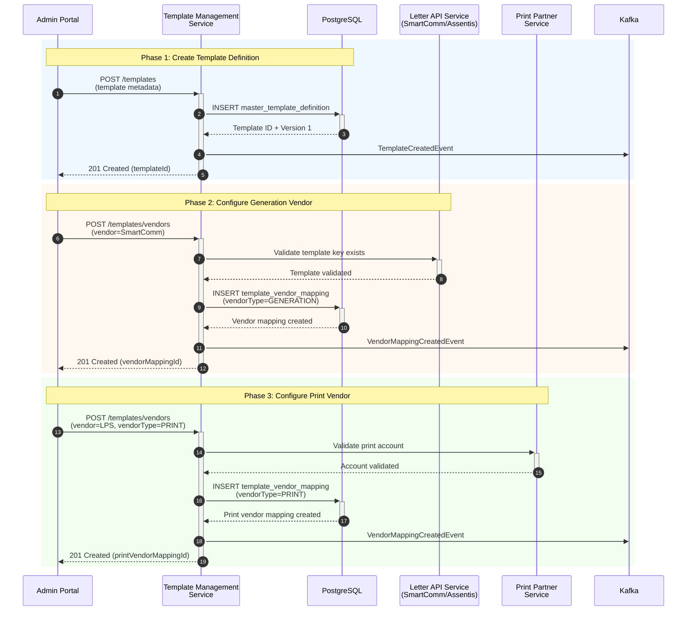
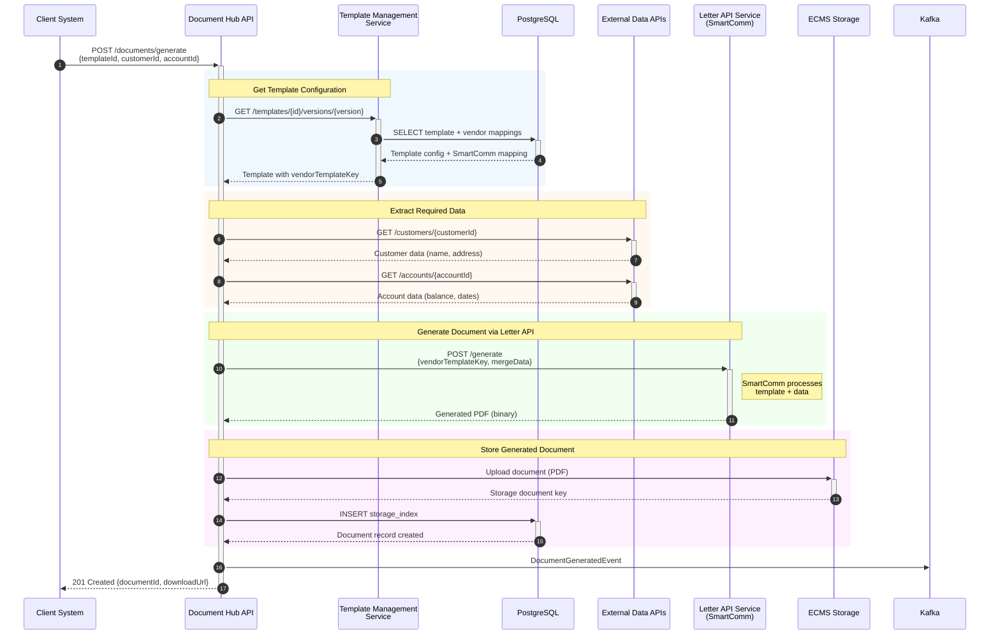
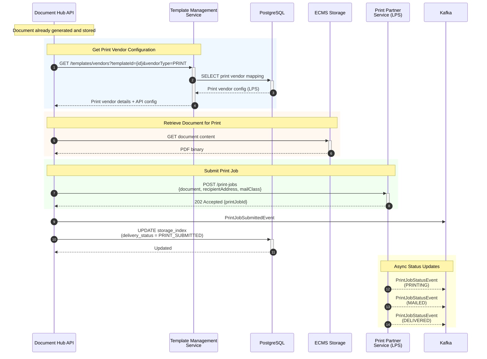
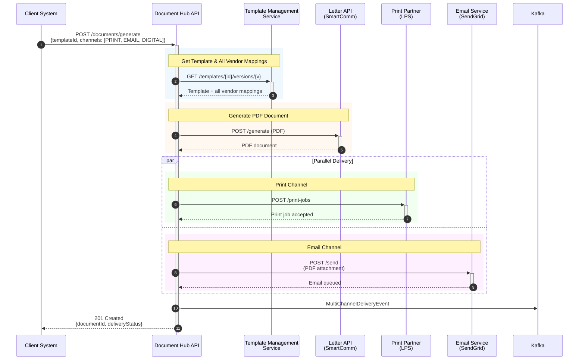
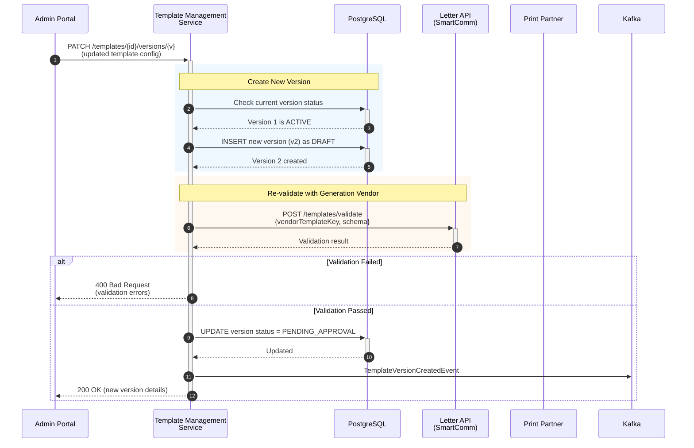
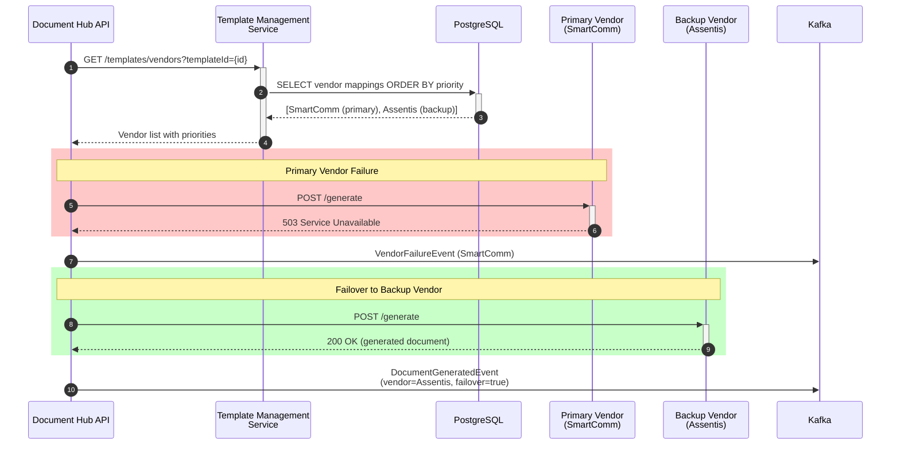
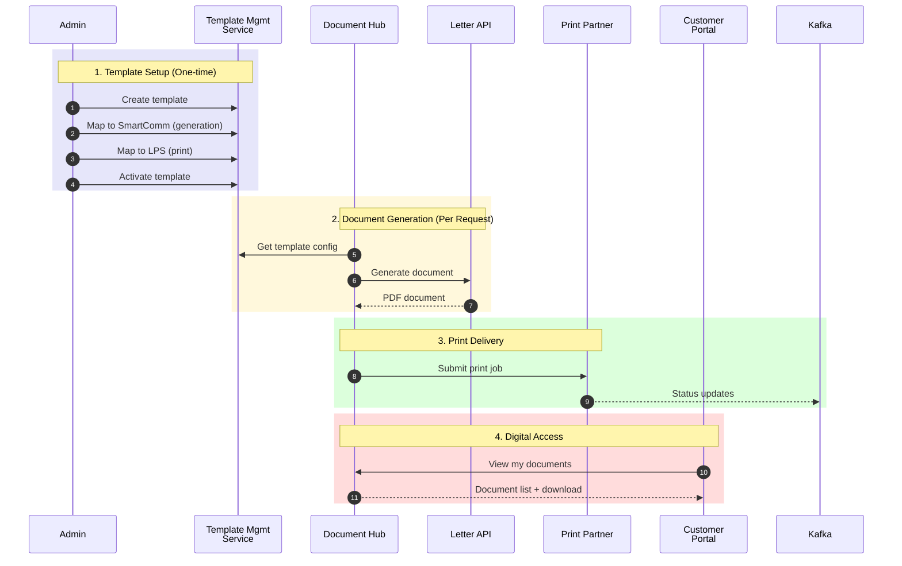

# Template Management Service - Integration Sequence Diagrams

## Overview

This document illustrates how the Template Management Service integrates with external services including Print Partner Service, Letter API Service (SmartComm/Assentis), and other downstream systems for document generation and delivery.

---

## Components

| Component | Type | Description |
|-----------|------|-------------|
| **Client** | External | Mobile App, Web App, Agent Portal, or System |
| **Template Management Service** | Core Service | Manages templates, versions, and vendor mappings |
| **Letter API Service** | Vendor Service | Document generation engine (SmartComm, Assentis, Handlebars) |
| **Print Partner Service** | Vendor Service | Physical mail printing and delivery (LPS, etc.) |
| **Document Hub API** | Core Service | Document storage, retrieval, and enquiry |
| **Kafka** | Message Broker | Event streaming for async processing |
| **PostgreSQL** | Database | Template and document metadata storage |

---

## 1. Template Onboarding with Vendor Mapping

This flow shows how a new template is created and mapped to generation and print vendors.

---

## 2. Document Generation Flow (Letter API Integration)

This flow shows how a document is generated using the Letter API Service based on template configuration.

---

## 3. Print Delivery Flow (Print Partner Integration)

This flow shows how a generated document is sent to the Print Partner Service for physical mailing.

---

## 4. Multi-Channel Delivery Flow

This flow shows generating and delivering the same content across multiple channels.

---

## 5. Template Version Update with Vendor Re-validation

This flow shows updating a template version and re-validating with vendors.

---

## 6. Vendor Failover Flow

This flow shows how the system handles vendor failures with automatic failover.

---

## 7. Complete End-to-End Flow

This comprehensive diagram shows the full journey from template creation to document delivery.

---

## API Contracts Summary

### Template Management Service APIs

| Endpoint | Method | Description |
|----------|--------|-------------|
| `/templates` | POST | Create new template |
| `/templates/{id}/versions/{v}` | GET | Get template version details |
| `/templates/{id}/versions/{v}` | PATCH | Update template version |
| `/templates/vendors` | POST | Create vendor mapping |
| `/templates/vendors` | GET | List vendor mappings |
| `/templates/vendors/{vendorId}` | PATCH | Update vendor mapping |

### Letter API Service APIs (SmartComm/Assentis)

| Endpoint | Method | Description |
|----------|--------|-------------|
| `/templates/validate` | POST | Validate template schema |
| `/generate` | POST | Generate document from template |
| `/preview` | POST | Generate preview with watermark |

### Print Partner Service APIs (LPS)

| Endpoint | Method | Description |
|----------|--------|-------------|
| `/print-jobs` | POST | Submit print job |
| `/print-jobs/{id}` | GET | Get job status |
| `/print-jobs/{id}/cancel` | POST | Cancel print job |
| `/accounts/validate` | POST | Validate print account |

---

## Event Schemas

### Kafka Topics

| Topic | Events |
|-------|--------|
| `template-events` | TemplateCreated, TemplateUpdated, TemplateActivated |
| `vendor-events` | VendorMappingCreated, VendorFailure, VendorRecovered |
| `document-events` | DocumentGenerated, DocumentDelivered |
| `print-events` | PrintJobSubmitted, PrintJobStatus, PrintJobCompleted |

---

## View These Diagrams

1. **GitHub/GitLab**: Mermaid diagrams render automatically
2. **VS Code**: Install "Markdown Preview Mermaid Support" extension
3. **Online**: Use [Mermaid Live Editor](https://mermaid.live)
