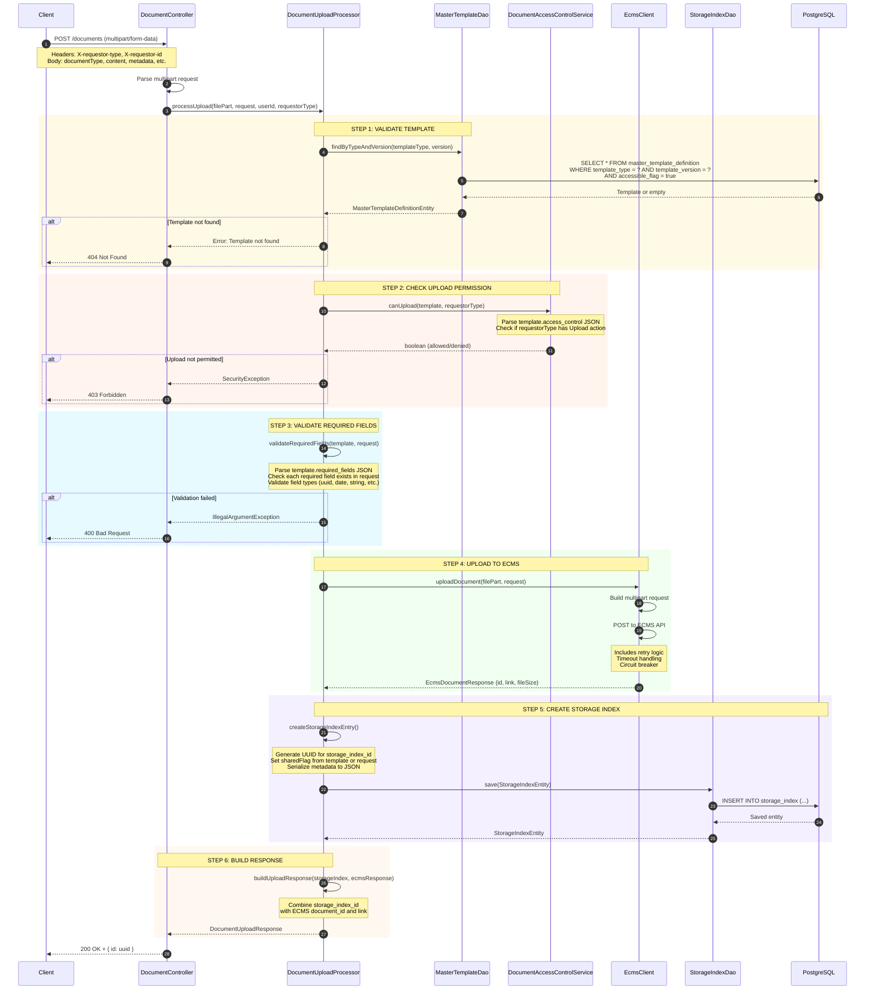
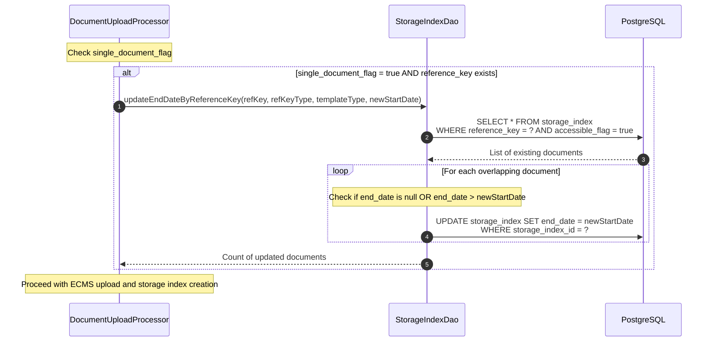

# Document Upload Flow - Implementation Guide

**Created:** December 2024
**Endpoint:** `POST /documents`
**Source:** API Specification, Demo Feedback Sessions

This document describes the complete flow for uploading documents to Document Hub.

---

## Table of Contents

1. [Overview](#overview)
2. [Pre-Upload Requirements](#pre-upload-requirements)
3. [Upload Request](#upload-request)
4. [Validation Steps](#validation-steps)
5. [Storage Flow](#storage-flow)
6. [Post-Upload Actions](#post-upload-actions)
7. [Error Handling](#error-handling)
8. [Integration Points](#integration-points)

---

## Overview

### High-Level Flow

```
┌─────────────────┐     ┌─────────────────┐     ┌─────────────────┐
│    Consumer     │────▶│  Document Hub   │────▶│   ECMS (S3)     │
│  (Vendor/App)   │     │      API        │     │                 │
└─────────────────┘     └─────────────────┘     └─────────────────┘
                               │
                               ▼
                        ┌─────────────────┐
                        │   PostgreSQL    │
                        │  (storage_index)│
                        └─────────────────┘
```

### Sequence Diagram



### Upload Sources

| Source | Description | Example |
|--------|-------------|---------|
| Statement Processor | Batch statements from Fiserv | Monthly credit card statements |
| Letter Generation | Internal letter service | Payment confirmation letters |
| Vendor Systems | External document providers | Disclosures from compliance vendor |
| Back Office | Manual uploads | Regulatory documents |
| Legacy Migration | One-time migration | Historical documents |

---

## Pre-Upload Requirements

### Step 1: Verify Template Exists

Before uploading a document, verify that the template definition exists and is active.

```
GET /templates?templateType={documentType}&lineOfBusiness={lob}
```

**Required Template Fields:**
- `master_template_id` - UUID of the template
- `template_version` - Current version number
- `template_type` - Must match document type
- `active_flag` = true
- `start_date` <= current date (if set)
- `end_date` >= current date (if set)

### Step 2: Validate Required Metadata

Each template defines required metadata fields in `required_fields` JSON column.

**Example Template Required Fields:**
```json
{
  "required_fields": [
    {"field": "accountId", "type": "uuid", "required": true},
    {"field": "statementDate", "type": "date", "required": true},
    {"field": "statementPeriodStart", "type": "date", "required": true},
    {"field": "statementPeriodEnd", "type": "date", "required": true}
  ]
}
```

### Step 3: Check Date Range Availability (P1-002)

**Critical Validation:** Ensure no overlapping date ranges for the same template type.

```sql
-- Check for overlapping documents
SELECT COUNT(*) FROM document_hub.storage_index
WHERE template_type = :templateType
AND account_key = :accountKey  -- For account-specific docs
AND (
    (active_start_date <= :newEndDate AND active_end_date >= :newStartDate)
)
AND accessible_flag = true;
```

**John's Requirement (Day 3):**
> "When we're uploading, we need to make sure that there shouldn't be any overlapping dates... They had to put checks in to make sure when they're entering a new one, it couldn't overlap an old one."

---

## Upload Request

### API Endpoint

```
POST /documents
Content-Type: multipart/form-data
```

### Required Headers

| Header | Type | Required | Description |
|--------|------|----------|-------------|
| `X-version` | integer | Yes | API version (default: 1) |
| `X-correlation-id` | string | Yes | Request tracing ID (max 36 chars) |
| `X-requestor-id` | uuid | Yes | ID of the uploading system/user |
| `X-requestor-type` | enum | Yes | CUSTOMER, AGENT, or SYSTEM |

### Request Body (multipart/form-data)

| Field | Type | Required | Description |
|-------|------|----------|-------------|
| `documentType` | string | Yes | Type of document (e.g., "Statement", "PrivacyPolicy") |
| `createdBy` | uuid | Yes | ID of user/system creating the entry |
| `templateId` | uuid | No | Reference to template used for generation |
| `referenceKey` | string | No | External identifier (e.g., disclosure code) |
| `referenceKeyType` | string | No | Type of reference key |
| `accountKey` | uuid | No | Account associated with document |
| `customerKey` | uuid | No | Customer associated with document |
| `category` | string | No | Document classification |
| `fileName` | string | No | Name of the file |
| `activeStartDate` | int64 | No | When document becomes active (epoch seconds) |
| `activeEndDate` | int64 | No | When document expires (epoch seconds) |
| `threadId` | uuid | No | Processing thread identifier |
| `correlationId` | uuid | No | Cross-system correlation ID |
| `content` | binary | Yes | The document file (PDF, etc.) |
| `metadata` | array | Yes | Key-value pairs for indexing |

### Example Request

```bash
curl -X POST "https://api.example.com/documents" \
  -H "X-version: 1" \
  -H "X-correlation-id: abc-123-def-456" \
  -H "X-requestor-id: 3fa85f64-5717-4562-b3fc-2c963f66afa6" \
  -H "X-requestor-type: SYSTEM" \
  -F "documentType=Statement" \
  -F "createdBy=3fa85f64-5717-4562-b3fc-2c963f66afa6" \
  -F "templateId=22222222-2222-2222-2222-222222222222" \
  -F "accountKey=aaaaaaaa-bbbb-cccc-dddd-eeeeeeeeeeee" \
  -F "customerKey=cccccccc-cccc-cccc-cccc-cccccccccccc" \
  -F "fileName=statement_2024_01.pdf" \
  -F "activeStartDate=1704067200" \
  -F "activeEndDate=1706745599" \
  -F 'metadata=[{"key":"statementDate","value":"2024-01-15"},{"key":"accountId","value":"aaaaaaaa-bbbb-cccc-dddd-eeeeeeeeeeee"}]' \
  -F "content=@/path/to/statement.pdf"
```

---

## Validation Steps

### Step-by-Step Validation Flow

```
┌─────────────────────────────────────────────────────────────────┐
│                    VALIDATION PIPELINE                          │
└─────────────────────────────────────────────────────────────────┘
                              │
                              ▼
┌─────────────────────────────────────────────────────────────────┐
│ 1. HEADER VALIDATION                                            │
│    - X-version present and valid                                │
│    - X-correlation-id present (max 36 chars)                    │
│    - X-requestor-id is valid UUID                               │
│    - X-requestor-type is valid enum                             │
└─────────────────────────────────────────────────────────────────┘
                              │
                              ▼
┌─────────────────────────────────────────────────────────────────┐
│ 2. REQUIRED FIELD VALIDATION                                    │
│    - documentType is not empty                                  │
│    - createdBy is valid UUID                                    │
│    - content is not empty                                       │
│    - metadata array is present                                  │
└─────────────────────────────────────────────────────────────────┘
                              │
                              ▼
┌─────────────────────────────────────────────────────────────────┐
│ 3. TEMPLATE VALIDATION                                          │
│    - Template exists for documentType                           │
│    - Template is active (active_flag = true)                    │
│    - Template is within validity period                         │
│    - Template allows this communication type (future)           │
└─────────────────────────────────────────────────────────────────┘
                              │
                              ▼
┌─────────────────────────────────────────────────────────────────┐
│ 4. METADATA VALIDATION                                          │
│    - All required fields from template are present              │
│    - Field types match expected types                           │
│    - Field values pass validation patterns (if defined)         │
└─────────────────────────────────────────────────────────────────┘
                              │
                              ▼
┌─────────────────────────────────────────────────────────────────┐
│ 5. DATE OVERLAP VALIDATION (P1-002)                             │
│    - Check for existing documents with overlapping dates        │
│    - For same template type + account/customer                  │
│    - Reject if overlap found                                    │
└─────────────────────────────────────────────────────────────────┘
                              │
                              ▼
┌─────────────────────────────────────────────────────────────────┐
│ 6. FILE VALIDATION                                              │
│    - File size within limits                                    │
│    - MIME type matches expected (e.g., application/pdf)         │
│    - Virus scan (future - currently client responsibility)      │
└─────────────────────────────────────────────────────────────────┘
                              │
                              ▼
                    [PROCEED TO STORAGE]
```

### Validation Error Responses

| Error Code | HTTP Status | Description |
|------------|-------------|-------------|
| MISSING_REQUIRED_FIELD | 400 | Required field not provided |
| INVALID_FIELD_TYPE | 400 | Field value doesn't match expected type |
| TEMPLATE_NOT_FOUND | 404 | No active template for document type |
| TEMPLATE_INACTIVE | 400 | Template exists but is not active |
| DATE_OVERLAP | 409 | Document with overlapping dates exists |
| FILE_TOO_LARGE | 400 | File exceeds size limit |
| INVALID_MIME_TYPE | 400 | File type not allowed |
| VIRUS_DETECTED | 409 | Antivirus scan failed |

---

## Storage Flow

### Step 1: Upload to ECMS

The document is uploaded to ECMS (Enterprise Content Management System) via the `EcmsClient`:

```java
// EcmsClient uploads to ECMS API
return webClient.post()
    .uri("/documents")
    .contentType(MediaType.MULTIPART_FORM_DATA)
    .body(BodyInserters.fromMultipartData(multipartData))
    .retrieve()
    .bodyToMono(EcmsDocumentResponse.class);
```

**ECMS Response:**
```json
{
  "id": "ecms-doc-uuid",
  "name": "document.pdf",
  "link": "https://ecms.example.com/documents/ecms-doc-uuid",
  "fileSize": { "value": 1024, "unit": "KB" }
}
```

### Step 2: Create Storage Index Record

```java
StorageIndexEntity entity = StorageIndexEntity.builder()
    .storageIndexId(UUID.randomUUID())
    .masterTemplateId(template.getMasterTemplateId())
    .templateVersion(request.getTemplateVersion())
    .templateType(request.getTemplateType())
    .storageVendor("ECMS")
    .storageDocumentKey(ecmsResponse.getId())  // ECMS document ID
    .fileName(request.getFileName())
    .referenceKey(request.getReferenceKey())
    .referenceKeyType(request.getReferenceKeyType())
    .accountKey(request.getAccountId())
    .customerKey(request.getCustomerId())
    .docCreationDate(System.currentTimeMillis())
    .accessibleFlag(true)
    .sharedFlag(sharedFlag)
    .startDate(request.getStartDate())
    .endDate(request.getEndDate())
    .createdBy(userId)
    .createdTimestamp(LocalDateTime.now())
    .archiveIndicator(false)
    .versionNumber(1L)
    .recordStatus("ACTIVE")
    .build();

// Set metadata if provided
if (request.getMetadata() != null) {
    entity.setDocMetadata(Json.of(objectMapper.writeValueAsString(request.getMetadata())));
}

return storageIndexDao.save(entity);
```

### Step 3: Single Document Flag Handling

When a template has `single_document_flag = true`, the system ensures only one document per `reference_key` is active at any given time.

#### How It Works

**Before uploading a new document:**
1. Check if template has `single_document_flag = true`
2. If true, find existing active documents with same `reference_key`, `reference_key_type`, and `template_type`
3. For each overlapping document, update its `end_date` to the new document's `start_date`

**Overlap Detection:**
A document is considered "overlapping" if:
- Its `end_date` is `null` (currently active with no end), OR
- Its `end_date` is greater than the new document's `start_date`

Documents with `end_date` before the new document's `start_date` are NOT updated (no overlap).

#### Sequence Diagram



#### Example Scenario

**Initial State:**
| Document ID | Reference Key | Start Date | End Date | Status |
|-------------|---------------|------------|----------|--------|
| doc-001 | ORDER-123 | 2024-01-01 | null | Active |

**Upload New Document:**
- New document for `ORDER-123` with `start_date = 2024-06-01`
- Template has `single_document_flag = true`

**After Upload:**
| Document ID | Reference Key | Start Date | End Date | Status |
|-------------|---------------|------------|----------|--------|
| doc-001 | ORDER-123 | 2024-01-01 | **2024-06-01** | Closed |
| doc-002 | ORDER-123 | 2024-06-01 | null | Active |

#### Code Implementation

**StorageIndexDao.java:**
```java
public Mono<Long> updateEndDateByReferenceKey(
        String referenceKey,
        String referenceKeyType,
        String templateType,
        Long newDocStartDate) {
    return findActiveByReferenceKey(referenceKey, referenceKeyType, templateType)
        .filter(doc -> isOverlapping(doc, newDocStartDate))
        .flatMap(doc -> updateEndDate(doc, newDocStartDate))
        .count();
}

private boolean isOverlapping(StorageIndexEntity doc, Long newDocStartDate) {
    if (newDocStartDate == null) {
        return true; // If no start date, consider all as overlapping
    }
    return doc.getEndDate() == null || doc.getEndDate() > newDocStartDate;
}
```

**DocumentUploadProcessor.java / DocumentManagementProcessor.java:**
```java
private Mono<Void> closeExistingDocsIfSingleDoc(
        MasterTemplateDefinitionEntity template, DocumentUploadRequest request) {
    if (!shouldCloseExistingDocs(template, request)) {
        return Mono.empty();
    }

    Long newDocStartDate = getStartDateForNewDoc(request);
    return storageIndexDao.updateEndDateByReferenceKey(
            request.getReferenceKey(),
            request.getReferenceKeyType(),
            template.getTemplateType(),
            newDocStartDate)
        .then();
}

private boolean shouldCloseExistingDocs(
        MasterTemplateDefinitionEntity template, DocumentUploadRequest request) {
    return Boolean.TRUE.equals(template.getSingleDocumentFlag())
        && request.getReferenceKey() != null
        && request.getReferenceKeyType() != null;
}
```

#### Test Coverage

| Test Class | Tests | Description |
|------------|-------|-------------|
| `StorageIndexDaoTest` | 9 | Tests overlap detection and end_date updates |
| `DocumentManagementProcessorTest` | 8 | Tests upload flow with single_document_flag |

**Key Test Scenarios:**
- ✅ Update docs with null end_date (overlapping)
- ✅ Update docs with end_date after new start_date (overlapping)
- ✅ Skip docs with end_date before new start_date (not overlapping)
- ✅ Skip when single_document_flag is false/null
- ✅ Skip when reference_key or reference_key_type is null
- ✅ Use provided activeStartDate as new end_date
- ✅ Fall back to current time when activeStartDate is null

---

### Step 4: Return Response

```json
{
  "id": "storage-index-uuid"
}
```

**Full Internal Response (DocumentUploadResponse):**
```json
{
  "storageIndexId": "storage-index-uuid",
  "ecmsDocumentId": "ecms-doc-uuid",
  "fileName": "statement_2024_01.pdf",
  "displayName": "statement_2024_01.pdf",
  "templateType": "Statement",
  "templateVersion": 1,
  "accountId": "account-uuid",
  "customerId": "customer-uuid",
  "referenceKey": "ACC-12345",
  "referenceKeyType": "ACCOUNT_ID",
  "documentLink": "https://ecms.example.com/documents/ecms-doc-uuid",
  "fileSize": { "value": 1024, "unit": "KB" },
  "createdAt": "2024-12-22T10:30:00",
  "status": "SUCCESS",
  "message": "Document uploaded successfully"
}
```

---

## Post-Upload Actions

### 1. Notification (If Required)

Check template's `notification_needed` flag:

```java
if (template.getNotificationNeeded()) {
    // Publish notification event
    notificationService.sendDocumentNotification(
        customerId,
        accountId,
        documentType,
        documentId
    );
}
```

### 2. Kafka Event (For Print/Delivery)

For letter-type documents that need printing (P1-011):

```java
if ("LETTER".equals(template.getCommunicationType())) {
    // Publish to Kafka topic for print fulfillment
    kafkaTemplate.send(
        "communication_delivery_letter_print",
        new PrintRequest(documentId, accountId, customerId)
    );
}
```

### 3. Legacy System Integration (P1-012)

For print fulfillment via legacy system:

```java
// 1. Copy PDF to legacy directory
Files.copy(pdfContent, legacyDropPath);

// 2. Update database with legacy reference
storageIndexRepository.updateLegacyReference(
    documentId,
    legacyFilePath
);
```

**John's Requirement (Day 3):**
> "PDF files dropped into the directory... We should just be able to do a file copy"

### 4. Audit Log

```java
auditService.logDocumentUpload(
    documentId,
    documentType,
    uploadedBy,
    timestamp,
    correlationId
);
```

---

## Error Handling

### Rollback Strategy

If any step fails after partial completion:

```
┌─────────────────────────────────────────────────────────────────┐
│                    ROLLBACK STRATEGY                            │
└─────────────────────────────────────────────────────────────────┘

1. S3 Upload Failed:
   └── Return error immediately (nothing to rollback)

2. Database Insert Failed:
   └── Delete S3 object
   └── Return error

3. Kafka Publish Failed:
   └── Mark document as pending_notification
   └── Return success (document uploaded)
   └── Retry notification via scheduled job

4. Legacy File Drop Failed:
   └── Mark document as pending_legacy_sync
   └── Return success (document uploaded)
   └── Retry via scheduled job
```

### Retry Configuration

```yaml
document-hub:
  upload:
    s3:
      max-retries: 3
      retry-delay-ms: 1000
    kafka:
      max-retries: 5
      retry-delay-ms: 2000
    legacy:
      max-retries: 3
      retry-delay-ms: 5000
```

---

## Integration Points

### 1. Statement Processor Integration

**Source:** Fiserv batch processing

```
┌─────────────┐     ┌─────────────┐     ┌─────────────┐
│   Fiserv    │────▶│   Batch     │────▶│ Document    │
│  Statements │     │  Processor  │     │    Hub      │
└─────────────┘     └─────────────┘     └─────────────┘
```

**Batch Upload Considerations:**
- Rate limiting (max X uploads per minute)
- Bulk validation before upload
- Progress tracking
- Failure recovery

### 2. Print Fulfillment Integration (P1-011, P1-012, P1-013)

```
┌─────────────┐     ┌─────────────┐     ┌─────────────┐
│ Document    │────▶│   Kafka     │────▶│  Smartcom/  │
│    Hub      │     │   Topic     │     │  Sentista   │
└─────────────┘     └─────────────┘     └─────────────┘
       │
       └────▶ Legacy File Drop ────▶ Print Queue
```

### 3. Vendor Template Integration

For documents generated by vendors:

1. Vendor generates document using their template
2. Vendor calls Document Hub upload API
3. Document Hub validates against template definition
4. Document Hub stores and indexes document

---

## Complete Upload Checklist

### Pre-Upload

- [ ] Template exists and is active
- [ ] Required metadata fields identified
- [ ] No overlapping date ranges
- [ ] File prepared and validated

### Upload

- [ ] Headers set correctly
- [ ] Required fields populated
- [ ] Metadata array complete
- [ ] File attached

### Post-Upload

- [ ] Response contains document ID
- [ ] Document queryable via enquiry API
- [ ] Notifications sent (if required)
- [ ] Print job queued (if letter type)
- [ ] Audit log created

---

## Sample Code

### Java Upload Processor (Actual Implementation)

```java
@Component
@RequiredArgsConstructor
public class DocumentUploadProcessor {

    private final MasterTemplateDao masterTemplateDao;
    private final StorageIndexDao storageIndexDao;
    private final EcmsClient ecmsClient;
    private final DocumentAccessControlService accessControlService;
    private final ObjectMapper objectMapper;

    public Mono<DocumentUploadResponse> processUpload(
            FilePart filePart,
            DocumentUploadRequest request,
            String userId,
            String requestorType) {

        return validateAndGetTemplate(request.getTemplateType(), request.getTemplateVersion())
            .flatMap(template -> {
                // Step 1: Check upload permission
                if (!accessControlService.canUpload(template, requestorType)) {
                    return Mono.error(new SecurityException(
                        "Upload not permitted for requestor type: " + requestorType));
                }

                // Step 2: Validate required fields from template config
                List<String> validationErrors = validateRequiredFields(template, request);
                if (!validationErrors.isEmpty()) {
                    return Mono.error(new IllegalArgumentException(
                        "Required fields validation failed: " + String.join(", ", validationErrors)));
                }

                // Step 3: Upload to ECMS
                return ecmsClient.uploadDocument(filePart, request)
                    .flatMap(ecmsResponse ->
                        // Step 4: Create storage index entry
                        createStorageIndexEntry(request, ecmsResponse, template, userId)
                            .map(storageIndex -> buildUploadResponse(storageIndex, ecmsResponse))
                    );
            });
    }

    private Mono<MasterTemplateDefinitionEntity> validateAndGetTemplate(
            String templateType, Integer templateVersion) {
        return masterTemplateDao.findByTypeAndVersion(templateType, templateVersion)
            .switchIfEmpty(Mono.error(new IllegalArgumentException(
                "Template not found: type=" + templateType + ", version=" + templateVersion)));
    }

    private List<String> validateRequiredFields(
            MasterTemplateDefinitionEntity template,
            DocumentUploadRequest request) {
        List<String> errors = new ArrayList<>();
        Json requiredFieldsJson = template.getRequiredFields();

        if (requiredFieldsJson != null) {
            JsonNode requiredFields = objectMapper.readTree(requiredFieldsJson.asString());
            for (JsonNode fieldDef : requiredFields) {
                String fieldName = fieldDef.path("field").asText();
                boolean required = fieldDef.path("required").asBoolean(true);
                if (required) {
                    Object fieldValue = getFieldValue(request, fieldName);
                    if (fieldValue == null || fieldValue.toString().isBlank()) {
                        errors.add("Missing required field: " + fieldName);
                    }
                }
            }
        }
        return errors;
    }
}
```

---

## Document History

| Date | Author | Changes |
|------|--------|---------|
| Dec 2024 | Team | Initial creation |
