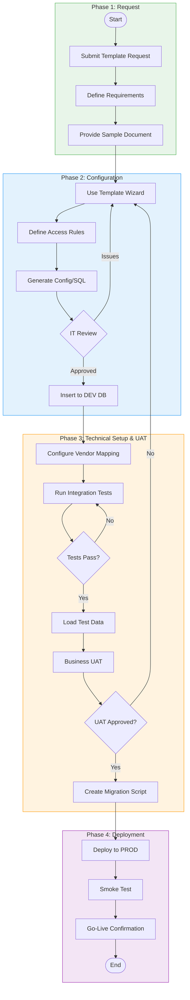
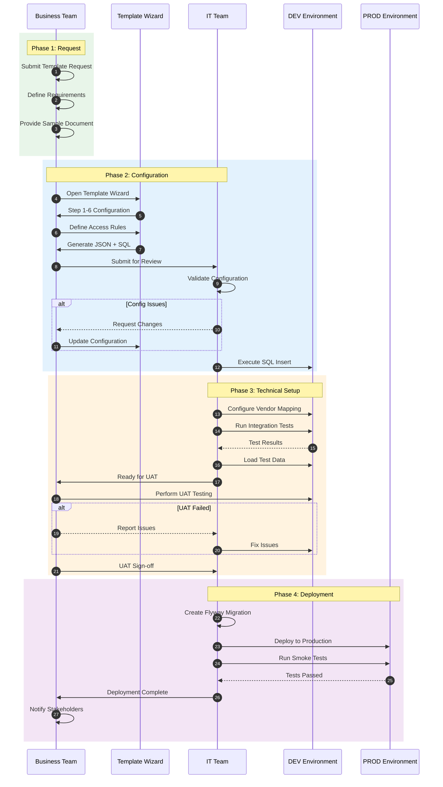
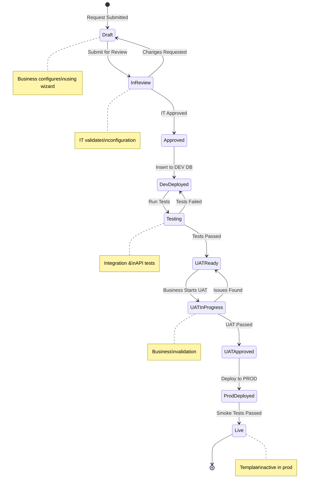
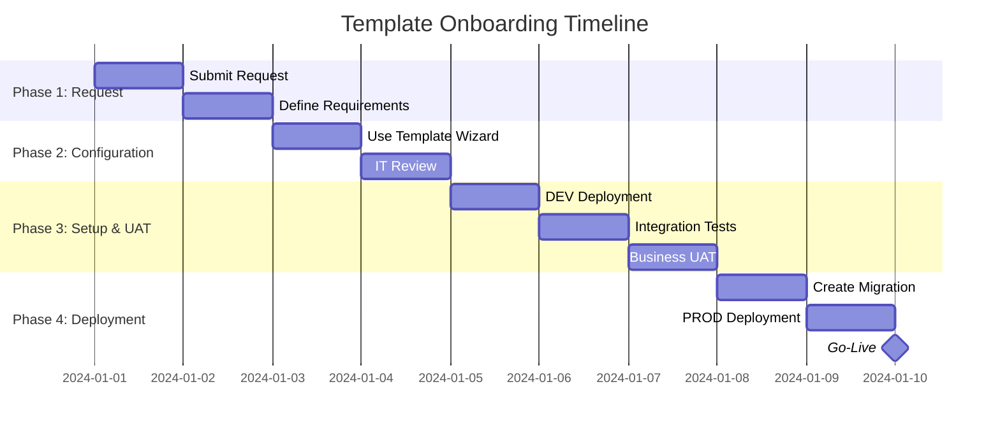
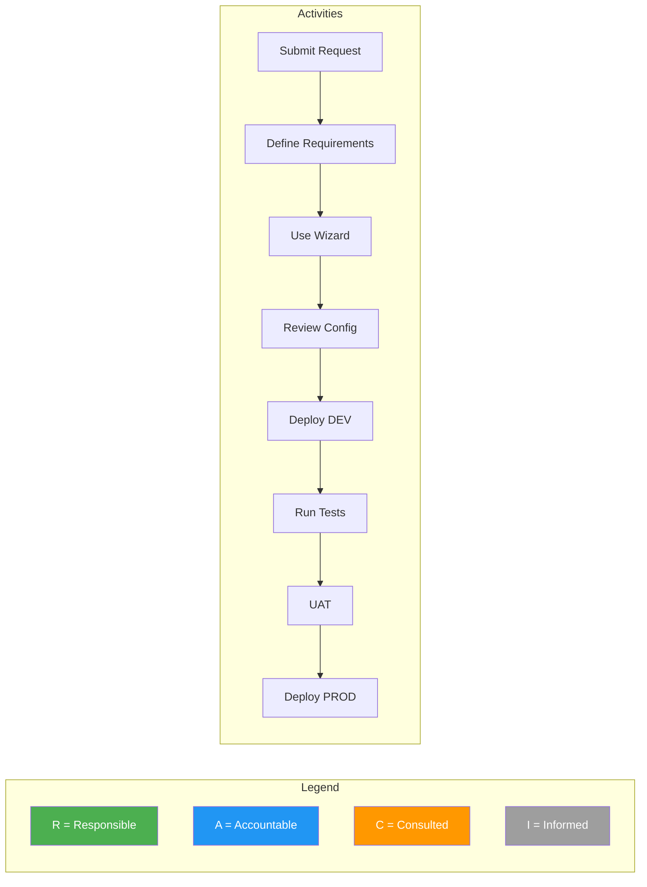

# Template Onboarding Process - Mermaid Diagrams

## Swimlane Flowchart

## Sequence Diagram (Interactions)

## State Diagram (Template Status)

## Gantt Chart (Timeline)

## RACI Matrix

| Activity | Business | IT | Management |
|----------|----------|-----|------------|
| Submit Request | R/A | I | I |
| Define Requirements | R/A | C | I |
| Use Template Wizard | R | C | I |
| Review Configuration | C | R/A | I |
| Deploy to DEV | I | R/A | I |
| Run Tests | I | R/A | I |
| UAT Testing | R/A | C | I |
| Deploy to PROD | I | R/A | A |
| Go-Live Confirmation | R | I | A |

## Simple Process Flow

---

## How to View These Diagrams

1. **GitHub/GitLab**: Diagrams render automatically in README files
2. **VS Code**: Install "Markdown Preview Mermaid Support" extension
3. **Online**: Use [Mermaid Live Editor](https://mermaid.live)
4. **Export**: Use Mermaid CLI to export as PNG/SVG
