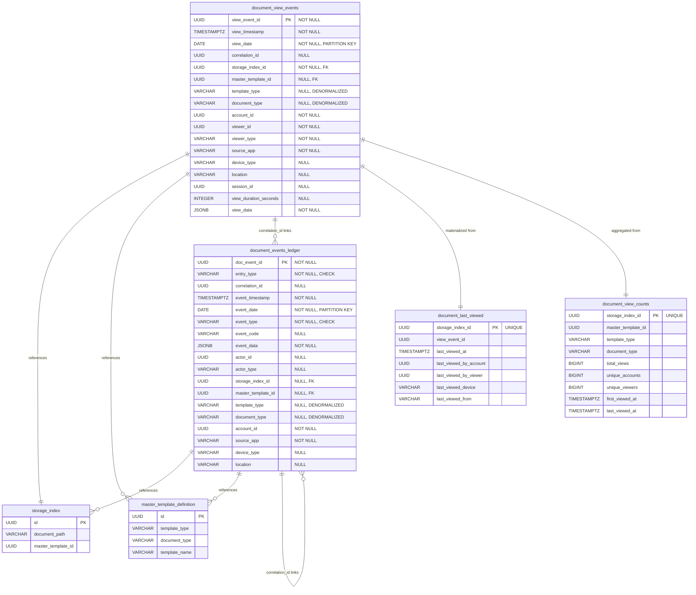

# Entity Relationship Diagram (ERD) - Document Events Ledger System

**Version:** 1.0
**Last Updated:** 2025-11-13
**Status:** Production Ready

---

## How to Use This Document

This document contains ERD diagrams in multiple formats:

1. **Mermaid Diagram** - Can be rendered in GitHub, GitLab, and many markdown viewers
2. **dbdiagram.io Code** - Copy to [dbdiagram.io](https://dbdiagram.io/) for interactive diagram
3. **Text-Based Diagram** - Simple ASCII representation

---

## System Overview

The Document Events Ledger System consists of two primary tables with supporting materialized views:

- `document_events_ledger` - Main ledger for document lifecycle events
- `document_view_events` - Separate high-volume view tracking
- `document_last_viewed` - Materialized view for quick "last viewed" lookups
- `document_view_counts` - Materialized view for aggregated view statistics

**External References:**
- `storage_index` - Document storage location (external table)
- `master_template_definition` - Template metadata (external table)

---

## Mermaid ERD Diagram



---

## dbdiagram.io Code

Copy the code below and paste it into [dbdiagram.io](https://dbdiagram.io/) for an interactive, visual ERD.

```dbdiagram
// Document Events Ledger System ERD
// Created: 2025-11-13
// Use this at: https://dbdiagram.io/

Table document_events_ledger {
  doc_event_id UUID [pk, not null, default: `gen_random_uuid()`, note: 'Unique identifier for ledger entry']
  entry_type VARCHAR(50) [not null, note: 'INITIAL, STATUS_CHANGE, FINAL, ERROR']
  correlation_id UUID [null, note: 'Links related entries across systems']
  event_timestamp TIMESTAMPTZ [not null, default: `CURRENT_TIMESTAMP`]
  event_date DATE [pk, not null, note: 'Partition key (monthly)']
  event_type VARCHAR(50) [not null, note: 'CREATED, DELETED, SIGNED, RESTORED, SHARED, PRINTED, REPRINTED']
  event_code VARCHAR(100) [null, note: 'Granular event classification']
  event_data JSONB [not null, default: `'{}'`, note: 'Flexible metadata (structure varies by entry_type)']
  actor_id UUID [null, note: 'Who/what performed action']
  actor_type VARCHAR(50) [null, note: 'USER, SYSTEM, SERVICE, API, SCHEDULER']
  storage_index_id UUID [null, ref: > storage_index.id, note: 'FK to storage_index']
  master_template_id UUID [null, ref: > master_template_definition.id, note: 'FK to master_template']
  template_type VARCHAR(100) [null, note: 'DENORMALIZED for analytics performance']
  document_type VARCHAR(100) [null, note: 'DENORMALIZED - NOT "paperless"']
  account_id UUID [not null, note: 'Required for analytics']
  source_app VARCHAR(100) [not null, note: 'Which app created entry']
  device_type VARCHAR(100) [null]
  location VARCHAR(255) [null, note: 'IP or region']

  indexes {
    event_timestamp [name: 'idx_timestamp']
    account_id [name: 'idx_account']
    master_template_id [name: 'idx_template']
    event_type [name: 'idx_event_type']
    entry_type [name: 'idx_entry_type']
    source_app [name: 'idx_source']
    correlation_id [name: 'idx_correlation', type: 'btree', note: 'Partial: WHERE correlation_id IS NOT NULL']
    (account_id, event_date, event_type) [name: 'idx_account_time_type']
    (master_template_id, event_date) [name: 'idx_template_time']
  }

  Note: '''
    # Analytics-Optimized Ledger
    - Partitioned monthly by event_date
    - 24-month retention
    - Append-only (no updates)
    - VIEWED events tracked separately
    - Denormalized for query performance
  '''
}

Table document_view_events {
  view_event_id UUID [pk, not null, default: `gen_random_uuid()`]
  view_timestamp TIMESTAMPTZ [not null, default: `CURRENT_TIMESTAMP`]
  view_date DATE [pk, not null, note: 'Partition key (monthly)']
  correlation_id UUID [null, note: 'Links to document_events_ledger']
  storage_index_id UUID [not null, ref: > storage_index.id]
  master_template_id UUID [null, ref: > master_template_definition.id]
  template_type VARCHAR(100) [null, note: 'DENORMALIZED']
  document_type VARCHAR(100) [null, note: 'DENORMALIZED']
  account_id UUID [not null, note: 'Required: "who viewed it"']
  viewer_id UUID [not null, note: 'Required: actual viewer']
  viewer_type VARCHAR(50) [not null, default: 'USER', note: 'USER, SYSTEM, SUPPORT, ADMIN']
  source_app VARCHAR(100) [not null]
  device_type VARCHAR(100) [null]
  location VARCHAR(255) [null]
  session_id UUID [null, note: 'Group related views']
  view_duration_seconds INTEGER [null]
  view_data JSONB [not null, default: `'{}'`]

  indexes {
    view_timestamp [name: 'idx_view_timestamp']
    account_id [name: 'idx_view_account']
    viewer_id [name: 'idx_viewer']
    storage_index_id [name: 'idx_view_storage']
    master_template_id [name: 'idx_view_template']
    correlation_id [name: 'idx_view_correlation']
    (storage_index_id, account_id, view_date) [name: 'idx_doc_account']
    (account_id, view_date) [name: 'idx_account_time']
    (master_template_id, view_date) [name: 'idx_template_time']
  }

  Note: '''
    # Separate View Tracking
    - Prevents millions of rows in main ledger
    - High volume (100M-1B rows/year)
    - Partitioned monthly
    - As John Drum warned: shared docs = millions of views
  '''
}

Table document_last_viewed {
  storage_index_id UUID [pk, unique, ref: - storage_index.id]
  view_event_id UUID
  last_viewed_at TIMESTAMPTZ
  last_viewed_by_account UUID
  last_viewed_by_viewer UUID
  last_viewed_device VARCHAR(100)
  last_viewed_from VARCHAR(100)

  Note: '''
    # Materialized View
    - Refresh: Hourly or daily
    - Quick "last viewed" lookups
    - Avoids scanning millions of rows
  '''
}

Table document_view_counts {
  storage_index_id UUID [pk, unique, ref: - storage_index.id]
  master_template_id UUID
  template_type VARCHAR(100)
  document_type VARCHAR(100)
  total_views BIGINT
  unique_accounts BIGINT
  unique_viewers BIGINT
  first_viewed_at TIMESTAMPTZ
  last_viewed_at TIMESTAMPTZ

  Note: '''
    # Materialized View
    - Refresh: Daily or as needed
    - Pre-aggregated statistics
    - Fast dashboard queries
  '''
}

Table storage_index {
  id UUID [pk, note: 'External table - document storage']
  document_path VARCHAR
  master_template_id UUID [ref: > master_template_definition.id]

  Note: 'External: Document storage location table'
}

Table master_template_definition {
  id UUID [pk, note: 'External table - template metadata']
  template_type VARCHAR(100)
  document_type VARCHAR(100)
  template_name VARCHAR

  Note: '''
    External: Template definition table
    Values denormalized into event tables for performance
  '''
}

// Relationships
Ref: document_view_events.correlation_id - document_events_ledger.correlation_id [note: 'Links view events to creation events']

// Table Groups
TableGroup analytics_ledger {
  document_events_ledger
  document_view_events
}

TableGroup materialized_views {
  document_last_viewed
  document_view_counts
}

TableGroup external_tables {
  storage_index
  master_template_definition
}
```

---

## ASCII Text Diagram

```
┌─────────────────────────────────────────────────────────────────────┐
│                    DOCUMENT EVENTS LEDGER SYSTEM                    │
│                         Entity Relationships                        │
└─────────────────────────────────────────────────────────────────────┘

EXTERNAL TABLES (Referenced)
┌──────────────────────────┐       ┌─────────────────────────────┐
│   storage_index          │       │ master_template_definition  │
├──────────────────────────┤       ├─────────────────────────────┤
│ • id (PK)                │       │ • id (PK)                   │
│ • document_path          │       │ • template_type             │
│ • master_template_id (FK)│───────│ • document_type             │
└──────────────────────────┘       │ • template_name             │
        │                          └─────────────────────────────┘
        │                                      │
        │                                      │
        │         ┌────────────────────────────┼─────────────────┐
        │         │                            │                 │
        ▼         ▼                            ▼                 ▼

ANALYTICS LEDGER (Main Tables)
┌───────────────────────────────────────┐  ┌──────────────────────────────────┐
│   document_events_ledger              │  │   document_view_events           │
│   [Partitioned by event_date]         │  │   [Partitioned by view_date]     │
├───────────────────────────────────────┤  ├──────────────────────────────────┤
│ PRIMARY KEY                           │  │ PRIMARY KEY                      │
│ • doc_event_id (PK)                   │  │ • view_event_id (PK)             │
│ • event_date (PK, Partition Key)      │  │ • view_date (PK, Partition Key)  │
│                                       │  │                                  │
│ CORE CLASSIFICATION                   │  │ CORE EVENT INFO                  │
│ • entry_type (INITIAL/STATUS/...)     │  │ • view_timestamp                 │
│ • correlation_id ◄────────────────────┼──┼─• correlation_id                 │
│ • event_timestamp                     │  │                                  │
│ • event_type (CREATED/PRINTED/...)    │  │ DOCUMENT IDENTIFICATION          │
│ • event_code                          │  │ • storage_index_id (FK) ────┐    │
│ • event_data (JSONB)                  │  │ • master_template_id (FK) ──┼─┐  │
│                                       │  │ • template_type (DENORM)    │ │  │
│ ACTOR INFO                            │  │ • document_type (DENORM)    │ │  │
│ • actor_id                            │  │                             │ │  │
│ • actor_type                          │  │ VIEWER INFO (Required)      │ │  │
│                                       │  │ • account_id                │ │  │
│ DOCUMENT CONTEXT                      │  │ • viewer_id                 │ │  │
│ • storage_index_id (FK) ──────┐       │  │ • viewer_type               │ │  │
│ • master_template_id (FK) ────┼───┐   │  │                             │ │  │
│ • template_type (DENORM)      │   │   │  │ VIEW CONTEXT                │ │  │
│ • document_type (DENORM)      │   │   │  │ • source_app                │ │  │
│ • account_id                  │   │   │  │ • device_type               │ │  │
│                               │   │   │  │ • location                  │ │  │
│ SOURCE/ORIGIN                 │   │   │  │ • session_id                │ │  │
│ • source_app                  │   │   │  │ • view_duration_seconds     │ │  │
│                               │   │   │  │ • view_data (JSONB)         │ │  │
│ ADDITIONAL CONTEXT            │   │   │  └──────────────────────────────────┘
│ • device_type                 │   │   │           │              │      │  │
│ • location                    │   │   │           │              │      │  │
└───────────────────────────────────────┘           │              │      │  │
                                                    ▼              ▼      ▼  ▼
MATERIALIZED VIEWS (Derived)
┌──────────────────────────────────┐  ┌─────────────────────────────────────┐
│   document_last_viewed           │  │   document_view_counts              │
│   [Materialized View]            │  │   [Materialized View]               │
├──────────────────────────────────┤  ├─────────────────────────────────────┤
│ • storage_index_id (PK, UNIQUE)  │  │ • storage_index_id (PK, UNIQUE)     │
│ • view_event_id                  │  │ • master_template_id                │
│ • last_viewed_at                 │  │ • template_type                     │
│ • last_viewed_by_account         │  │ • document_type                     │
│ • last_viewed_by_viewer          │  │ • total_views                       │
│ • last_viewed_device             │  │ • unique_accounts                   │
│ • last_viewed_from               │  │ • unique_viewers                    │
│                                  │  │ • first_viewed_at                   │
│ Refresh: Hourly/Daily            │  │ • last_viewed_at                    │
└──────────────────────────────────┘  │                                     │
                                      │ Refresh: Daily                      │
                                      └─────────────────────────────────────┘

RELATIONSHIP KEY:
─────►  Foreign Key Reference
◄────►  Bidirectional Link (correlation_id)
─ ─ ─►  Denormalized Data (copied for performance)

PARTITIONING STRATEGY:
• Both main tables partitioned MONTHLY by date field
• 24-month retention (older partitions dropped)
• Partition pruning improves query performance
```

---

## Detailed Relationship Descriptions

### 1. document_events_ledger → storage_index

**Relationship**: Many-to-One (optional)
**Foreign Key**: `storage_index_id`
**Constraint**: No FK constraint (for performance and flexibility)
**Purpose**: Links event to the actual stored document

**Notes**:
- Not all events have storage_index_id (e.g., CREATED event before document saved)
- Link established when document is saved to storage

---

### 2. document_events_ledger → master_template_definition

**Relationship**: Many-to-One (optional)
**Foreign Key**: `master_template_id`
**Constraint**: No FK constraint
**Purpose**: Links event to template definition

**Denormalization**:
- `template_type` copied from master_template
- `document_type` copied from master_template
- Avoids JOIN for analytics queries

**Trade-off**:
- Duplicated data vs. query performance
- John Drum's guidance: "If this is a analytic schema specifically for documents, you should denormalize it."

---

### 3. document_events_ledger ↔ document_events_ledger (Self-Reference)

**Relationship**: One-to-Many (via correlation_id)
**Link Field**: `correlation_id`
**Purpose**: Links all events for a single document request

**Example**:
```
correlation_id: abc-123
├─ Entry 1: entry_type=INITIAL, event_type=CREATED (request received)
├─ Entry 2: entry_type=STATUS_CHANGE, event_type=PRINTED (PDF rendered)
├─ Entry 3: entry_type=STATUS_CHANGE, event_type=PRINTED (sent to vendor)
└─ Entry 4: entry_type=FINAL, event_type=PRINTED (delivery confirmed)
```

---

### 4. document_view_events → storage_index

**Relationship**: Many-to-One (required)
**Foreign Key**: `storage_index_id`
**Constraint**: NOT NULL
**Purpose**: Every view event must reference an actual document

---

### 5. document_view_events → master_template_definition

**Relationship**: Many-to-One (optional)
**Foreign Key**: `master_template_id`
**Denormalization**: Same as document_events_ledger

---

### 6. document_view_events ↔ document_events_ledger

**Relationship**: Many-to-Many (via correlation_id)
**Link Field**: `correlation_id`
**Purpose**: Links view events back to document creation/print events

**Example**:
- Document created with correlation_id: xyz-789
- Document viewed 1,000 times, all view events have correlation_id: xyz-789
- Can trace views back to original creation event

---

### 7. document_view_events → document_last_viewed

**Relationship**: Materialized View (one-to-one effective)
**Update Method**: `REFRESH MATERIALIZED VIEW CONCURRENTLY`
**Purpose**: Quick lookup of most recent view per document

**Query Pattern**:
```sql
-- Instead of scanning millions of rows:
SELECT MAX(view_timestamp) FROM document_view_events WHERE storage_index_id = 'xxx';

-- Use materialized view (instant):
SELECT last_viewed_at FROM document_last_viewed WHERE storage_index_id = 'xxx';
```

---

### 8. document_view_events → document_view_counts

**Relationship**: Materialized View (aggregation)
**Update Method**: `REFRESH MATERIALIZED VIEW CONCURRENTLY`
**Purpose**: Pre-aggregated statistics for dashboards

**Benefits**:
- Dashboard queries in milliseconds
- No expensive COUNT(*) on billions of rows
- Periodic refresh (e.g., daily) acceptable for dashboards

---

## Key Design Decisions

### 1. No Foreign Key Constraints

**Decision**: No FK constraints defined between tables

**Rationale**:
- Analytics tables receive high INSERT volume
- FK constraint checks add overhead
- Application ensures referential integrity
- Allows for temporal data skew (event arrives before referenced data)

**Trade-off**: Performance vs. strict integrity

---

### 2. Composite Primary Keys for Partitioning

**Decision**: (id, date) as primary key instead of just (id)

**Rationale**:
- PostgreSQL requires partition key in PK for range partitioning
- Allows partition pruning in queries
- Minimal impact (UUID already ensures uniqueness)

---

### 3. Denormalized template_type and document_type

**Decision**: Copy these fields instead of JOIN

**Rationale** (from John Drum review):
> "So that means I want to just in my where clause for when I'm querying things, there's certain things I'm going to query on, right? The whole purpose of a document is to be able to say which document I want to look at. So I want to define that without, you know, joining 3 tables together."

**Impact**:
- 10-100x faster analytics queries
- Slight data duplication (acceptable for analytics)

---

### 4. Separate View Tracking Table

**Decision**: Separate table for VIEWED events

**Rationale** (from John Drum review):
> "So this is going to be a problem because if you use viewed and you have a shared document, you're going to get millions, literally millions of entries in here for viewing a shared document."

**Benefits**:
- Prevents main ledger bloat
- Different optimization strategies
- Different retention policies possible

---

## Index Strategy Visualization

```
document_events_ledger INDEXES:

SINGLE-COLUMN INDEXES (Fast Filtering)
├─ idx_timestamp        → event_timestamp
├─ idx_account          → account_id
├─ idx_template         → master_template_id
├─ idx_event_type       → event_type
├─ idx_entry_type       → entry_type
└─ idx_source           → source_app

PARTIAL INDEXES (Space Efficient)
└─ idx_correlation      → correlation_id WHERE correlation_id IS NOT NULL

COMPOSITE INDEXES (Common Query Patterns)
├─ idx_account_time_type → (account_id, event_date, event_type)
│  Use case: "Show me all PRINTED events for account X this month"
│
└─ idx_template_time     → (master_template_id, event_date)
   Use case: "How many times was template Y used this quarter"
```

---

## Partition Visualization

```
document_events_ledger PARTITIONS (Monthly):

Parent Table: document_events_ledger
├─ document_events_ledger_2023_11  [2023-11-01 to 2023-12-01]  ← Ready to drop
├─ document_events_ledger_2023_12  [2023-12-01 to 2024-01-01]
├─ document_events_ledger_2024_01  [2024-01-01 to 2024-02-01]
├─ ...
├─ document_events_ledger_2025_11  [2025-11-01 to 2025-12-01]  ← Current month
├─ document_events_ledger_2025_12  [2025-12-01 to 2026-01-01]  ← Pre-created
└─ document_events_ledger_2026_01  [2026-01-01 to 2026-02-01]  ← Pre-created

Retention: 24 months
Action: Drop document_events_ledger_2023_11 in December 2025

Benefits:
✓ Fast DELETE (DROP partition vs DELETE rows)
✓ Partition pruning (query only scans relevant partitions)
✓ Manageable partition sizes
✓ Easy archival (export partition before drop)
```

---

## Common Query Patterns (Mapped to ERD)

### Pattern 1: Complete Document Lifecycle

```sql
-- Trace all events for a document using correlation_id
SELECT * FROM document_events_ledger
WHERE correlation_id = 'xxx'
ORDER BY event_timestamp;
```

**ERD Path**: document_events_ledger → self-reference via correlation_id

---

### Pattern 2: Account Activity Dashboard

```sql
-- What did account do this month?
SELECT event_type, COUNT(*)
FROM document_events_ledger
WHERE account_id = 'xxx'
  AND event_date >= '2025-11-01'
GROUP BY event_type;
```

**ERD Path**: document_events_ledger (single table, denormalized)
**Index Used**: idx_account_time_type

---

### Pattern 3: Document View History

```sql
-- Who viewed this document?
SELECT account_id, viewer_id, view_timestamp
FROM document_view_events
WHERE storage_index_id = 'xxx'
ORDER BY view_timestamp DESC;
```

**ERD Path**: document_view_events → storage_index
**Index Used**: idx_view_storage

---

### Pattern 4: Template Popularity

```sql
-- Most popular templates this quarter
SELECT template_type, document_type, COUNT(*)
FROM document_events_ledger
WHERE event_type = 'CREATED'
  AND event_date >= '2025-10-01'
GROUP BY template_type, document_type;
```

**ERD Path**: document_events_ledger (denormalized, no JOIN needed)
**Index Used**: idx_template_time + idx_event_type

---

## Tools for Visualization

### Recommended Tools

1. **dbdiagram.io** (Recommended)
   - Copy the dbdiagram.io code above
   - Paste into https://dbdiagram.io/
   - Interactive, professional diagrams
   - Export to PDF, PNG, SQL

2. **Mermaid Live Editor**
   - Copy Mermaid diagram above
   - Paste into https://mermaid.live/
   - Renders the diagram
   - Export to SVG, PNG

3. **DBeaver / DataGrip**
   - Import schema SQL
   - Auto-generate ERD
   - See actual relationships

4. **PostgreSQL pgAdmin**
   - Import schema
   - Use built-in ERD tool
   - See indexes and constraints

---

## Related Documentation

- [Data Dictionary](data_dictionary.md) - Detailed field descriptions
- [Verification Report](verification_report.md) - Requirements analysis
- [Schema SQL](document_events_ledger.sql) - Executable schema
- [View Events SQL](document_view_events.sql) - View tracking schema

---

## Revision History

| Date | Version | Changes |
|------|---------|---------|
| 2025-11-13 | 1.0 | Initial ERD based on final schema design |

---

**End of ERD Documentation**
