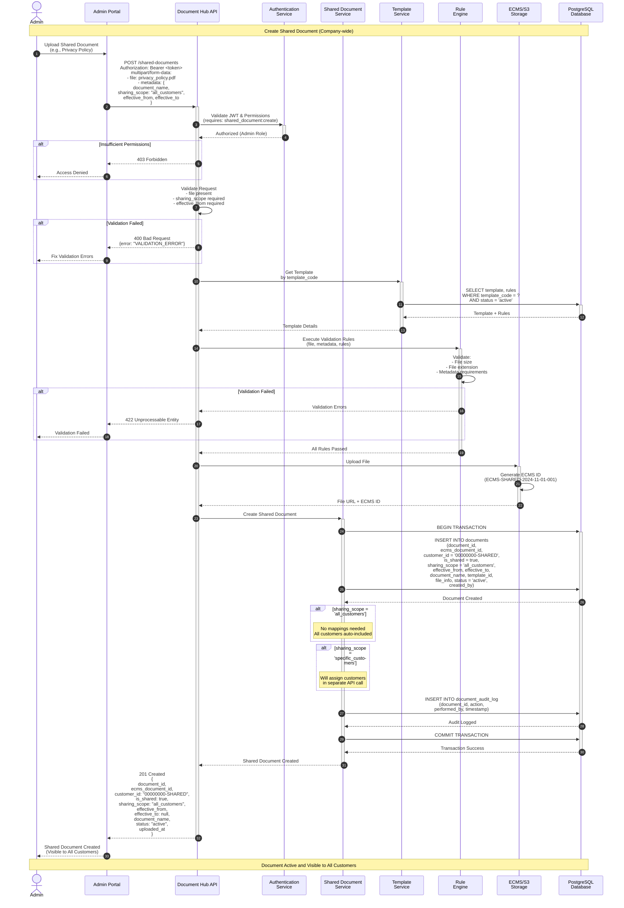
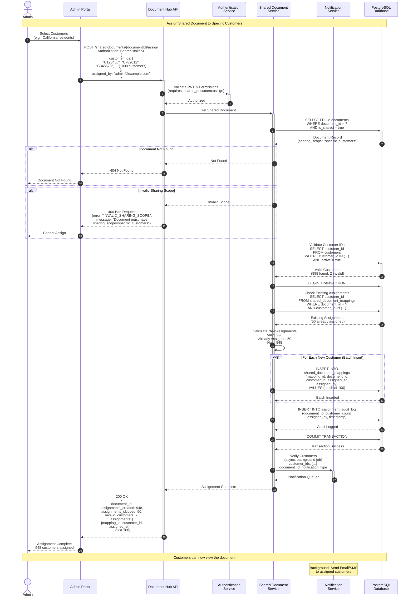
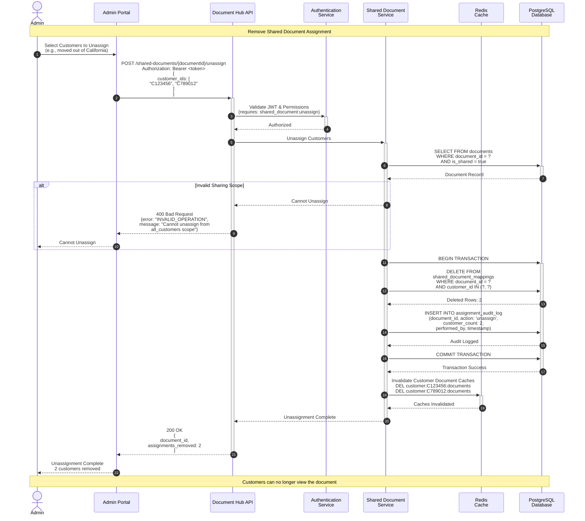
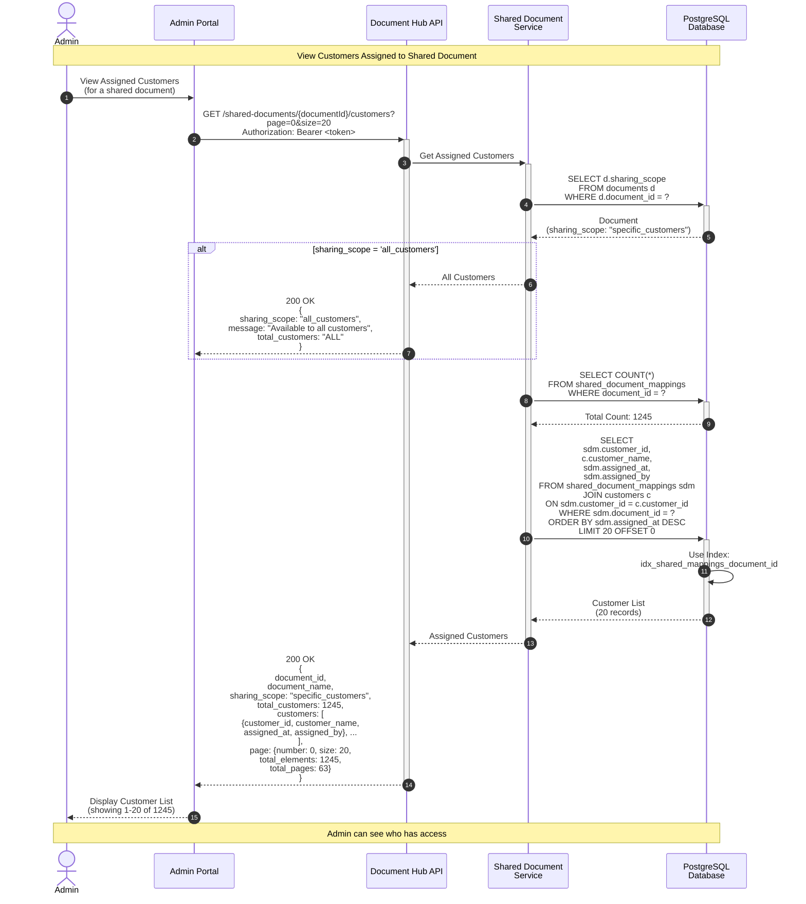

# Shared Document Creation & Assignment Flow - Sequence Diagram

This sequence diagram illustrates the creation of shared documents and their assignment to customers in the Document Hub API.

## Mermaid Sequence Diagram - Create Shared Document



## Mermaid Sequence Diagram - Assign Shared Document to Specific Customers



## Mermaid Sequence Diagram - Unassign Shared Document



## Mermaid Sequence Diagram - Get Assigned Customers



## Flow Descriptions

### Create Shared Document Flow

1. **Authentication & Authorization** (Steps 1-4)
   - Admin uploads shared document
   - Validate JWT token and permissions
   - Require `shared_document:create` permission
   - If unauthorized → 403 Forbidden

2. **Request Validation** (Steps 5-6)
   - Validate file present
   - Validate sharing_scope (required)
   - Validate effective_from (required)
   - If invalid → 400 Bad Request

3. **Template & Rule Validation** (Steps 7-11)
   - Retrieve template by template_code
   - Execute validation rules
   - Check file size, extension, metadata
   - If validation fails → 422 Unprocessable Entity

4. **File Storage** (Steps 12-13)
   - Upload file to S3/ECMS
   - Generate shared document ID (ECMS-SHARED-*)
   - Store file in shared documents path

5. **Database Creation** (Steps 14-20)
   - Begin transaction
   - Create document record with:
     - `customer_id = '00000000-SHARED'` (special ID for shared docs)
     - `is_shared = true`
     - `sharing_scope` (all_customers, specific_customers, etc.)
     - `effective_from` and `effective_to` dates
   - Log audit trail
   - Commit transaction

6. **Response** (Steps 21-22)
   - Return created shared document
   - Document immediately available based on scope

### Assign Shared Document Flow

1. **Authorization** (Steps 1-3)
   - Admin selects customers to assign
   - Validate permissions
   - Require `shared_document:assign` permission

2. **Document Validation** (Steps 4-8)
   - Retrieve shared document
   - Verify `is_shared = true`
   - Verify `sharing_scope = 'specific_customers'`
   - If wrong scope → 400 Bad Request

3. **Customer Validation** (Steps 9-10)
   - Validate all customer IDs exist
   - Check customers are active
   - Report invalid customer IDs

4. **Assignment Logic** (Steps 11-17)
   - Check for existing assignments (avoid duplicates)
   - Calculate new assignments needed
   - Batch insert mappings (100 at a time)
   - Log audit trail
   - Commit transaction

5. **Notifications** (Steps 18-19)
   - Queue background job to notify customers
   - Send email/SMS notifications
   - Non-blocking, async operation

6. **Response** (Steps 20-22)
   - Return assignment results
   - Show created, skipped, invalid counts
   - Return first 100 assignments for confirmation

### Unassign Shared Document Flow

1. **Authorization** (Steps 1-3)
   - Admin selects customers to remove
   - Validate permissions

2. **Document Validation** (Steps 4-7)
   - Verify document exists and is shared
   - Verify can unassign (not all_customers scope)
   - If invalid → 400 Bad Request

3. **Unassignment** (Steps 8-12)
   - Delete mapping records
   - Log audit trail
   - Commit transaction

4. **Cache Invalidation** (Steps 13-14)
   - Invalidate affected customer document caches
   - Ensure customers don't see stale data

5. **Response** (Steps 15-17)
   - Return removal count
   - Customers immediately lose access

### Get Assigned Customers Flow

1. **Request** (Steps 1-3)
   - Admin views assigned customers
   - Query specific shared document

2. **Scope Check** (Steps 4-6)
   - Check sharing_scope
   - If 'all_customers', return special response
   - If 'specific_customers', proceed with query

3. **Count & List** (Steps 7-11)
   - Get total customer count
   - Query paginated customer list
   - Join with customers table for names
   - Use index for performance

4. **Response** (Steps 12-14)
   - Return paginated customer list
   - Include assignment metadata
   - Show total and pages

## API Endpoint Details

### Create Shared Document

```
POST /api/v1/shared-documents
Authorization: Bearer <token>
Content-Type: multipart/form-data

Form Data:
- file: privacy_policy.pdf
- metadata: {
    "document_name": "Privacy Policy 2024",
    "document_type": "PRIVACY_POLICY",
    "document_category": "REGULATORY",
    "template_code": "PRIVACY_POLICY_TEMPLATE",
    "sharing_scope": "all_customers",
    "effective_from": "2024-01-01T00:00:00Z",
    "effective_to": null,
    "tags": ["regulatory", "privacy"]
  }
```

**Success Response (201 Created):**
```json
{
  "document_id": "cc0e8400-e29b-41d4-a716-446655440030",
  "ecms_document_id": "ECMS-SHARED-2024-01-01-001",
  "customer_id": "00000000-SHARED",
  "is_shared": true,
  "sharing_scope": "all_customers",
  "effective_from": "2024-01-01T00:00:00Z",
  "effective_to": null,
  "document_name": "Privacy Policy 2024",
  "status": "active",
  "uploaded_at": "2024-01-01T10:00:00Z"
}
```

### Assign Shared Document

```
POST /api/v1/shared-documents/{documentId}/assign
Authorization: Bearer <token>
Content-Type: application/json

Request Body:
{
  "customer_ids": ["C123456", "C789012", "C345678"],
  "assigned_by": "admin@example.com"
}
```

**Success Response (200 OK):**
```json
{
  "document_id": "cc0e8400-e29b-41d4-a716-446655440030",
  "assignments_created": 948,
  "assignments_skipped": 50,
  "invalid_customers": 2,
  "assignments": [
    {
      "mapping_id": "dd0e8400-e29b-41d4-a716-446655440040",
      "customer_id": "C123456",
      "assigned_at": "2024-11-01T14:00:00Z"
    }
  ]
}
```

### Unassign Shared Document

```
POST /api/v1/shared-documents/{documentId}/unassign
Authorization: Bearer <token>
Content-Type: application/json

Request Body:
{
  "customer_ids": ["C123456", "C789012"]
}
```

**Success Response (200 OK):**
```json
{
  "document_id": "cc0e8400-e29b-41d4-a716-446655440030",
  "assignments_removed": 2
}
```

### Get Assigned Customers

```
GET /api/v1/shared-documents/{documentId}/customers?page=0&size=20
Authorization: Bearer <token>
```

**Success Response (200 OK):**
```json
{
  "document_id": "cc0e8400-e29b-41d4-a716-446655440030",
  "document_name": "Regulatory Notice - California",
  "sharing_scope": "specific_customers",
  "total_customers": 1245,
  "customers": [
    {
      "customer_id": "C123456",
      "customer_name": "John Doe",
      "assigned_at": "2024-11-01T14:00:00Z",
      "assigned_by": "admin@example.com"
    }
  ],
  "page": {
    "number": 0,
    "size": 20,
    "total_elements": 1245,
    "total_pages": 63
  }
}
```

## Sharing Scope Strategies

### 1. All Customers
- **Best For**: Company-wide policies, terms of service
- **Assignment**: Automatic, no mappings needed
- **Performance**: Excellent (no JOIN needed)
- **Management**: Simple, no customer list to maintain

### 2. Specific Customers
- **Best For**: Targeted communications, regional notices
- **Assignment**: Manual via API
- **Performance**: Good (indexed JOIN)
- **Management**: Flexible, precise control

### 3. Account Type
- **Best For**: Account-specific terms, tier benefits
- **Assignment**: Automatic based on customer account_type
- **Performance**: Good (attribute match)
- **Management**: Dynamic, updates automatically

### 4. Customer Segment
- **Best For**: VIP communications, loyalty programs
- **Assignment**: Automatic based on customer segment
- **Performance**: Good (attribute match)
- **Management**: Dynamic, segment-driven

## Performance Considerations

### Bulk Assignment Performance
- **Batch Insert**: 100 records at a time
- **Transaction**: Single transaction for consistency
- **Async Notifications**: Don't block response
- **Target**: <2 seconds for 1000 assignments

### Database Indexes
```sql
-- Shared document mappings
CREATE INDEX idx_shared_mappings_document_id
ON shared_document_mappings(document_id, customer_id);

CREATE INDEX idx_shared_mappings_customer_id
ON shared_document_mappings(customer_id, document_id);

-- Shared documents
CREATE INDEX idx_documents_shared_scope
ON documents(is_shared, sharing_scope, status)
WHERE is_shared = true;

-- Effective dates
CREATE INDEX idx_documents_effective_dates
ON documents(effective_from, effective_to, status)
WHERE is_shared = true;
```

## Error Scenarios

| Scenario | HTTP Status | Error Code | Action |
|----------|-------------|------------|--------|
| Unauthorized | 401 | UNAUTHORIZED | Login required |
| Insufficient permissions | 403 | INSUFFICIENT_PERMISSIONS | Need admin role |
| Invalid sharing scope | 400 | INVALID_SHARING_SCOPE | Use specific_customers |
| Cannot unassign all_customers | 400 | INVALID_OPERATION | Scope doesn't support unassign |
| Document not found | 404 | DOCUMENT_NOT_FOUND | Check document ID |
| Invalid customers | 400 | INVALID_CUSTOMERS | Some customer IDs invalid |

## Best Practices

1. **Use Appropriate Sharing Scope**
   - `all_customers` for universal documents
   - `specific_customers` for targeted communications
   - `account_type` for account-specific documents
   - `customer_segment` for segment-based documents

2. **Set Effective Dates**
   - Always set `effective_from`
   - Use `effective_to` for time-limited documents
   - Supports compliance and auditing

3. **Batch Assignments**
   - Send customer IDs in batches of 1000
   - Monitor response times
   - Use async notifications

4. **Audit Everything**
   - Log all assignments/unassignments
   - Track who performed action
   - Record timestamps

5. **Cache Invalidation**
   - Invalidate customer caches on assignment changes
   - Ensure customers see updates immediately
   - Use targeted cache invalidation
