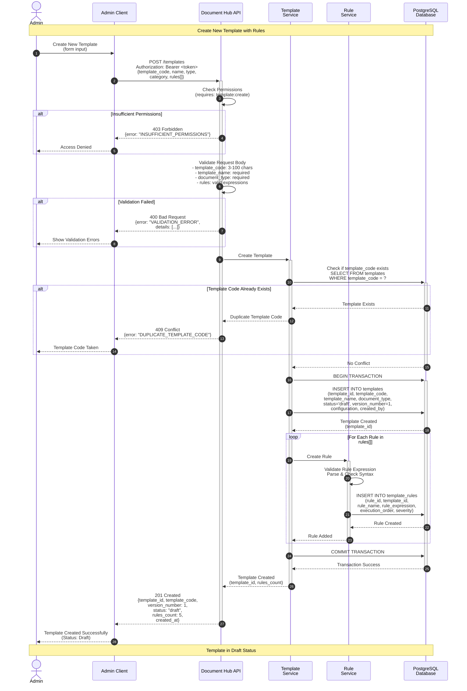
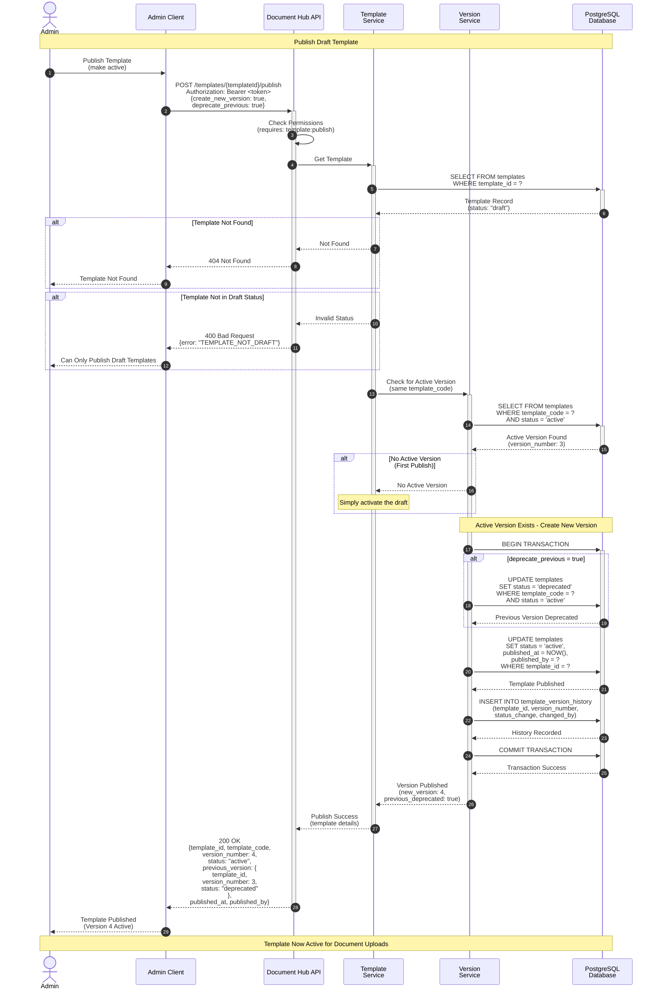
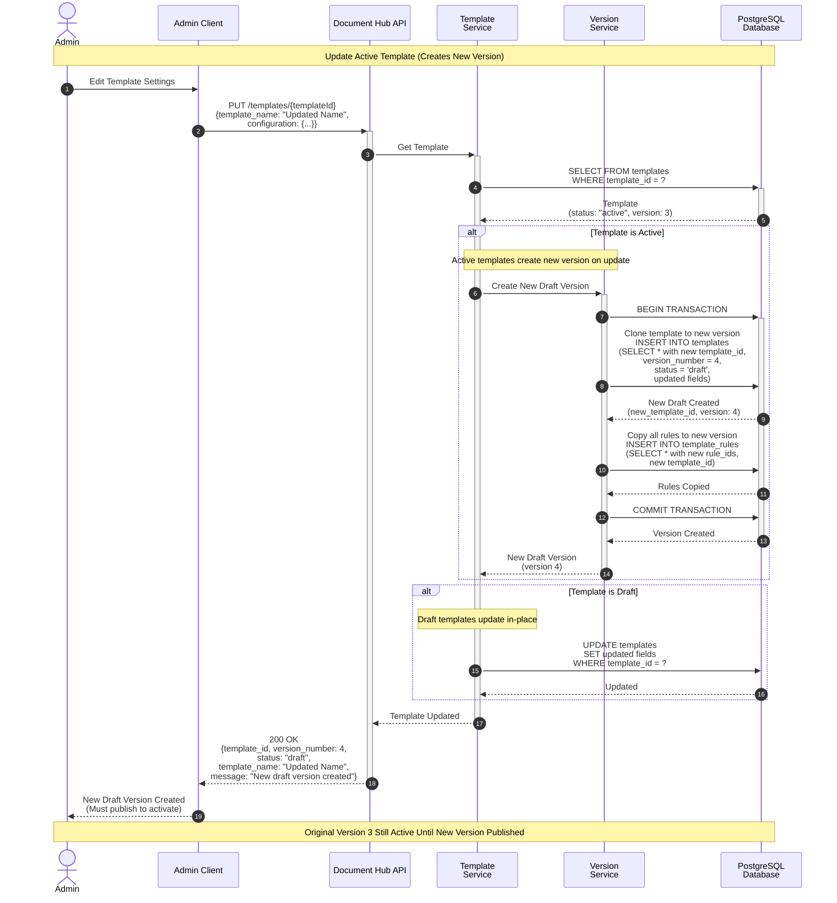

# Template Creation & Publishing Flow - Sequence Diagram

**Note:** Authentication is handled by the API Gateway before requests reach the API.

This sequence diagram illustrates the complete template lifecycle including creation, rule management, versioning, and publishing in the Document Hub API.

## Mermaid Sequence Diagram - Template Creation



## Mermaid Sequence Diagram - Template Publishing



## Mermaid Sequence Diagram - Template Update & Versioning



## Flow Descriptions

### Template Creation Flow

1. **Request & Authorization** (Step 1)
   - Admin submits new template with rules
   - API Gateway validates JWT token and checks for `template:create` permission before request reaches API
   - If unauthorized → 403 Forbidden

2. **Request Validation** (Steps 2-3)
   - Validate all required fields
   - Check template_code format (3-100 chars)
   - Validate rule expressions
   - If invalid → 400 Bad Request

3. **Duplicate Check** (Steps 4-6)
   - Check if template_code already exists
   - If exists → 409 Conflict

4. **Template Creation** (Steps 7-10)
   - Begin database transaction
   - Create template record with `status='draft'` and `version_number=1`
   - Insert all rules with execution order
   - Commit transaction

5. **Response** (Steps 11-12)
   - Return 201 Created with template details
   - Template remains in draft status

### Template Publishing Flow

1. **Authorization & Retrieval** (Step 1)
   - Admin requests to publish template
   - API Gateway validates permissions before request reaches API
   - Retrieve template from database
   - Verify template is in draft status

2. **Version Check** (Steps 2-4)
   - Check if an active version exists for this template_code
   - If no active version, simply activate the draft
   - If active version exists, proceed with versioning

3. **Version Management** (Steps 5-10)
   - Begin transaction
   - Optionally deprecate previous active version
   - Update draft template to `status='active'`
   - Record version history
   - Commit transaction

4. **Response** (Steps 11-13)
   - Return published template details
   - Include information about previous version
   - Template now active for document uploads

### Template Update Flow

1. **Update Active Template** (Step 1)
   - Admin updates an active template
   - System detects template is active

2. **Create New Draft Version** (Steps 2-7)
   - Clone template to new version (version_number + 1)
   - New version has `status='draft'`
   - Copy all rules to new version
   - Apply updates to the new draft

3. **Preserve Active Version**
   - Original active version remains unchanged
   - New draft must be published separately
   - Zero-downtime updates

4. **Update Draft Template**
   - If template is already draft, update in-place
   - No versioning needed for drafts

## API Endpoint Details

### Create Template

```
POST /api/v1/templates
Authorization: Bearer <token>
Content-Type: application/json

Request Body:
{
  "template_code": "LOAN_APPLICATION",
  "template_name": "Loan Application Form",
  "description": "Standard loan application template",
  "document_type": "APPLICATION",
  "document_category": "LENDING",
  "retention_period_days": 2555,
  "requires_signature": true,
  "configuration": {
    "max_file_size_mb": 10,
    "allowed_extensions": ["pdf", "docx"]
  },
  "rules": [
    {
      "rule_name": "Validate File Size",
      "rule_type": "validation",
      "rule_expression": "file_size_bytes <= 10485760",
      "execution_order": 1,
      "severity": "error",
      "error_message": "File size must not exceed 10 MB"
    }
  ]
}
```

**Success Response (201 Created):**
```json
{
  "template_id": "550e8400-e29b-41d4-a716-446655440000",
  "template_code": "LOAN_APPLICATION",
  "version_number": 1,
  "template_name": "Loan Application Form",
  "status": "draft",
  "rules_count": 5,
  "created_at": "2024-11-01T10:30:00Z",
  "created_by": "admin@example.com"
}
```

### Publish Template

```
POST /api/v1/templates/{templateId}/publish
Authorization: Bearer <token>
Content-Type: application/json

Request Body (Optional):
{
  "create_new_version": true,
  "deprecate_previous": true
}
```

**Success Response (200 OK):**
```json
{
  "template_id": "990e8400-e29b-41d4-a716-446655440010",
  "template_code": "LOAN_APPLICATION",
  "version_number": 4,
  "status": "active",
  "previous_version": {
    "template_id": "550e8400-e29b-41d4-a716-446655440000",
    "version_number": 3,
    "status": "deprecated"
  },
  "published_at": "2024-11-01T11:15:00Z",
  "published_by": "admin@example.com"
}
```

### Update Template

```
PUT /api/v1/templates/{templateId}
Authorization: Bearer <token>
Content-Type: application/json

Request Body:
{
  "template_name": "Updated Loan Application Form",
  "description": "Updated description",
  "configuration": {
    "max_file_size_mb": 15
  }
}
```

**Success Response (200 OK) - Active Template:**
```json
{
  "template_id": "new-template-id-uuid",
  "template_code": "LOAN_APPLICATION",
  "version_number": 4,
  "template_name": "Updated Loan Application Form",
  "status": "draft",
  "message": "New draft version created. Original version remains active until new version is published.",
  "updated_at": "2024-11-01T11:00:00Z"
}
```

## Template Versioning Strategy

### Version States
1. **Draft** - Being edited, not used for documents
2. **Active** - Currently used for document uploads
3. **Deprecated** - No longer active, but documents may reference it

### Versioning Rules
- Only one **active** version per `template_code`
- Multiple **deprecated** versions can exist
- Multiple **draft** versions can exist (rare)
- Documents always reference `template_id` (specific version)

### Version Lifecycle
```
Create → Draft (v1)
         ↓ Publish
      Active (v1)
         ↓ Update
      Active (v1) + Draft (v2)
         ↓ Publish v2
      Deprecated (v1) + Active (v2)
         ↓ Update
      Deprecated (v1) + Active (v2) + Draft (v3)
```

## Error Scenarios

| Scenario | HTTP Status | Error Code | Action |
|----------|-------------|------------|--------|
| Authentication (401 Unauthorized) | 401 | UNAUTHORIZED | Handled by API Gateway; not shown in this diagram |
| Insufficient permissions | 403 | INSUFFICIENT_PERMISSIONS | Need admin role |
| Invalid request body | 400 | VALIDATION_ERROR | Fix validation errors |
| Duplicate template_code | 409 | DUPLICATE_TEMPLATE_CODE | Use different code |
| Template not found | 404 | TEMPLATE_NOT_FOUND | Check template ID |
| Template not draft | 400 | TEMPLATE_NOT_DRAFT | Only drafts can be published |
| Template in use | 409 | TEMPLATE_IN_USE | Cannot delete |

## Best Practices

1. **Always Test in Draft**
   - Create template as draft
   - Test validation rules
   - Publish only when ready

2. **Version Control**
   - Use semantic versioning in descriptions
   - Document changes between versions
   - Never delete deprecated versions

3. **Rule Management**
   - Order rules by execution priority
   - Test rule expressions before publishing
   - Use clear error messages

4. **Zero-Downtime Updates**
   - Update creates new draft version
   - Original version stays active
   - Publish new version when ready
   - No interruption to document uploads
